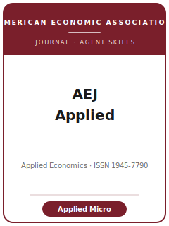

# AEJ: Applied Economics Skills

<p align="center"></p>

English | [简体中文](README.zh-CN.md)

Twelve agent skills for manuscripts targeted at the **American Economic Journal: Applied Economics
(AEJ: Applied)** — the American Economic Association's quarterly journal for **empirical applied
microeconomics with credible causal identification** (labor, development, health, education, public, urban,
environmental, household finance). The pack is identification-driven and empirical-first: it routes a
manuscript from venue fit and a clean research design, through robustness, exhibits, and AEA house-style
writing, into the signature **AEA Data and Code Availability Policy** — the openICPSR replication package
that the AEA Data Editor checks for reproducibility **before** publication — and on through single-blind
submission and the R&R rebuttal.

**Official basis checked 2026-06-20**: AEA / AEJ: Applied journal, editors, editorial policy, reviewer,
submission, style, disclosure, and data/code pages. Sources and live-check boundaries are in
[`resources/official-source-map.md`](resources/official-source-map.md).

## Why a separate stack?

| AEJ: Applied constraint | What it forces on the manuscript |
|-------------------------|----------------------------------|
| Empirical-first applied micro | A credible causal design is the contribution; theory only interprets/structures |
| Single-blind review | Author identities are visible to referees; referee identities remain anonymous |
| AEA online submission + JEL codes | JEL codes required; title/byline/affiliations on first page; member/nonmember fee |
| AEA Data & Code Availability Policy | Data + code deposited to the AEA Data and Code Repository on openICPSR |
| Pre-publication reproducibility check (AEA Data Editor, Lars Vilhuber) | Tables/figures must regenerate from the deposited package before publication |
| AEA house presentation | 100-word abstract; stars permitted but standard errors expected; self-contained exhibit notes; online appendix |

## Quick Start

**As a Claude Code plugin** — point your marketplace at this directory and enable the plugin:

```
/plugin marketplace add ./AEJ-Applied-Economics-Skills
/plugin install aej-applied-economics-skills
```

**Manually** — each skill is a self-contained `SKILL.md` under `skills/`. Open `skills/aeja-workflow/SKILL.md`
first; it routes you to the right skill for your current stage.

## Default Workflow

```
aeja-topic-selection → aeja-literature-positioning → aeja-identification → aeja-theory-model
   → aeja-robustness → aeja-tables-figures → aeja-writing-style → aeja-replication-package
   → aeja-referee-strategy → aeja-submission → aeja-rebuttal
                         (aeja-workflow routes among all of the above)
```

## Skills

| # | Skill | What it does |
|---|-------|--------------|
| 1 | [`aeja-workflow`](skills/aeja-workflow/SKILL.md) | Router — diagnose the current bottleneck and route to the right skill |
| 2 | [`aeja-topic-selection`](skills/aeja-topic-selection/SKILL.md) | Decide AEJ: Applied vs AER / AEJ: Policy / a field journal; sharpen the question |
| 3 | [`aeja-literature-positioning`](skills/aeja-literature-positioning/SKILL.md) | Stake the marginal contribution against the closest prior work |
| 4 | [`aeja-identification`](skills/aeja-identification/SKILL.md) | Stress-test the causal design (RCT / DID / RD / IV / shift-share) |
| 5 | [`aeja-theory-model`](skills/aeja-theory-model/SKILL.md) | Right-size theory to interpret/structure the estimate, not lead it |
| 6 | [`aeja-robustness`](skills/aeja-robustness/SKILL.md) | Show the headline survives specification, sample, and inference |
| 7 | [`aeja-tables-figures`](skills/aeja-tables-figures/SKILL.md) | Make the main result legible in one exhibit in AEA house style |
| 8 | [`aeja-writing-style`](skills/aeja-writing-style/SKILL.md) | Land the question and estimate in the first paragraph |
| 9 | [`aeja-replication-package`](skills/aeja-replication-package/SKILL.md) | Build the openICPSR package for the AEA Data Editor check |
| 10 | [`aeja-referee-strategy`](skills/aeja-referee-strategy/SKILL.md) | Pre-empt the objections this design invites |
| 11 | [`aeja-submission`](skills/aeja-submission/SKILL.md) | Final preflight: front matter, JEL, fee, format, declarations |
| 12 | [`aeja-rebuttal`](skills/aeja-rebuttal/SKILL.md) | Draft the response-to-referees letter and revision plan |

## Resources

- [`resources/README.md`](resources/README.md) — capability-layer index
- [`resources/official-source-map.md`](resources/official-source-map.md) — official AEA URLs behind every fact
- [`resources/external_tools.md`](resources/external_tools.md) — data sources, software, packages
- [`resources/worked-examples/01-introduction.md`](resources/worked-examples/01-introduction.md) — a before→after AEJ: Applied introduction (fictional)
- [`resources/exemplars/library.md`](resources/exemplars/library.md) — real, web-verified AEJ: Applied papers by method × topic
- [`resources/code/`](resources/code/) — reproducible Stata + Python causal-inference skeleton

## Differences vs. sibling journals

| Journal | Niche | This pack's positioning |
|---------|-------|-------------------------|
| **AEJ: Applied** | Identification-driven applied micro of broad interest | The target of this pack |
| **American Economic Review (AER)** | General-interest, agenda-setting, longer | AEJ: Applied takes more specialized applied-micro work |
| **AEJ: Economic Policy** | Policy-question framing, program evaluation verdicts | AEJ: Applied is method/identification-driven, not policy-ROI |
| **Field journals (JHE / JOLE / JDE)** | Sub-field-internal contributions | AEJ: Applied wants wider applied-micro readership |

## Related

- American Economic Association journals: https://www.aeaweb.org/journals
- AEA Data and Code Availability Policy: https://www.aeaweb.org/journals/policies/data-code

## License

MIT © 2026 Bryce Wang. See [LICENSE](LICENSE).
