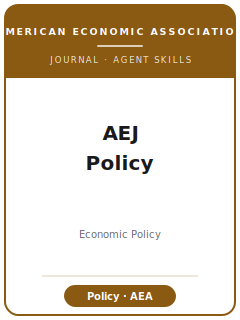

# AEJ: Economic Policy Skills

<p align="center">
  
</p>

[](LICENSE)
[](https://www.aeaweb.org/journals/pol)
[](https://www.aeaweb.org/journals/pol)
[](skills/)
[](https://github.com/anthropics/claude-code)

English | [简体中文](README.zh-CN.md)

Agent skill stack for manuscripts targeted at the **American Economic Journal: Economic Policy
(AEJ: Policy)** — the American Economic Association's quarterly journal for the **economic analysis OF
policy**. **12 skills** span the full lifecycle from a policy-question-first topic through credible
quasi-experimental identification, a welfare/cost-benefit reading, the AEA Data Editor reproducibility
check, and the R&R rebuttal — shipping a **runnable Stata + Python code library**.

The through-line of every skill is **policy relevance**: topic selection and contribution framing
foreground the **policy question and its counterfactual / welfare implication**; identification centers
**credible quasi-experimental and RCT policy evaluation**; writing-style covers **translating estimates
into a clear policy takeaway without overclaiming**.

It is **not** a generic applied-microeconomics toolbox. It is an AEJ: Policy-specific methodology stack.

Official basis checked **2026-06** against the AEA / AEJ: Policy pages (journal home, submission
guidelines, AEA Data and Code Availability Policy, AEA Disclosure Policy). See
[`resources/official-source-map.md`](resources/official-source-map.md). Volatile facts (submission fee,
editors, exact format limits) are tagged *(检索于 2026-06；以官网为准)* and marked **待核实** where a primary
fetch could not confirm them.

---

## Why a Separate AEJ: Policy Skill Stack?

AEJ: Policy imposes constraints that differ materially from a field public-finance journal, the other
AEJs, and the AER (rows marked **[official]** are verified against AEA sources):

| Constraint | AEJ: Economic Policy | Implication |
|---|---|---|
| Through-line | A **policy question** with a welfare / cost-benefit / distributional reading | A clean estimate with no policy "so what" is off-fit |
| Scope [official] | Economic analysis **of policy** (public econ, environment/energy, health, education, labor/welfare, regulation, dev/political economy) | Pure methods or no-policy applied micro is off-fit |
| Identification | Credible quasi-experimental / RCT evaluation of the policy | TWFE-on-staggered / OLS+controls draws fast pushback |
| Welfare reading | Estimate → MVPF / cost-benefit / incidence | "This is welfare-improving" asserted is not enough |
| Review [official] | **Single-blind** via the AEA submission system | Manuscript carries title, byline, and affiliations |
| Codes [official] | **JEL codes + keywords** required | Missing codes is a form error |
| Significance [official] | **Standard errors / CIs, no asterisks** (AEA house style) | `***` is disallowed; report SEs |
| Data & code [official] | AEA Data and Code Availability Policy; **AEA Data Editor** check **before** publication; deposit at **openICPSR** | Build the replication package as you go |
| Restricted data [official] | ≥5-yr preservation, public code, documented sources; "upon request" **not** acceptable | Document a real access path |

> Every fact above is verified and sourced in
> [`resources/official-source-map.md`](resources/official-source-map.md). Where the journal does not
> publish a hard limit (word/page counts), the tools treat numbers as "rules of thumb — defer to the
> current AEA guidelines," never as hard assertions.

---

## Quick Start

### As a Claude Code plugin

```
/plugin marketplace add brycewang-stanford/aej-economic-policy-skills
/plugin install aej-economic-policy-skills
```

Then ask, e.g., *"My estimate of a tax-credit expansion is clean but a referee says it has no policy
point"* — `aejpol-workflow` routes you to `aejpol-theory-model` (welfare reading) and
`aejpol-writing-style` (the policy sentence).

### Manually

Point your agent at this directory and invoke a skill by name (start with `aejpol-workflow`), or read the
`SKILL.md` files directly under [`skills/`](skills/).

---

## Default Workflow

```
aejpol-workflow (router)
   │
   ├─ aejpol-topic-selection ........ lock the policy question + welfare stake
   ├─ aejpol-literature-positioning . stake the contribution as a policy answer
   ├─ aejpol-identification ......... credible quasi-experimental / RCT evaluation
   ├─ aejpol-theory-model .......... map the estimate to a welfare / cost-benefit object
   ├─ aejpol-robustness ............ defend the policy number against threats
   ├─ aejpol-tables-figures ........ exhibits (no asterisks) + a headline policy exhibit
   ├─ aejpol-writing-style ......... translate estimates into a policy takeaway (intro/abstract last)
   ├─ aejpol-replication-package ... AEA Data Editor / openICPSR deposit
   ├─ aejpol-referee-strategy ...... pre-empt the objections referees will raise
   ├─ aejpol-submission ............ AEA system preflight (front matter + JEL + disclosure)
   └─ aejpol-rebuttal .............. response letter + revision plan after the R&R
```

---

## The 12 Skills

| Skill | Purpose |
|---|---|
| `aejpol-workflow` | Router — decides which sub-skill to invoke next |
| `aejpol-topic-selection` | Policy-question fit (vs. JPubE / AEJ:Applied / AER) + the welfare stake |
| `aejpol-literature-positioning` | Stake the contribution as a sharper policy answer |
| `aejpol-identification` | Credible quasi-experimental / RCT evaluation of the policy (DID / IV / RDD / RCT) |
| `aejpol-theory-model` | Map estimates to a welfare / cost-benefit / distributional object (sufficient stats, MVPF) |
| `aejpol-robustness` | Defend the headline policy number against specification, inference, and identification threats |
| `aejpol-tables-figures` | AEA-style exhibits (no asterisks) + a self-contained headline policy exhibit |
| `aejpol-writing-style` | Translate estimates into a clear policy takeaway without overclaiming |
| `aejpol-replication-package` | AEA Data and Code Availability Policy / AEA Data Editor / openICPSR deposit |
| `aejpol-referee-strategy` | Pre-empt the objections AEJ: Policy referees raise; calibrate expectations |
| `aejpol-submission` | AEA system preflight: front matter, JEL codes, data statement, disclosure |
| `aejpol-rebuttal` | Response-letter strategy and revision plan after an R&R |

---

## Resources

- [`resources/code/`](resources/code/) — runnable Stata + Python causal-inference skeleton (vendored).
- [`resources/worked-examples/01-introduction.md`](resources/worked-examples/01-introduction.md) —
  fictional before→after AEJ: Policy introduction.
- [`resources/exemplars/library.md`](resources/exemplars/library.md) — real, web-verified AEJ: Policy
  papers by policy area (`10.1257/pol…` DOI verified).
- [`resources/official-source-map.md`](resources/official-source-map.md) — official AEA URLs behind every
  fact.
- [`resources/external_tools.md`](resources/external_tools.md) — data sources, software, welfare/cost-
  benefit tooling.
- Shared hub:
  [`reviewer-objection-checklist`](../shared-resources/empirical-methods/reviewer-objection-checklist.md) ·
  [`reporting-standards`](../shared-resources/empirical-methods/reporting-standards.md).

---

## Differences vs. Sibling Journals

| | AEJ: Economic Policy | AEJ: Applied Economics | J. Public Economics | AER |
|---|---|---|---|---|
| Core ask | Broad-interest policy question + welfare reading | Identification-driven applied micro | Field public-finance contribution | First-order, general-interest result |
| Policy lever | Required (a real instrument) | Optional / incidental | Common but specialist | Optional |
| Welfare / cost-benefit reading | Expected (MVPF / incidence) | Not required | Often, but for specialists | Varies |
| Readership | Broad AEA policy audience | Applied-micro audience | Public-finance field | Top general-interest |
| Length | Field-leading policy paper | Applied-micro paper | Field paper | Longer, top-5 scale |
| Process | AEA single-blind, openICPSR Data Editor | AEA single-blind, openICPSR Data Editor | Elsevier, double-blind | AEA single-blind, openICPSR Data Editor |

> Pick AEJ: Policy when the **policy lesson is the headline** and a broad AEA reader would care; pick
> AEJ: Applied when the natural experiment is the point; pick JPubE when the audience is the public-finance
> field; pick AER when the contribution is larger and longer.

---

## Related

- Official: [AEJ: Economic Policy](https://www.aeaweb.org/journals/pol) ·
  [AEA Data and Code Availability Policy](https://www.aeaweb.org/journals/policies/data-code)
- Sibling packs in this repo: `AEJ-Applied-Economics-Skills/`, `Quantitative-Economics-Skills/`.

---

## License

[MIT](LICENSE) © 2026 Bryce Wang.
