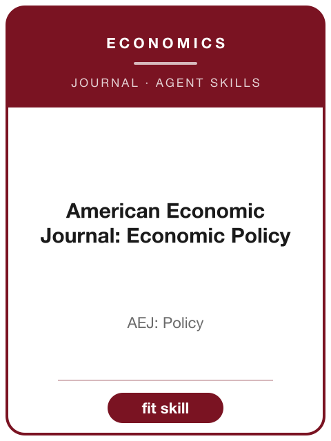

<!-- AJS-ROOT-JOURNAL-ENTRY -->
# AEJ: Economic Policy

> Publishes research on the role of economic policy, spanning public economics, urban and regional economics, regulation, law and economics, and environmental economics.

| At a glance | |
|---|---|
| **Field** | Economics (economic policy) |
| **Publisher** | American Economic Association |
| **Founded** | 2009 |
| **ISSN** | 1945-7731 (print) · 1945-774X (online) |
| **Frequency** | Quarterly |
| **Official** | [aeaweb.org](https://www.aeaweb.org/journals/pol) |
| **Checked** | 2026-06-17 |

**▶ Use the skill — [`aej-economic-policy`](../English-SocialScience-Journal-Skills/skills/aej-economic-policy/):** venue fit, framing, the method-and-evidence bar, house style, and desk-reject heuristics.

Part of the **[English Social-Science Journal Skills](../English-SocialScience-Journal-Skills/)** bundle. Always re-check the live author guidelines on the official site before submitting.

---

<!-- Machine-readable canonical pointer — do not remove or alter (validated by tools/audit_repo.py). -->

- Canonical skill: [English-SocialScience-Journal-Skills/skills/aej-economic-policy/](../English-SocialScience-Journal-Skills/skills/aej-economic-policy/)
- Skill name: `aej-economic-policy`
- Bundle: [English-SocialScience-Journal-Skills/](../English-SocialScience-Journal-Skills/)

This folder intentionally does not contain a `SKILL.md`; the installable skill stays inside the bundle so plugin paths and skill counts remain stable.
