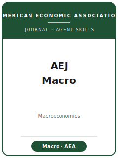

# American Economic Journal: Macroeconomics Skills

<p align="center">
  
</p>

<p align="center">
  
  
  
  
</p>

<p align="center">English | <a href="README.zh-CN.md">简体中文</a></p>

Twelve agent skills for manuscripts targeted at the **American Economic Journal: Macroeconomics
(AEJ: Macro)**, the American Economic Association's quarterly, broad-interest macroeconomics journal
(founded 2009; one of four AEJs). The pack is built around AEJ: Macro's defining feature — it welcomes
**both** quantitative-theoretical work (DSGE, heterogeneous-agent / HANK, structural estimation) **and**
identified-empirical work (SVAR, local projections, narrative and high-frequency identification) — judged
on **quantitative discipline and policy relevance**. It encodes the AEA submission process: the
membership-scaled submission fee, single-blind review, JEL codes, the ≤100-word abstract, the ~40-page
length guidance, per-coauthor disclosure, and the AEA Data Editor's pre-publication reproducibility check
(covering simulation and model-solution code) deposited at the AEA Data and Code Repository on openICPSR.

**Official basis checked 2026-06:** AEJ: Macro submission guidelines, editorial policy, and editors pages;
the AEA Data and Code Availability Policy and Office of the AEA Data Editor; the AEA disclosure policy. See
[`resources/official-source-map.md`](resources/official-source-map.md). Volatile facts (fees, page charge,
editors, length guidance, policy dates) are marked "检索于 2026-06；以官网为准" — verify on the official AEA
pages before relying on a specific number.

## Why a separate stack?

AEJ: Macro is neither the general-interest flagship nor a field outlet, and its process has macro-specific
traps a generic econ stack misses:

| Constraint | AEJ: Macro specifics | Why a generic stack fails |
|---|---|---|
| Methodological breadth | Both quantitative-theory (DSGE/HANK) and identified-empirics (SVAR/LP/narrative) are in scope | A purely-empirical or purely-structural stack mis-frames half the journal |
| Broad-interest bar | Decisions weigh breadth of topic + interest to the AEJ: Macro audience | Field-depth framing reads as JME/RED, not AEJ: Macro |
| Abstract length | ≤100 words (hard) | Most stacks assume 150–250 words |
| Length guidance | ~40pp (11pt) / ~45pp (12pt), incl. figures/tables/refs/appendices | Generic stacks ignore the page budget and the online-appendix split |
| Review model | Single-blind (author known to referee) | Stacks that assume double-blind anonymization mislead |
| Reproducibility | AEA Data Editor checks **before** publication; **simulation/solver code** required | Stacks that package only regression scripts fail the macro check |
| Disclosure | Separate statement **per coauthor**; $10,000 threshold | One-statement assumptions miss a hard requirement |

## Quick Start

**As a Claude Code plugin (recommended).** Add the marketplace and install:

```
/plugin marketplace add brycewang-stanford/aej-macroeconomics-skills
/plugin install aej-macroeconomics-skills
```

Then ask, e.g., "Use aejmac-workflow: my HANK paper got an R&R, what next?" and the router points you to
the right skill.

**Manually.** Copy this directory into your project and point your agent at `skills/<name>/SKILL.md`. Start
with [`skills/aejmac-workflow/SKILL.md`](skills/aejmac-workflow/SKILL.md), the router.

## Default Workflow

```
aejmac-workflow (router)
   │
   ▼
topic-selection → literature-positioning → identification ─┐
                                          theory-model ────┤→ robustness → tables-figures
                                                           │
   writing-style → replication-package → referee-strategy → submission → rebuttal
```

> `identification` (empirical) and `theory-model` (quantitative) are siblings: an empirical paper leans on
> the former, a quantitative paper on the latter, a hybrid visits both.

## Skills

| # | Skill | Use it when |
|---|-------|-------------|
| 1 | [`aejmac-workflow`](skills/aejmac-workflow/SKILL.md) | Route the manuscript from fit through submission and the R&R |
| 2 | [`aejmac-topic-selection`](skills/aejmac-topic-selection/SKILL.md) | Decide whether the paper fits AEJ: Macro vs. AER, JME, RED, AEJ: Applied |
| 3 | [`aejmac-literature-positioning`](skills/aejmac-literature-positioning/SKILL.md) | Stake the contribution vs. the theory and empirical frontiers |
| 4 | [`aejmac-identification`](skills/aejmac-identification/SKILL.md) | Stress-test SVAR / LP / narrative / high-frequency identification |
| 5 | [`aejmac-theory-model`](skills/aejmac-theory-model/SKILL.md) | Discipline a DSGE / HANK / structural model: calibration, identification, numerics |
| 6 | [`aejmac-robustness`](skills/aejmac-robustness/SKILL.md) | Show the headline number survives sample, spec, and method choices |
| 7 | [`aejmac-tables-figures`](skills/aejmac-tables-figures/SKILL.md) | Build IRFs, fan charts, and model-fit exhibits to AEA + macro norms |
| 8 | [`aejmac-writing-style`](skills/aejmac-writing-style/SKILL.md) | Hit the broad-interest intro arc and the ≤100-word abstract |
| 9 | [`aejmac-replication-package`](skills/aejmac-replication-package/SKILL.md) | Assemble the openICPSR package (incl. simulation/solver code) for the AEA Data Editor |
| 10 | [`aejmac-referee-strategy`](skills/aejmac-referee-strategy/SKILL.md) | Pre-empt the objections macro referees raise; gauge desk-reject risk |
| 11 | [`aejmac-submission`](skills/aejmac-submission/SKILL.md) | Final AEA-system preflight: fee tier, abstract, JEL, disclosure |
| 12 | [`aejmac-rebuttal`](skills/aejmac-rebuttal/SKILL.md) | Draft the response letter and revision plan after an R&R |

## Resources

- [`resources/README.md`](resources/README.md) — capability-layer index.
- [`resources/official-source-map.md`](resources/official-source-map.md) — official AEA URLs behind every fact.
- [`resources/external_tools.md`](resources/external_tools.md) — data sources and the macro toolchain (FRED/ALFRED, Dynare, sequence-space-Jacobian, SVAR/LP packages).
- [`resources/worked-examples/01-introduction.md`](resources/worked-examples/01-introduction.md) — a fictional before→after AEJ: Macro introduction.
- [`resources/exemplars/library.md`](resources/exemplars/library.md) — real, web-verified AEJ: Macro papers by method × topic.
- [`resources/code/`](resources/code/) — a vendored empirical-methods code skeleton (a *starting point* for macro; add SVAR/LP/DSGE code).

## Differences vs. siblings

| Journal | Niche | This pack's stance |
|---|---|---|
| **AEJ: Macro** | Broad-interest macro; quantitative-theory **and** identified-empirics; AEA process | The target of this pack |
| **AER** | Top general-interest; first-order, longer papers | Send the field-reshaping result there; AEJ: Macro is high-quality, not the flagship |
| **J. Monetary Economics** | Field-macro depth for specialists | If breadth is thin, JME fits better |
| **RED** | Quantitative dynamics / methods for the macro-methods community | A pure dynamic-GE methods paper fits RED |
| **AEJ: Applied** | Micro-empirical applied identification | A micro paper touching aggregates fits AEJ: Applied |

## Related

- Reference pack: `../Quantitative-Economics-Skills/` (Econometric Society, structurally identical).
- Shared method hub: [`../shared-resources/empirical-methods/`](../shared-resources/empirical-methods/).

## License

MIT © 2026 Bryce Wang. See [LICENSE](LICENSE).
