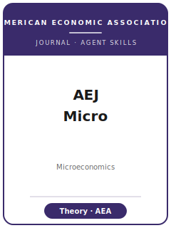

# American Economic Journal: Microeconomics Skills

<p align="center">
  
</p>

[](LICENSE)
[](https://www.aeaweb.org/journals/mic)
[](https://www.aeaweb.org/journals/mic)
[](https://github.com/anthropics/claude-code)

English | [简体中文](README.zh-CN.md)

Twelve agent skills for manuscripts targeted at the **American Economic Journal: Microeconomics
(AEJ: Micro)** — the **American Economic Association's** quarterly journal (founded 2009, one of four AEJs)
for **microeconomic theory and its applications** (Print ISSN 1945-7669 / Online ISSN 1945-7685), submitted
via the AEA submission system.

This repository is opinionated and **theory-first**. AEJ: Micro "publishes theoretical work as well as both
empirical and experimental work with a theoretical framework," and the deciding criterion is a **clean,
general, well-motivated micro-theory result** of **broad** interest — game theory, mechanism and market
design, industrial-organization theory, contract theory, information economics, decision and behavioral
theory, and theory-grounded experiments. The **central skill is `aejmic-theory-model`** (model setup,
equilibrium concept, proof strategy, generality vs. tractability). Empirical, structural, and experimental
work belongs here **only when the theory is the point**.

Official basis checked 2026-06: AEJ: Micro journal home, editors, submission guidelines, and editorial
policy on aeaweb.org, plus the AEA Data and Code Availability Policy / Office of the AEA Data Editor. See
[`resources/official-source-map.md`](resources/official-source-map.md).

---

## Why a Separate AEJ: Micro Skill Stack?

AEJ: Micro's constraints differ materially from an empirical flagship and from specialist theory journals:

| Constraint            | AEJ: Micro                                                       | Implication                                                            |
|-----------------------|-----------------------------------------------------------------|-----------------------------------------------------------------------|
| Core deliverable      | A **clean, broadly interesting theorem / characterization**     | A coefficient with no central theory result is off-fit                 |
| Scope gate            | Theory-first; empirical/experimental **with a theory framework** | Stand-alone empirical applied-micro belongs at **AEJ: Applied**        |
| Audience              | **Broad** micro interest + the **AEA process**                  | Maximal-generality, specialist-only work fits **JET / GEB** instead    |
| "Identification"      | Which **assumption is doing the work**; what makes it tight     | For pure theory there is no causal design — credibility is the proof   |
| House style           | Numbered propositions; **proofs in appendix**; numerical examples | Narrative-empirical formatting reads as off-template                   |
| Statistical reporting | **Standard errors / confidence sets, not significance asterisks** | Asterisk tables are an AEA house-style anti-pattern                    |
| Review                | **Single-blind** (referee sees author; referee anonymous)       | No anonymization burden — the paper stands on rigor, not blinding      |
| Abstract              | **≤100 words**                                                  | A long abstract fails the format check                                 |
| Data / replication    | **AEA Data and Code Availability Policy** (AEA Data Editor; openICPSR) | Empirical/simulation/experimental work verified **before acceptance**; theory deposits numerical-example code |

Volatile specifics — the **current submission fee**, the exact **JEL-requirement wording**, and the
**founding-year** statement — are confirmed for 2026-06 where possible and otherwise marked **待核实**. See
[`resources/official-source-map.md`](resources/official-source-map.md).

> **Submission fee vs. publication fee, do not conflate:** AEJ: Micro charges a **submission fee** (AEA
> member $200 / $100 / $0 by country income; nonmember higher — volatile) *and*, separately, a **$15 per
> typeset page** publication fee assessed at page proofs.

---

## Quick Start

### Option A — Claude Code Plugin (recommended)

```bash
/plugin marketplace add https://github.com/brycewang-stanford/aej-microeconomics-skills
/plugin install aej-microeconomics-skills
/reload-plugins
```

### Option B — Manual Copy

```bash
git clone https://github.com/brycewang-stanford/aej-microeconomics-skills.git
cd aej-microeconomics-skills

mkdir -p ~/.claude/skills && cp -R skills/aejmic-* ~/.claude/skills/
# or
mkdir -p ~/.codex/skills && cp -R skills/aejmic-* ~/.codex/skills/
```

### First Prompt

```
Use aejmic-workflow to tell me which skill I should use next for my AEJ: Micro theory paper.
```

---

## Default Workflow

```text
aejmic-topic-selection         (broad-interest micro-theory fit? not JET/GEB/TE/AEJ:Applied)
        ▼
aejmic-literature-positioning  (stake the theorem-relative delta vs. the closest result)
        ▼
aejmic-theory-model            ★ CENTRAL: model, equilibrium concept, proof strategy
        ▼
aejmic-identification          (which assumption is doing the work / what identifies it)
        ▼
aejmic-robustness              (extensions, edge cases, applied robustness)
        ▼
aejmic-tables-figures          (propositions, numerical examples, experimental tables)
        ▼
aejmic-writing-style           (theory-paper intro arc; polish — last)
        ▼
aejmic-replication-package     (proof appendix + numerical/structural/experimental code)
        ▼
aejmic-referee-strategy        (pre-empt the objections theory referees raise)
        ▼
aejmic-submission              (AEA system preflight: single-blind, 100-word abstract, fee)
        ▼
aejmic-rebuttal                (single-blind R&R response letter)
```

`aejmic-workflow` is the router — it tells you which skill to use next based on where you are.

---

## Skills

| Skill                          | Purpose                                                                           |
|--------------------------------|-----------------------------------------------------------------------------------|
| `aejmic-workflow`              | Router — decides which sub-skill to invoke next                                    |
| `aejmic-topic-selection`       | Theory-first, broad-interest scope gate (vs. JET/GEB, TE/Econometrica, AEJ:Applied) |
| `aejmic-literature-positioning`| Theorem-relative delta against the closest existing result                         |
| `aejmic-identification`        | What makes the result tight (theory) / what the data identify (structural/exp.)    |
| `aejmic-theory-model`          | **Central** — model setup, equilibrium concept, proof strategy, generality         |
| `aejmic-robustness`            | Extensions, edge cases, perturbations; applied/experimental robustness             |
| `aejmic-tables-figures`        | Propositions, numerical examples, schematic figures, empirical tables              |
| `aejmic-writing-style`         | AEA house style and the theory-paper intro arc                                     |
| `aejmic-replication-package`   | Proof appendix + AEA Data Editor code/data deposit (incl. numerical examples)      |
| `aejmic-referee-strategy`      | Anticipate expert-referee objections; read the single-blind process               |
| `aejmic-submission`            | AEA system preflight (single-blind, 100-word abstract, JEL, fee, data policy)      |
| `aejmic-rebuttal`              | R&R response strategy (correctness / generality / exposition)                      |

### Resources

- [`resources/README.md`](resources/README.md) — capability layer index; theory vs. empirical-subset split
- [`resources/official-source-map.md`](resources/official-source-map.md) — official AEA / AEJ: Micro URLs behind every fact, with `待核实` flags
- [`resources/external_tools.md`](resources/external_tools.md) — LaTeX/proof toolchain plus the structural/empirical/experimental kit
- [`resources/exemplars/library.md`](resources/exemplars/library.md) — real, web-verified AEJ: Micro papers by area (`10.1257/mic` DOI stem)
- [`resources/worked-examples/01-introduction.md`](resources/worked-examples/01-introduction.md) — before→after theory-paper introduction in AEJ: Micro style
- [`resources/code/`](resources/code/) — runnable Stata/Python skeleton for the empirical/structural subset only

---

## Differences vs. Other Stacks

| Dimension          | AEJ: Micro                              | JET / GEB (specialist theory)     | AEJ: Applied (empirical)        |
|--------------------|-----------------------------------------|-----------------------------------|---------------------------------|
| Lead with          | A broadly interesting theorem           | A general/technical theory advance| A causal empirical finding      |
| "Identification"   | Which assumption is load-bearing        | Assumptions + maximal generality  | Design (RCT/DID/IV/RDD)         |
| Audience / process | Broad micro + AEA editorial process     | Specialist theory community       | Applied-micro + AEA process     |
| Review             | **Single-blind**                        | Single/double per journal         | Single-blind                    |
| Data / replication | AEA Data Editor; openICPSR              | Encouraged, varies                | AEA Data Editor; openICPSR      |
| House style        | Numbered props; SEs not asterisks       | Theorem-proof, publisher LaTeX    | Author-date; SEs not asterisks  |

---

## What This Repo Does Not Do

- It does not write a submittable proof or manuscript for you
- It does not check whether your theorem is correct — that is the author's and referees' job
- It does not assert volatile metadata (current fee, exact JEL wording, founding year) — these are marked `待核实` or dated 2026-06; verify on the official AEA page
- It does not judge whether your contribution is genuinely original or broadly interesting — that is the researcher's call

---

## Related

- [awesome-journal-skills](https://github.com/brycewang-stanford/awesome-journal-skills) — Index of journal-specific skill packs
- [AEJ: Microeconomics (official)](https://www.aeaweb.org/journals/mic) — American Economic Association

---

## License

MIT — Copyright (c) 2026 Bryce Wang. See [LICENSE](LICENSE).
