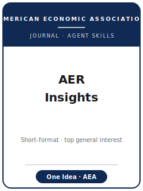

# AER: Insights Skills

<p align="center"></p>

[](LICENSE)
[](https://www.aeaweb.org/journals/aeri)
[](resources/official-source-map.md)
[](https://www.aeaweb.org/journals/aeri/submissions)

English | [简体中文](README.zh-CN.md)

Twelve agent skills for **short-format** manuscripts targeted at **American Economic Review: Insights
(AER: Insights)** — the American Economic Association's journal (founded 2019) for **short, self-contained
papers built around ONE important, well-executed idea** (empirical, theoretical, or methodological). The bar
is **AER-level importance compressed into a short paper**. The whole pack is engineered around two hard
constraints: the **length cap** (≤7,000 words with no exhibits, minus 200 per exhibit, maximum five
exhibits, abstract ≤100 words) and the **single-insight discipline** — everything secondary goes to the
online Supplemental Appendix. It also encodes the journal's **fast, decisive review** (no traditional
revise-and-resubmit; first decisions are conditional accept or reject), the AEA submission portal, fees,
metadata/classifications, and the AEA Data and Code Availability Policy.

**Official basis checked 2026-06-20:** AEA / AER: Insights submission, editorial-policy, editors,
style-guide, accepted-article, JEL, and AEA Data and Code Availability pages. Sources and live-check
items are in [`resources/official-source-map.md`](resources/official-source-map.md).

## Why a separate stack?

| AER: Insights constraint | What it forces on the manuscript |
|--------------------------|----------------------------------|
| Hard length cap (≤7,000 words − 200/exhibit; ≤5 exhibits; abstract ≤100 words) | Over the cap → **returned unreviewed**; cut to fit from day one |
| One idea per paper | A single headline result carries everything; secondary results go to the appendix |
| Lead-with-the-result writing | The answer (with SE/CI) appears in the first paragraph, not Section 4 |
| No traditional R&R | First decision is conditional accept or reject — pre-empt objections **before** submitting |
| Conditional accept (~8 weeks, usually no second referee round) | The revision is finishing, not relitigating |
| AEA house presentation | **Single-blind** review; title/byline/affiliations on the first page; no significance asterisks |
| AEA Data & Code Availability Policy | openICPSR deposit verified by the AEA Data Editor **before** publication (appendix in scope) |

## Quick Start

**As a Claude Code plugin** — point your marketplace at this directory and enable the plugin:

```
/plugin marketplace add ./AER-Insights-Skills
/plugin install aer-insights-skills
```

**Manually** — each skill is a self-contained `SKILL.md` under `skills/`. Open `skills/aeri-workflow/SKILL.md`
first; it routes you to the right skill for your current stage.

## Default Workflow

```
aeri-topic-selection → aeri-literature-positioning → aeri-identification → aeri-theory-model
   → aeri-robustness → aeri-tables-figures → aeri-writing-style → aeri-replication-package
   → aeri-referee-strategy → aeri-submission → aeri-rebuttal
                         (aeri-workflow routes among all of the above)
```

## Skills

| # | Skill | What it does |
|---|-------|--------------|
| 1 | [`aeri-workflow`](skills/aeri-workflow/SKILL.md) | Router — diagnose the current bottleneck and route to the right skill |
| 2 | [`aeri-topic-selection`](skills/aeri-topic-selection/SKILL.md) | Confirm ONE crisp, important, well-identified insight that stands alone (vs AER / AEJ) |
| 3 | [`aeri-literature-positioning`](skills/aeri-literature-positioning/SKILL.md) | Stake the contribution in one or two paragraphs — no survey |
| 4 | [`aeri-identification`](skills/aeri-identification/SKILL.md) | Make the design or parameter identification clean enough to defend short |
| 5 | [`aeri-theory-model`](skills/aeri-theory-model/SKILL.md) | Keep only the minimal model the single insight requires |
| 6 | [`aeri-robustness`](skills/aeri-robustness/SKILL.md) | Triage checks: ≤2 in-text, the rest to the Supplemental Appendix |
| 7 | [`aeri-tables-figures`](skills/aeri-tables-figures/SKILL.md) | Fit the five-exhibit budget, one page each, no significance asterisks |
| 8 | [`aeri-writing-style`](skills/aeri-writing-style/SKILL.md) | Lead with the result; enforce the word cap and the ≤100-word abstract |
| 9 | [`aeri-replication-package`](skills/aeri-replication-package/SKILL.md) | Build the openICPSR deposit for the AEA Data Editor check |
| 10 | [`aeri-referee-strategy`](skills/aeri-referee-strategy/SKILL.md) | Understand the fast, decisive review; pre-empt the objections short papers cannot survive |
| 11 | [`aeri-submission`](skills/aeri-submission/SKILL.md) | Final preflight: word/exhibit gates, abstract, author metadata, fee, declarations, data policy |
| 12 | [`aeri-rebuttal`](skills/aeri-rebuttal/SKILL.md) | Draft the concise conditional-accept response and revision plan |

## Resources

- [`resources/README.md`](resources/README.md) — capability-layer index
- [`resources/official-source-map.md`](resources/official-source-map.md) — official AEA / AER: Insights URLs behind every fact
- [`resources/external_tools.md`](resources/external_tools.md) — data sources, software, packages for short empirical/structural/methods work
- [`resources/worked-examples/01-introduction.md`](resources/worked-examples/01-introduction.md) — a before→after AER: Insights introduction that leads with the single result (fictional)
- [`resources/exemplars/library.md`](resources/exemplars/library.md) — real, web-verified AER: Insights papers by method × topic
- [`resources/code/`](resources/code/) — reproducible Stata + Python causal-inference skeleton (vendored)

## Differences vs. AER / AEJ

| Journal | Niche | This pack's positioning |
|---------|-------|-------------------------|
| **AER: Insights** | **One** important idea, **short**, **fast** review | The target of this pack |
| **American Economic Review (AER)** | General-interest, **multi-result**, longer flagship | AER: Insights takes single-idea papers that do not need AER's length |
| **AEJ family (Applied / Micro / Macro / Policy)** | **Field-oriented full papers** | AER: Insights is **general-interest and short**, not field-internal |
| **QJE / JPE / Econometrica** | Long, agenda-setting field/general papers | AER: Insights is deliberately a short outlet for a single clean insight |

## Related

- AER: Insights: https://www.aeaweb.org/journals/aeri
- AER: Insights submission guidelines: https://www.aeaweb.org/journals/aeri/submissions
- AEA Data and Code Availability Policy: https://www.aeaweb.org/journals/policies/data-code

## License

MIT © 2026 Bryce Wang. See [LICENSE](LICENSE).
