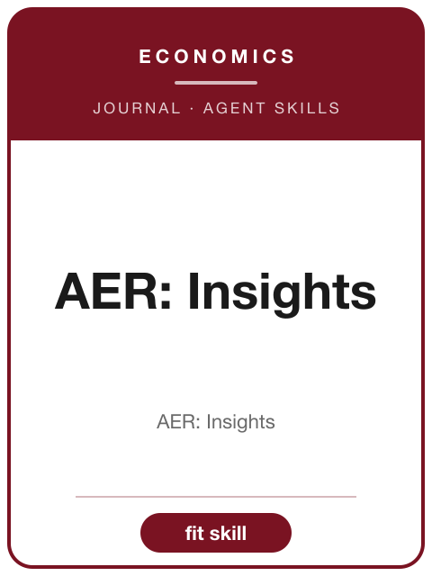

<!-- AJS-ROOT-JOURNAL-ENTRY -->
# AER: Insights

> A general-interest journal publishing papers of American Economic Review quality whose important insights can be conveyed succinctly.

| At a glance | |
|---|---|
| **Field** | Economics (general interest) |
| **Publisher** | American Economic Association |
| **Founded** | 2019 |
| **ISSN** | 2640-205X (print) · 2640-2068 (online) |
| **Frequency** | Quarterly |
| **Official** | [aeaweb.org](https://www.aeaweb.org/journals/aeri) |
| **Checked** | 2026-06-17 |

**▶ Use the skill — [`aer-insights`](../English-SocialScience-Journal-Skills/skills/aer-insights/):** venue fit, framing, the method-and-evidence bar, house style, and desk-reject heuristics.

Part of the **[English Social-Science Journal Skills](../English-SocialScience-Journal-Skills/)** bundle. Always re-check the live author guidelines on the official site before submitting.

---

<!-- Machine-readable canonical pointer — do not remove or alter (validated by tools/audit_repo.py). -->

- Canonical skill: [English-SocialScience-Journal-Skills/skills/aer-insights/](../English-SocialScience-Journal-Skills/skills/aer-insights/)
- Skill name: `aer-insights`
- Bundle: [English-SocialScience-Journal-Skills/](../English-SocialScience-Journal-Skills/)

This folder intentionally does not contain a `SKILL.md`; the installable skill stays inside the bundle so plugin paths and skill counts remain stable.
