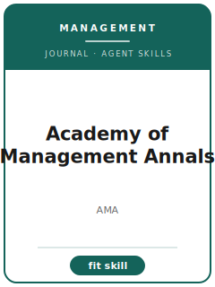

# Academy of Management Annals Skills

<p align="center"></p>

[English](README.md) | 简体中文

面向 **Academy of Management Annals（Annals）** 投稿的 12 个 agent skills。本包围绕 commissioned and high-level reviews that synthesize management and organization research 设计，帮助稿件区别于 Academy of Management Review, Journal of Management, Journal of Management Studies, and Annual Review outlets，并强调 field-defining synthesis that reorganizes theory rather than merely cataloging papers。

**官方依据核验日期：2026-06**（投稿前需复核易变细节）：见 [`resources/official-source-map.md`](resources/official-source-map.md)。

## 为什么需要单独的技能栈？

| Annals 约束 | 对稿件的要求 |
|-------------------|--------------|
| 范围 | 主张必须服务于 commissioned and high-level reviews that synthesize management and organization research |
| 同门边界 | 说明为什么不是 Academy of Management Review, Journal of Management, Journal of Management Studies, and Annual Review outlets |
| 证据标准 | 设计、模型、综述或质性证据必须匹配 field-defining synthesis that reorganizes theory rather than merely cataloging papers |
| 来源纪律 | 当前流程事实必须有来源，或明确标记 待核实 |

## 快速开始

```text
/plugin marketplace add ./Academy-of-Management-Annals-Skills
/plugin install academy-of-management-annals-skills
```

手动使用：先打开 [`skills/amann-workflow/SKILL.md`](skills/amann-workflow/SKILL.md)。

## 默认工作流

```text
amann-workflow → amann-topic-selection → amann-proposal-framing → amann-literature-synthesis → amann-organizing-framework → amann-evidence-standards → amann-tables-figures → amann-writing-style → amann-editor-strategy → amann-submission → amann-review-process → amann-revision
```

## 技能列表

| # | Skill | 作用 |
|---|-------|------|
| 1 | [`amann-workflow`](skills/amann-workflow/SKILL.md) | 面向 Annals 稿件的 Workflow Router |
| 2 | [`amann-topic-selection`](skills/amann-topic-selection/SKILL.md) | 面向 Annals 稿件的 Topic Selection |
| 3 | [`amann-proposal-framing`](skills/amann-proposal-framing/SKILL.md) | 面向 Annals 稿件的 Proposal Framing |
| 4 | [`amann-literature-synthesis`](skills/amann-literature-synthesis/SKILL.md) | 面向 Annals 稿件的 Literature Synthesis |
| 5 | [`amann-organizing-framework`](skills/amann-organizing-framework/SKILL.md) | 面向 Annals 稿件的 Organizing Framework |
| 6 | [`amann-evidence-standards`](skills/amann-evidence-standards/SKILL.md) | 面向 Annals 稿件的 Evidence Standards |
| 7 | [`amann-tables-figures`](skills/amann-tables-figures/SKILL.md) | 面向 Annals 稿件的 Tables and Figures |
| 8 | [`amann-writing-style`](skills/amann-writing-style/SKILL.md) | 面向 Annals 稿件的 Writing Style |
| 9 | [`amann-editor-strategy`](skills/amann-editor-strategy/SKILL.md) | 面向 Annals 稿件的 Editor Strategy |
| 10 | [`amann-submission`](skills/amann-submission/SKILL.md) | 面向 Annals 稿件的 Submission Preflight |
| 11 | [`amann-review-process`](skills/amann-review-process/SKILL.md) | 面向 Annals 稿件的 Review Process |
| 12 | [`amann-revision`](skills/amann-revision/SKILL.md) | 面向 Annals 稿件的 Revision Strategy |

## 资源

- [`resources/README.md`](resources/README.md) — 资源索引
- [`resources/official-source-map.md`](resources/official-source-map.md) — 官方 URL 与易变信息
- [`resources/external_tools.md`](resources/external_tools.md) — 数据库、方法与软件工具
- [`resources/worked-examples/01-introduction.md`](resources/worked-examples/01-introduction.md) — 虚构引言改写示例
- [`resources/exemplars/library.md`](resources/exemplars/library.md) — 真实论文槽位与来源纪律
- [`resources/code/`](resources/code/) — 适用时使用的实证代码脚手架

## 许可

MIT (c) 2026 Bryce Wang。见 [LICENSE](LICENSE)。
