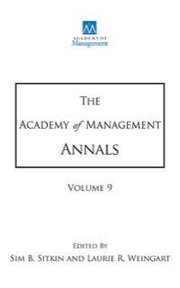

<!-- AJS-ROOT-JOURNAL-ENTRY -->
# Academy of Management Annals

> Publishes comprehensive, integrative review articles that synthesize and advance management and organization research.

| At a glance | |
|---|---|
| **Field** | Management (review journal) |
| **Publisher** | Routledge (Taylor & Francis), for the Academy of Management |
| **Founded** | 2007 |
| **ISSN** | 1941-6520 (print) · 1941-6067 (online) |
| **Frequency** | Semiannual |
| **Standing** | SSCI |
| **Official** | [journals.aom.org](https://journals.aom.org/journal/annals) |
| **Checked** | 2026-06-17 |

**▶ Use the skill — [`academy-of-management-annals`](../English-SocialScience-Journal-Skills/skills/academy-of-management-annals/):** venue fit, framing, the method-and-evidence bar, house style, and desk-reject heuristics.

Part of the **[English Social-Science Journal Skills](../English-SocialScience-Journal-Skills/)** bundle. Always re-check the live author guidelines on the official site before submitting.

---

<!-- Machine-readable canonical pointer — do not remove or alter (validated by tools/audit_repo.py). -->

- Canonical skill: [English-SocialScience-Journal-Skills/skills/academy-of-management-annals/](../English-SocialScience-Journal-Skills/skills/academy-of-management-annals/)
- Skill name: `academy-of-management-annals`
- Bundle: [English-SocialScience-Journal-Skills/](../English-SocialScience-Journal-Skills/)

This folder intentionally does not contain a `SKILL.md`; the installable skill stays inside the bundle so plugin paths and skill counts remain stable.
