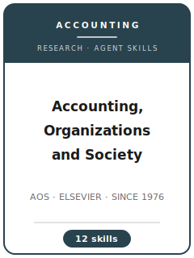

# Accounting, Organizations and Society (AOS) Skills

<p align="center">
  
</p>

[](LICENSE)
[](https://www.sciencedirect.com/journal/accounting-organizations-and-society)
[](https://www.sciencedirect.com/journal/accounting-organizations-and-society)
[](https://github.com/anthropics/claude-code)

English | [简体中文](README.zh-CN.md)

Agent skill stack for manuscripts targeted at **Accounting, Organizations and Society (AOS)** — the flagship interdisciplinary accounting journal, launched in **1976 by Anthony Hopwood** and published by **Elsevier** (ISSN 0361-3682).

This repository is opinionated. It is **not** a generic "accounting writing" toolbox, and it is emphatically not a capital-markets stack. AOS exists to study the **social, organizational, behavioral and institutional** life of accounting: qualitative field studies, experimental/behavioral work, surveys, historical and critical scholarship, and archival designs that carry real social theory. The journal's canonical desk reject is the JAR/JAE/TAR-style archival-financial-economics paper with no organizational or social theorizing — so this stack is built theory-first, routes by intellectual tradition (institutional theory, governmentality, Bourdieu, actor-network theory, practice theory, psychological process), and enforces the qualitative rigor bar the journal itself canonized (Ahrens & Chapman 2006).

> Durable norms only. Editors, portal behavior, article types, and open-access pricing change — always verify on the official ScienceDirect/Elsevier AOS pages and in Editorial Manager (facts in this pack checked 2026-07-16).

---

## Why a Separate AOS Skill Stack?

AOS's constraints differ in kind, not degree, from both the US archival accounting journals and the management journals:

| Constraint            | Accounting, Organizations and Society (AOS)                              | Implication                                                     |
|-----------------------|---------------------------------------------------------------------------|------------------------------------------------------------------|
| Mission               | Social, organizational, behavioral, institutional aspects of accounting  | Capital-markets papers without social theory are desk-rejected  |
| Method stance         | Plural: field studies, experiments, surveys, historical, archival+theory | Advice must branch by tradition, and the bars differ per tradition |
| Theory                | Theory-first: the conceptual claim is the product                        | Institutional / Foucault / Bourdieu / ANT / practice / JDM traditions must do real work |
| Canon                 | 50 years of its own archive defines the conversations                    | Positioning happens against AOS threads, not JAR/TAR debates    |
| Editors               | Three joint EiCs spanning the traditions (Annisette / Messner / Tan)     | Triage is tradition-aware; write for the editor who will champion you |
| Review                | Double-anonymized, interdisciplinary referees                            | A sociology reader and a JDM reader may referee the same paper  |
| Length                | No fixed word cap published; long interpretive papers normal             | Freedom is a discipline test — every page must be load-bearing  |
| Fees                  | No submission fee found (re-check); optional hybrid OA with personalized APC | Budget only if electing gold OA; confirm the APC at submission |
| Field-data transparency | Consent and site anonymity restrict sharing                             | Disclose the corpus precisely; never oversell shareability      |

Generic "scientific writing" or single-tradition method packs do not address these constraints.

---

## Quick Start

### Option A — Claude Code Plugin (recommended)

```bash
/plugin marketplace add https://github.com/brycewang-stanford/aos-skills
/plugin install aos-skills
/reload-plugins
```

### Option B — Manual Copy

```bash
git clone https://github.com/brycewang-stanford/aos-skills.git
cd aos-skills

mkdir -p ~/.claude/skills && cp -R skills/aos-* ~/.claude/skills/
# or
mkdir -p ~/.codex/skills && cp -R skills/aos-* ~/.codex/skills/
```

### First Prompt

```
Use aos-workflow to tell me which skill I should use next for my AOS manuscript.
```

---

## Default Workflow

```text
aos-topic-selection
        ▼
aos-theory-development
        ▼
aos-literature-positioning
        ▼
aos-methods
        ▼
aos-data-analysis
        ▼
aos-contribution-framing
        ▼
aos-tables-figures
        ▼
aos-writing-style        (polish)
        ▼
aos-submission
        ▼
aos-review-process
        ▼
aos-rebuttal
```

`aos-workflow` is the router — it names the next skill based on where you are, starting from which intellectual tradition (qualitative field / experimental-behavioral / survey / historical-critical / archival-with-theory) your paper works in.

---

## Skills

| Skill                        | Purpose                                                                          |
|------------------------------|-----------------------------------------------------------------------------------|
| `aos-workflow`               | Router — decides which sub-skill to invoke next, by intellectual tradition        |
| `aos-topic-selection`        | Fit with AOS's social/organizational mission; the "no security prices" test       |
| `aos-theory-development`     | Choose and inhabit a theory tradition (institutional / Foucault / Bourdieu / ANT / practice / JDM) |
| `aos-literature-positioning` | Enter one of AOS's own 50-year conversations; engage the interdisciplinary sources |
| `aos-methods`                | Field-study, experiment, survey, and historical design; ethics and site anonymity  |
| `aos-data-analysis`          | Qualitative coding & evidence chains; experimental/survey estimation; audit trails |
| `aos-contribution-framing`   | A conceptual claim that changes the conversation — and gives back to the theory   |
| `aos-tables-figures`         | Data-inventory & evidence tables, cell-means exhibits, theory-carrying figures    |
| `aos-writing-style`          | Argumentative long-form prose; length discipline without a cap; anonymization     |
| `aos-submission`             | Editorial Manager preflight (anonymized files, title page, declarations, OA)      |
| `aos-review-process`         | Joint-EiC triage, interdisciplinary referees, reading the decision letter         |
| `aos-rebuttal`               | R&R plan — recoding, new conditions, re-theorizing — and the point-by-point letter |

### Resources

- [`resources/external_tools.md`](resources/external_tools.md) — tradition-by-tradition toolkit (NVivo/ATLAS.ti and evidence registers; Qualtrics/Prolific/oTree; survey psychometrics; Stata/R archival stack)
- [`resources/official-source-map.md`](resources/official-source-map.md) — official Elsevier/ScienceDirect URLs behind every verified fact (checked 2026-07-16)
- [`resources/exemplars/library.md`](resources/exemplars/library.md) — the AOS canon by tradition × topic, each with a self-check question
- [`resources/worked-examples/01-introduction.md`](resources/worked-examples/01-introduction.md) — before → after AOS-style introduction (fictional field study)

---

## Differences vs. JAR / JAE / TAR / CAR

| Dimension        | AOS                                            | JAR / JAE                        | TAR                        | CAR                                |
|------------------|--------------------------------------------------|-----------------------------------|----------------------------|-------------------------------------|
| Publisher        | Elsevier (founded by Hopwood, 1976)             | Chicago Booth–Wiley / Elsevier    | American Accounting Assoc. | CAAA / Wiley                        |
| Core question    | Accounting's social & organizational operation  | Accounting in markets & contracting | Broad, archival-leaning  | Method-agnostic accounting          |
| Theory base      | Sociology, organization theory, psychology      | Financial economics               | Economics/psychology mix   | Economics + psychology              |
| Modal method     | Qualitative field study; experiments            | Archival                          | Archival                   | Archival, plus broad tent           |
| Fatal misfit     | Capital-markets paper without social theorizing | Interpretive fieldwork            | —                          | Pure finance in accounting clothes  |

If your paper's payoff is a pricing or earnings-quality coefficient, AOS is the wrong target; if its payoff is a changed understanding of what accounting *does* in organizations and society, nothing else is the right one.

---

## Related

- [awesome-journal-skills](https://github.com/brycewang-stanford/awesome-journal-skills) — index of journal-specific skill packs
- [Contemporary-Accounting-Research-Skills](https://github.com/brycewang-stanford) — CAR skill pack (the method-agnostic sibling)

---

## License

MIT
