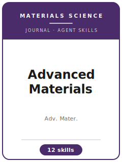

# Advanced Materials Skills

<p align="center">
  
</p>

[](LICENSE)
[](https://advanced.onlinelibrary.wiley.com/journal/15214095)
[](https://www.wiley.com/)
[](https://github.com/anthropics/claude-code)

[English](README.md) | 简体中文

面向 **Advanced Materials（Adv. Mater.，先进材料）** 投稿的智能体技能栈——由 Wiley-VCH 出版的旗舰级、极高影响力材料科学期刊，每周出版，覆盖**全部**材料科学领域：材料化学、纳米技术、能源材料（电池、光伏、催化）、电子与光电子、生物材料等。

本仓库是高度定制化的。它**不是**通用的材料写作工具箱，而是围绕 Adv. Mater. 的核心标准构建的 **Adv. Mater. 专用**技能栈：成果必须是真正的**材料科学突破**——一种新材料、新机制或新性质，而非增量式优化——并经过**多种互补技术的严格表征**，最好推进到**与当前最先进水平（SOTA）基准对比的器件级演示**，且以**封面级质量的图**呈现。

---

## 为什么需要独立的 Adv. Mater. 技能栈？

Advanced Materials 的门槛与 Wiley "Advanced" 系列中优秀的姊妹期刊（Advanced Functional Materials、Advanced Science、Small、Advanced Materials Interfaces）有本质区别：

| 约束               | Advanced Materials                                       | 含义                                                       |
|--------------------|----------------------------------------------------------|------------------------------------------------------------|
| 准入门槛            | 真正的突破**且**广泛影响（两者缺一不可）                 | 即使完美无缺，增量式优化也会因影响力不足被拒                |
| 读者群             | 全体材料科学家，而非仅你的子领域                          | 开篇/摘要必须让子领域之外的读者也能读懂                    |
| 表征               | 对"结构→性质"论断进行多技术三角互证                       | 仅一张 XRD 或一张 TEM 图远远不够                            |
| 基准对比            | 在文中与最佳已报道体系公平比较                            | 只有一个"记录数字"而无基准对比会被视为缺乏支撑             |
| 篇幅格式            | Communication（约 4 排版页）vs. Research Article（约 10 页） | 篇幅按排版页计，图与正文一并计入                            |
| Communication 摘要 | **开篇段落即充当摘要**                                    | 第一段必须独立成立并推销该突破                              |
| 图                 | 封面级质量，另加必需的目录（TOC）图                       | 图 1 必须让人一眼看懂突破；TOC 图负责吸引读者               |
| 投稿信             | 必须向编辑论证突破 + 广泛影响                             | 漏掉"广泛影响"这一条是最常见的失误                          |
| 流程               | Wiley 编辑 + 审稿人；高度选择性，按影响力初筛             | 即使正确也可能因新颖性/影响力被拒；存在转投途径             |

通用的"科学写作"技能包无法应对"突破 vs. 优化"门槛、多技术三角互证、基准对比纪律，以及 Communication 与 Article 的格式区别。

> 易变的具体数值（当前各文章类型的页数上限、图像 DPI/格式、TOC 图规格、投稿系统、开放获取费 APC、必需声明）会变化——请务必在 Wiley Advanced Materials 官方作者页面核实。

---

## 快速开始

### 方式 A —— Claude Code 插件（推荐）

```bash
/plugin marketplace add https://github.com/brycewang-stanford/advmat-skills
/plugin install advmat-skills
/reload-plugins
```

### 方式 B —— 手动复制

```bash
git clone https://github.com/brycewang-stanford/advmat-skills.git
cd advmat-skills

mkdir -p ~/.claude/skills && cp -R skills/advmat-* ~/.claude/skills/
# 或
mkdir -p ~/.codex/skills && cp -R skills/advmat-* ~/.codex/skills/
```

### 首个提示词

```
用 advmat-workflow 告诉我，我的 Advanced Materials 稿件下一步该用哪个技能。
```

---

## 默认工作流

```text
advmat-scope-fit
        ▼
advmat-results-framing
        ▼
advmat-methods
        ▼
advmat-figures
        ▼
advmat-supplementary
        ▼
advmat-writing-style       （润色）
        ▼
advmat-length-management   （适配文章类型格式）
        ▼
advmat-cover-letter
        ▼
advmat-submission
        ▼
advmat-referee-strategy
        ▼
advmat-revision
```

`advmat-workflow` 是路由器——它根据你当前所处的阶段，告诉你下一步该用哪个技能。

---

## 技能列表

| 技能                      | 用途                                                                         |
|---------------------------|------------------------------------------------------------------------------|
| `advmat-workflow`         | 路由器——决定下一步调用哪个子技能                                             |
| `advmat-scope-fit`        | 突破 + 广泛影响门槛；Adv. Mater. 还是 AFM / Adv. Sci. / Small / AMI          |
| `advmat-results-framing`  | 单一突破叙事、结构→性质→功能因果链、Communication 开篇段落即摘要             |
| `advmat-methods`          | 多技术表征、基准对比、可复现性；正文 vs. 实验部分 vs. 支持信息               |
| `advmat-figures`          | 封面级首图、多子图表征图、目录（TOC）图                                      |
| `advmat-supplementary`    | 把扩展数据/完整实验细节下放到支持信息；保证正文独立成立                       |
| `advmat-writing-style`    | Wiley 文风、去浮夸、规范命名/单位、跨子领域可读性                            |
| `advmat-length-management`| 适配 Communication（约 4 页）或 Research Article（约 10 页）格式；图与正文一并计入 |
| `advmat-cover-letter`     | 向编辑论证突破 + 广泛影响                                                    |
| `advmat-submission`       | 投稿前预检 + Adv. Mater. 模板（文章类型、文件、TOC、ORCID）                  |
| `advmat-referee-strategy` | 推荐 / 回避审稿人；预先化解表征与基准对比方面的异议                          |
| `advmat-revision`         | 审稿意见回复、再投稿，以及 Wiley 转投途径                                    |

### 资源

- [`skills/advmat-submission/templates/manuscript_template.md`](skills/advmat-submission/templates/manuscript_template.md) —— Adv. Mater. 骨架（标题、摘要/开篇、正文、实验部分、图/TOC 预算、支持信息提纲、投稿信）
- [`skills/advmat-submission/templates/checklist.md`](skills/advmat-submission/templates/checklist.md) —— 10 大类投稿前自检清单
- [`resources/external_tools.md`](resources/external_tools.md) —— 表征分析软件、DFT/模拟工具链（VASP、Quantum ESPRESSO、Materials Project、pymatgen）、绘图工具与数据仓库
- [`resources/exemplars/library.md`](resources/exemplars/library.md) —— 经网络核实的 *Adv. Mater.* 里程碑论文（MXenes、超疏水表面、电子皮肤、碳气凝胶、AIE 等）及"易错归属"清单，用于设计定位
- [`resources/worked-examples/01-introduction.md`](resources/worked-examples/01-introduction.md) —— Communication 开篇段落的前→后标注范例
- [`resources/official-source-map.md`](resources/official-source-map.md) —— 支撑本包事实的 Wiley 官方网址，附核实日期

---

## 与姊妹刊（Advanced 系列）的差异

| 维度               | Advanced Materials                    | Adv. Funct. Mater. / Adv. Sci. / Small / AMI |
|--------------------|---------------------------------------|-----------------------------------------------|
| 准入门槛           | 真正的突破 **+ 广泛影响**             | 严谨性 + 明确（常为专业化）的读者群           |
| 读者群             | 全体材料科学家                        | 特定子领域 / 功能方向                          |
| 增量结果           | 因影响力不足被拒                      | 恰当且受欢迎                                   |
| 基准对比           | 文中与 SOTA 公平比较                  | 按刊物层级要求，同样需要                        |
| 篇幅格式           | Communication 或 Research Article     | 各刊各自的文章类型惯例                          |

如果你的结果扎实但偏增量或偏专业功能，`advmat-scope-fit` 会建议改投姊妹刊，而不是硬碰影响力门槛。

---

## 相关链接

- [awesome-journal-skills](https://github.com/brycewang-stanford/awesome-journal-skills) —— 期刊专用技能包索引
- [Advanced Materials](https://advanced.onlinelibrary.wiley.com/journal/15214095) —— Wiley 官方期刊页面
- [Wiley-VCH](https://www.wiley.com/) —— 出版方

---

## 许可证

MIT
