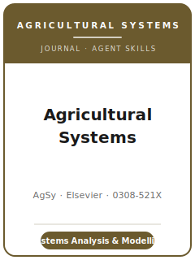

# 农业系统（Agricultural Systems）技能包

<p align="center">
  
</p>

[](LICENSE)
[](https://www.sciencedirect.com/journal/agricultural-systems)
[](https://www.sciencedirect.com/journal/agricultural-systems/about/aims-and-scope)
[](https://github.com/anthropics/claude-code)

[English](README.md) | 简体中文

面向 **《农业系统》（Agricultural Systems, AgSy）** 投稿的 Agent 技能栈。AgSy 是面向**农业系统系统分析**
的国际期刊，由 **Elsevier（爱思唯尔）** 出版（ISSN 0308-521X 印刷 / 1873-2267 在线）。按其自身定义，
本刊是一本关于**相互作用（interactions）**的期刊：农业系统各组分之间、系统各层级之间
（田块 → 农场 → 景观 → 区域 → 食物系统）、农业系统与其他土地利用系统之间，以及农业系统与其
**自然、社会、经济环境**之间的相互作用。

本仓库是**有主见的**。它**不是**通用农学写作工具箱，**也不是**把田间试验包改个名字套到系统研究上。
它是 **AgSy 专属** 技能栈，聚焦本刊的鲜明定位：一个真正的**系统问题**（相互作用、权衡、涌现行为）、
一个被**描述、校准并评估**且如实报告不确定性的**模型**、从**整农场到食物系统**的边界，以及与某个
**决策**（设计、管理或政策）的清晰联系。一个单因子田间试验——无论做得多干净——若未嵌入系统分析，
在这里都属于**选题不合适**。

---

## AgSy 是什么，为何需要专属技能栈？

AgSy 的约束不同于田间试验型农学刊或泛用方法刊：

| 约束 | Agricultural Systems | 含义 |
|------|------|------|
| 核心对象 | 跨组分、跨层级的**相互作用** | 单因子结果若不嵌入系统则不合适 |
| 看重 | **整农场 / 景观 / 食物系统**尺度 + 集成**建模** | 纯田块尺度农学应投田间作物类刊 |
| 方法 | 概念 + 经验 + **动态 / 生物经济建模**、权衡分析 | 须描述、校准并**评估**模型，报告不确定性 |
| 出版方 | **Elsevier**（ISSN 0308-521X 印刷 / 1873-2267 在线） | 使用当前 **Submit your article** / Editorial Manager 路径 |
| 评审模式 | **单向匿名**；至少两位评审；编辑决定 | 作者身份可见；面向系统领域专家评审论证 |
| 篇幅 | 研究论文 **约 8,000 词**（短讯约 4,000；展望约 2,000；评论约 1,000） | 无硬性上限，但应贴近指南 |
| 摘要 / 首页 | **摘要 ≤ 250 词** + **Highlights** + **图文摘要** | 投稿时三者齐备 |
| 声明 | **CRediT** 贡献 + **利益冲突声明** + 资助 / AI 使用披露 | 提前准备 |
| 数据 / 代码 / 模型 | **存储、引用并链接研究数据**，或说明为何无法共享 | Elsevier 把代码与模型视作研究数据——边做边建 |

当前 source map 已按 **2026-06-20** 可直接访问的 ScienceDirect / Elsevier 官方页面刷新。实际投稿前仍应
现场复核易变项，尤其是编辑、APC、投稿系统 URL、图文摘要规格，以及综述 / 展望文章的投稿前咨询规则。

### 文章类型

- **Research paper（研究论文）**——主力形式；完整的系统研究，建议 **约 8,000 词**（无硬性上限）。
- **Short communication（短讯）**——聚焦型贡献，**约 4,000 词**。
- **Perspective（展望）**——前瞻性观点文章，**约 2,000 词**，采用**快速评审**。
- **Comment（评论）**——对已发表工作的简短回应，**约 1,000 词**。
- **Review article（综述）**——通常应聚焦特定方法的应用，而不是描述性综述；指南要求时先咨询编辑。

---

## 快速开始

### 方式 A — Claude Code 插件（推荐）

```bash
/plugin marketplace add https://github.com/brycewang-stanford/agsy-skills
/plugin install agsy-skills
/reload-plugins
```

### 方式 B — 手动复制

```bash
git clone https://github.com/brycewang-stanford/agsy-skills.git
cd agsy-skills

mkdir -p ~/.claude/skills && cp -R skills/agsy-* ~/.claude/skills/
# 或
mkdir -p ~/.codex/skills && cp -R skills/agsy-* ~/.codex/skills/
```

### 第一条提示

```
用 agsy-workflow 告诉我，我的 Agricultural Systems 稿件下一步该用哪个技能。
```

---

## 默认工作流

```text
agsy-topic-selection
        ▼
agsy-literature-positioning
        ▼
agsy-systems-framing-and-modeling
        ▼
agsy-data-and-model-evaluation
        ▼
agsy-figures-and-tables
        ▼
agsy-writing-style          （润色）
        ▼
agsy-impact-and-implications
        ▼
agsy-reproducibility-and-data-policy
        ▼
agsy-review-process
        ▼
agsy-submission
        ▼
agsy-revision-and-rebuttal
```

`agsy-workflow` 是路由器——根据你所处阶段告诉你下一步用哪个技能。多数系统类论文会在
**框定 ↔ 建模 ↔ 评估** 之间循环数轮后再动笔；而 **影响 / 决策相关性** 这一步，正是 AgSy 论文区别于
方法演示的关键。若模型本身就是贡献，请把主要精力放在 `agsy-systems-framing-and-modeling` 与
`agsy-data-and-model-evaluation`。

---

## 技能列表

| 技能 | 用途 |
|------|------|
| `agsy-workflow` | 路由器——决定下一步调用哪个子技能 |
| `agsy-topic-selection` | 这是真正的系统问题吗？选定边界、尺度与文章类型 |
| `agsy-literature-positioning` | 在系统 / 建模 / 食物系统多脉络中定位，而非单一子领域 |
| `agsy-systems-framing-and-modeling` | 系统边界、组分、反馈；模型选择、描述与校准 |
| `agsy-data-and-model-evaluation` | 评估指标、敏感性、不确定性、权衡与情景分析 |
| `agsy-figures-and-tables` | 展示相互作用、动态、权衡与观测—模拟拟合的图表 |
| `agsy-reproducibility-and-data-policy` | 存放数据、代码与模型；模型描述规范；豁免情形 |
| `agsy-writing-style` | 清晰的科学写作；摘要 ≤ 250、Highlights、图文摘要 |
| `agsy-impact-and-implications` | 决策 / 管理 / 政策相关性——系统结果为何重要 |
| `agsy-review-process` | 单向匿名评审、桌面筛查、评审期待、决定类别 |
| `agsy-submission` | Editorial Manager 投稿前检查（文章类型、摘要、声明、数据、文件） |
| `agsy-revision-and-rebuttal` | 面向多位评审 + 编辑的回应信策略 |

### 资源

- [`resources/external_tools.md`](resources/external_tools.md) — 系统模型（APSIM / DSSAT / STICS / DNDC）、整农场与生物经济模型、ABM / 集成评估工具、校准 / 敏感性 / 不确定性软件包，以及食物系统数据源（FAOSTAT / GYGA / FADN）
- [`resources/official-source-map.md`](resources/official-source-map.md) — 本包所用期刊事实背后的 Elsevier / ScienceDirect 官方 URL

---

## 本仓库不做什么

- 不替你写出可直接投稿的稿件
- 不替你搭建、校准或运行模型——只告诉你评审对模型的期待
- 不把单因子田间试验包装成系统论文；系统问题必须是真问题
- 不固化易变元数据（现任编辑、费用、URL 或规则措辞）——真实投稿前请现场复核官方页面
- 不替你判断你的问题是否为真正的系统问题——那是研究者的判断

---

## 相关

- [awesome-journal-skills](https://github.com/brycewang-stanford/awesome-journal-skills) — 期刊专属技能包索引
- [Agricultural Systems（ScienceDirect）](https://www.sciencedirect.com/journal/agricultural-systems) — 出版方主页
- [Agricultural Systems — Guide for Authors](https://www.sciencedirect.com/journal/agricultural-systems/publish/guide-for-authors) — 文章类型、摘要、声明、数据政策

---

## 许可

MIT
