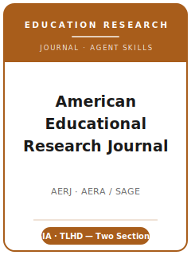

# American Educational Research Journal Skills

<p align="center">
  
</p>

[](LICENSE)
[](https://journals.sagepub.com/home/aer)
[](https://www.aera.net/Publications/Journals/American-Educational-Research-Journal)
[](https://github.com/anthropics/claude-code)

English | [简体中文](README.zh-CN.md)

Agent skill stack for manuscripts targeted at the **American Educational Research Journal (AERJ)** —
the **flagship journal of the American Educational Research Association (AERA)**, founded in **1964**
and published by **SAGE**. AERJ publishes original peer-reviewed analyses that span the **whole field
of education research** — across all subfields, all levels of education and the lifespan, and all
forms of learning — using **quantitative, qualitative, and mixed methods** alike.

What makes AERJ structurally distinct is its **integrated, field-wide** remit. AERJ formerly used
separate SIA/TLHD sections, but AERA integrated the journal for new manuscripts in 2015. Current
submissions should not be routed by former section labels; they should show why the question matters
across education research, whether the dominant lens is policy/institutions, teaching/learning,
human development, or a cross-cutting design.

This repository is opinionated. It is **not** a generic social-science writing toolbox and it is
**not** an economics or psychology pack repurposed for education. It is an **AERJ-specific** stack: a
question of **broad significance to education research**, framed for the **integrated AERJ audience**, an argument
anchored in a **conceptual or theoretical framework**, a design defended on **its own methodological
terms** (quant / qual / mixed), **masked** preparation in **APA 7th-edition** style, and reporting
that meets the **AERA Standards for Reporting on Empirical Social Science Research**.

---

## What Is AERJ, and Why a Dedicated Stack?

AERJ's constraints differ from a narrow specialty journal or a methods journal:

| Constraint            | AERJ                                                                          | Implication                                                       |
|-----------------------|-------------------------------------------------------------------------------|------------------------------------------------------------------|
| Scope                 | **Whole field** of education research, all levels and methods                 | The paper must matter beyond one subfield                        |
| Structure             | **Integrated field-wide journal** (former SIA/TLHD split ended for new submissions in 2015) | Frame the dominant education lens clearly                       |
| Premium on            | **Broad significance** + a clear conceptual/theoretical framework             | A narrow, descriptive-only result is off-fit                     |
| Methods               | Quantitative, qualitative, and mixed methods — judged on their own terms      | Do not force one template onto every paper                       |
| Publisher / owner     | **SAGE** / **AERA**                                                           | Submitted via **ScholarOne Manuscript Central**                  |
| Review model          | **Masked (anonymous)**                                                        | Anonymize the manuscript; names only on the title page file      |
| Fee                   | **No fee to publish or submit** stated; SAGE Choice gold OA available for a fee | Do not budget a submission fee; verify OA terms                 |
| Length                | Manuscripts **maximum 50 pages** (double-spaced, 12-pt, 1" margins, inclusive) | Plan length including tables, figures, notes, references         |
| Abstract              | **100–120 words**                                                             | Tight, structured abstract                                       |
| Style                 | **APA 7th edition** (author-date)                                             | Not Chicago/AERA-house; ORCID for the corresponding author       |
| Reporting standards   | **AERA reporting standards** (empirical social science; humanities companion) | Report against the standard that matches your method             |

Volatile specifics (editor roster, SAGE Choice fee, portal behavior, policy wording) change. Verify on
the official SAGE/AERA pages before upload.

### Fit Lenses

- **Policy / institutions / organizations** — governance, equity, systems, resources, and educational organizations.
- **Teaching / learning / human development** — instruction, curriculum, learning processes, cognition, motivation, and development.
- **Cross-cutting work** — make the dominant lens explicit, then show why the contribution travels across the field.

---

## Quick Start

### Option A — Claude Code Plugin (recommended)

```bash
/plugin marketplace add https://github.com/brycewang-stanford/aerj-skills
/plugin install aerj-skills
/reload-plugins
```

### Option B — Manual Copy

```bash
git clone https://github.com/brycewang-stanford/aerj-skills.git
cd aerj-skills

mkdir -p ~/.claude/skills && cp -R skills/aerj-* ~/.claude/skills/
# or
mkdir -p ~/.codex/skills && cp -R skills/aerj-* ~/.codex/skills/
```

### First Prompt

```
Use aerj-workflow to tell me which skill I should use next for my AERJ manuscript.
```

---

## Default Workflow

```text
aerj-topic-selection         (field-wide fit)
        ▼
aerj-literature-positioning
        ▼
aerj-theory-and-framework
        ▼
aerj-research-design         (quant / qual / mixed)
        ▼
aerj-data-analysis
        ▼
aerj-tables-figures
        ▼
aerj-writing-style           (polish)
        ▼
aerj-transparency-and-data-policy
        ▼
aerj-review-process
        ▼
aerj-submission
        ▼
aerj-rebuttal
```

`aerj-workflow` is the router — it tells you which skill to use next based on where you are and whether
the dominant education lens and field-wide contribution are clear. If your design is **prospective**,
route to `aerj-research-design` early to consider **preregistration**; if your contribution is conceptual or methodological, lean on
`aerj-theory-and-framework` and `aerj-literature-positioning`.

---

## Skills

| Skill                                | Purpose                                                                       |
|--------------------------------------|-------------------------------------------------------------------------------|
| `aerj-workflow`                      | Router — decides which sub-skill to invoke next; flags AERJ fit               |
| `aerj-topic-selection`               | Broad-significance fit across the field; name the dominant education lens     |
| `aerj-literature-positioning`        | Speak past your subfield; engage the literatures AERJ readers expect          |
| `aerj-theory-and-framework`          | Build the conceptual / theoretical framework that frames the contribution     |
| `aerj-research-design`               | Defend the design — quantitative, qualitative, or mixed methods in education   |
| `aerj-data-analysis`                 | Analysis norms (multilevel, IRT, qual coding), uncertainty, robustness         |
| `aerj-tables-figures`                | Accessible, self-contained exhibits in APA 7th-edition format                  |
| `aerj-writing-style`                 | APA 7th edition; reach the whole field within the length limit                 |
| `aerj-transparency-and-data-policy`  | AERA reporting standards; data availability; qualitative transparency          |
| `aerj-review-process`                | Masked review, desk screening, field-wide fit, decision categories             |
| `aerj-submission`                    | ScholarOne preflight (masking, length, abstract, APA, ORCID, title page)       |
| `aerj-rebuttal`                      | R&R response-letter strategy for multiple reviewers + the handling editor      |

### Resources

- [`resources/external_tools.md`](resources/external_tools.md) — education-research data sources (NCES / ECLS / NAEP / SEDA / PISA / TIMSS / state SLDS / QDR) + R / Stata / Mplus / HLM and qualitative/CAQDAS tooling
- [`resources/official-source-map.md`](resources/official-source-map.md) — official AERA / SAGE URLs behind current process facts

---

## What This Repo Does Not Do

- It does not write a submittable manuscript for you
- It does not simulate any specific editor's or reviewer's taste
- It does not assert volatile metadata (current editors, SAGE Choice fee, portal behavior, policy wording) as permanent — verify on the official page
- It does not decide whether your question is of broad significance to education research — that is the researcher's call
- It does not choose a former section for you — it helps you frame the dominant education lens for integrated AERJ

---

## Related

- [awesome-journal-skills](https://github.com/brycewang-stanford/awesome-journal-skills) — Index of journal-specific skill packs
- [American Educational Research Journal (SAGE Journals)](https://journals.sagepub.com/home/aer) — publisher home
- [AERJ at AERA](https://www.aera.net/Publications/Journals/American-Educational-Research-Journal) — owner, editors, policies

---

## License

MIT
