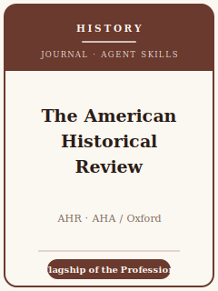

# The American Historical Review Skills

<p align="center">
  
</p>

[](LICENSE)
[](https://academic.oup.com/ahr)
[](https://www.historians.org/news-publications/american-historical-review/)
[](https://github.com/anthropics/claude-code)

English | [简体中文](README.zh-CN.md)

Agent skill stack for manuscripts targeted at **The American Historical Review (AHR)** — the
**flagship journal of the historical profession** and the **official publication of the American
Historical Association (AHA)**, founded in **1895** and published by **Oxford University Press**
(since 2023). The AHR publishes scholarship across **all periods and all places** of the human past —
ancient to contemporary; Africa, Asia, Oceania, Latin America, the Middle East, Europe, and the
Americas — and is read by historians of every field.

This repository is opinionated, and it is **humanities, not social science**. There is **no
data-availability or replication policy**, **no statistical-significance bar**, and **no results
tables** here. An AHR article is a **historiographical intervention** built on **primary sources**,
read critically, and argued in **clear prose** with **Chicago-style footnotes**. This stack is **not**
a social-science template renamed for history — it is about **argument, archives, interpretation, and
the historian's craft**.

---

## What Is the AHR, and Why a Dedicated Stack?

The AHR's constraints differ from a social-science journal or a specialist history journal:

| Constraint            | The AHR                                                                       | Implication                                                       |
|-----------------------|-------------------------------------------------------------------------------|------------------------------------------------------------------|
| Scope                 | **All periods, all places** of history; English-language                      | The article must matter to historians beyond your subfield       |
| Premium on            | A **historiographical intervention** grounded in primary sources              | A source dump or a local-only finding is off-fit                 |
| Method                | Social, cultural, intellectual, political, global, micro — judged on own terms | Do not force one template; there is no single "history method"   |
| Publisher / owner     | **Oxford University Press** / **AHA**                                          | Submit via **ScholarOne**, not a social-science portal           |
| Review model          | **Double-blind / anonymous**, **≥ 6 readers**                                 | Mask the manuscript; expect intensive expert reports             |
| Timeline / acceptance | Decision in **6–8 months**; **~8–10%** accepted                               | Plan a long cycle; significance and craft are decided early      |
| Length                | Ideally **≤ 8,000 words** of text, **excluding notes**                        | The substantial note apparatus does not count toward the target  |
| Style                 | **Chicago Manual of Style** footnotes; **no bibliography**, no in-text citation | Not author-date; all citation lives in the notes              |
| Sources               | **Primary-source criticism** is the core discipline                           | Provenance, bias, silences, representativeness all matter         |
| Images                | Author clears **permissions**; **alt-text** required on every figure          | Budget time for rights; write alt-text up front                  |
| Fees                  | **No author processing fees**                                                 | Do not budget an APC for submission/publication                  |

Volatile specifics (current editor and term, exact word/notes figures, whether an abstract is required,
OA/APC options, review counts and timelines) change — items not directly confirmed are marked **待核实**
in [`resources/official-source-map.md`](resources/official-source-map.md).
**Verify on the official journal page.**

### What the AHR publishes

- **Research articles** — original, argument-driven history, ideally **≤ 8,000 words** of text.
- **Reviews** — a large **commissioned** section (~650/year) of books, exhibits, films, podcasts,
  video games, and digital history. Reviews are **invited**, not author-solicited.
- **Distinctive forms** — features such as *History Unclassified*, *History Lab*, *AHR Syllabus*, and
  *Art as Historical Method* that experiment with how history is written and presented.

---

## Quick Start

### Option A — Claude Code Plugin (recommended)

```bash
/plugin marketplace add https://github.com/brycewang-stanford/ahr-skills
/plugin install ahr-skills
/reload-plugins
```

### Option B — Manual Copy

```bash
git clone https://github.com/brycewang-stanford/ahr-skills.git
cd ahr-skills

mkdir -p ~/.claude/skills && cp -R skills/ahr-* ~/.claude/skills/
# or
mkdir -p ~/.codex/skills && cp -R skills/ahr-* ~/.codex/skills/
```

### First Prompt

```
Use ahr-workflow to tell me which skill I should use next for my AHR manuscript.
```

---

## Default Workflow

```text
ahr-topic-selection
        ▼
ahr-historiography-positioning
        ▼
ahr-argument-development
        ▼
ahr-sources-and-archives
        ▼
ahr-interpretation-and-method
        ▼
ahr-structure-and-exposition
        ▼
ahr-writing-style              (polish)
        ▼
ahr-citation-and-style
        ▼
ahr-review-process
        ▼
ahr-submission
        ▼
ahr-revision-and-response
```

`ahr-workflow` is the router — it tells you which skill to use next based on where you are. History
rarely moves in a straight line: most projects loop **argument ↔ sources ↔ interpretation** many times
as the archive talks back before the structure and prose settle.

---

## Skills

| Skill                              | Purpose                                                                       |
|------------------------------------|-------------------------------------------------------------------------------|
| `ahr-workflow`                     | Router — decides which sub-skill to invoke next                               |
| `ahr-topic-selection`              | Significance to the whole discipline; is this an AHR-scale question?          |
| `ahr-historiography-positioning`   | Frame the article as an intervention, not a report                            |
| `ahr-argument-development`         | Turn archival findings into a sustained, contestable thesis                   |
| `ahr-sources-and-archives`         | Primary vs. secondary; source criticism; archival citation; image permissions |
| `ahr-interpretation-and-method`    | Choose and defend an interpretive lens and scale                              |
| `ahr-structure-and-exposition`     | Weave narrative and analysis within the ~8,000-word target                    |
| `ahr-writing-style`                | Lucid, narrative-aware prose for historians across fields                     |
| `ahr-citation-and-style`           | Chicago notes — no bibliography, no in-text citation; the note apparatus      |
| `ahr-review-process`               | Double-blind review, ≥ 6 readers, 6–8 months, 8–10% acceptance                |
| `ahr-submission`                   | ScholarOne preflight (masking, length, notes, format, alt-text, exclusivity)  |
| `ahr-revision-and-response`        | Response-letter strategy for multiple expert reports + editor                 |

### Resources

- [`resources/external_tools.md`](resources/external_tools.md) — archives and finding aids (ArchiveGrid / WorldCat / national archives), digitized databases (JSTOR / Gale / EEBO-ECCO), transcription/OCR (Transkribus), and Chicago-notes reference tooling (Zotero / BibLaTeX)
- [`resources/official-source-map.md`](resources/official-source-map.md) — official AHA / Oxford URLs behind every fact, with 待核实 markers on unverified items

---

## What This Repo Does Not Do

- It does not write a submittable article for you, and it never invents or embellishes a source
- It does not simulate any specific editor's or reviewer's taste
- It does not assert volatile metadata (current editor and term, exact word/notes figures, abstract
  requirement, OA/APC options) — verify on the official page; unverified items are marked 待核实
- It does not decide whether your question is of general historical significance — that is the
  historian's call
- It does not apply a social-science template (hypotheses, data sections, replication packages) — the
  AHR has none of those

---

## Related

- [awesome-journal-skills](https://github.com/brycewang-stanford/awesome-journal-skills) — Index of journal-specific skill packs
- [The American Historical Review (Oxford Academic)](https://academic.oup.com/ahr) — publisher home
- [AHR at the AHA](https://www.historians.org/news-publications/american-historical-review/) — owner, submission guidelines, reviews

---

## License

MIT
