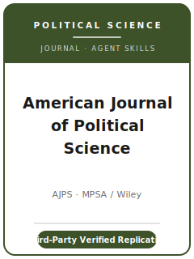

# American Journal of Political Science Skills

<p align="center">
  
</p>

[](LICENSE)
[](https://ajps.org/)
[](https://www.mpsanet.org/)
[](https://github.com/anthropics/claude-code)

English | [简体中文](README.zh-CN.md)

Agent skill stack for manuscripts targeted at the **American Journal of Political Science (AJPS)** —
the **flagship journal of the Midwest Political Science Association (MPSA)**, published by **Wiley**.
AJPS is a generalist but **quantitatively leaning** political-science journal: most of its pages carry
rigorous empirical, experimental, computational, or formal-empirical work across American politics,
comparative politics, international relations, political behavior, institutions, and methodology.

This repository is opinionated. It is **not** a generic social-science writing toolbox and it is
**not** an APSR pack with the names swapped. It is an **AJPS-specific** stack built around the
journal's signature feature: **mandatory third-party verification of replication materials before
publication** — an independent verifier re-runs your deposited code and confirms it reproduces the
**numerical results in the main text** before the article is published, with materials deposited to the
**AJPS Dataverse** on the **Harvard Dataverse Network**.

---

## What Is AJPS, and Why a Dedicated Stack?

AJPS's constraints differ from a discipline-wide review or a methods journal:

| Constraint            | AJPS                                                                          | Implication                                                       |
|-----------------------|-------------------------------------------------------------------------------|------------------------------------------------------------------|
| Owner / publisher     | **MPSA** / **Wiley**                                                           | Submitted via **Editorial Manager** (`editorialmanager.com/ajps`)|
| Methods center of mass| **Quantitatively leaning** generalist                                         | Empirical identification and inference carry the paper           |
| Review model          | **Double-blind**                                                              | Fully anonymize — no acknowledgments, funding, conference mentions|
| Length                | **Articles <= 10,000 words**; **Research Notes / Correspondence <= 4,000**     | Word count goes on the **title page**                            |
| Word count includes   | Notes, parenthetical refs, **table/figure headers and notes**, print appendices| Excludes refs, abstract, online SI, math notation                |
| Abstract              | **<= 150 words**                                                              | Background, hypotheses, approach, findings, conclusions          |
| Style                 | **APSA Style Manual** (rev. 2018/2023) **or** **Chicago 18th ed.**             | Pick one; full first + last names in references                  |
| Supporting Information| **<= 25 pages** for original submissions, uploaded as "Appendix"               | Push robustness grids out of the main text                       |
| **Verification**      | **Third-party, PRE-publication** re-run of your code vs. main-text numbers      | Engineer reproducibility from day one — it gates publication     |

**Official basis checked 2026-06-20:** AJPS manuscript, preparation, submission, accepted-article,
verification, AI-policy, editorial-board, MPSA, and Dataverse pages. Live-check portal prompts, Wiley
license/open-access choices, and any later policy updates via
[`resources/official-source-map.md`](resources/official-source-map.md).

### The signature differentiator: third-party verification

Many journals ask for a replication package; AJPS **independently re-runs it before publishing**. After
acceptance, you deposit data and code to the **AJPS Dataverse**, and a verifier confirms the code
reproduces the **numerical results in the main text**. The published article then carries a statement
such as *"The Cornell Center for Social Sciences verified that the data and replication code submitted
to the AJPS Dataverse replicates the numerical results reported in the main text of this article."*
Qualitative and multi-method work follows the AJPS qualitative checklist and access-control/exemption
rules rather than a generic open-data recipe.

### Three submission types

- **Article** — full original study, **<= 10,000 words**.
- **Research Note** — **methodology papers (including methodology in normative theory) and
  meta-analyses only**, **<= 4,000 words**. Not a short empirical paper.
- **Correspondence** — critical responses to work **already published in AJPS**, **<= 4,000 words**.

---

## Quick Start

### Option A — Claude Code Plugin (recommended)

```bash
/plugin marketplace add https://github.com/brycewang-stanford/ajps-skills
/plugin install ajps-skills
/reload-plugins
```

### Option B — Manual Copy

```bash
git clone https://github.com/brycewang-stanford/ajps-skills.git
cd ajps-skills

mkdir -p ~/.claude/skills && cp -R skills/ajps-* ~/.claude/skills/
# or
mkdir -p ~/.codex/skills && cp -R skills/ajps-* ~/.codex/skills/
```

### First Prompt

```
Use ajps-workflow to tell me which skill I should use next for my AJPS manuscript.
```

---

## Default Workflow

```text
ajps-topic-selection
        ▼
ajps-literature-positioning
        ▼
ajps-theory-building
        ▼
ajps-research-design
        ▼
ajps-data-analysis
        ▼
ajps-tables-figures
        ▼
ajps-writing-style          (polish)
        ▼
ajps-replication-and-verification
        ▼
ajps-review-process
        ▼
ajps-submission
        ▼
ajps-rebuttal
```

`ajps-workflow` is the router — it tells you which skill to use next based on where you are. Start
`ajps-replication-and-verification` **while you analyze**, not at acceptance: the third-party verifier
re-runs your code, and an unscripted analysis cannot be repaired under deadline.

---

## Skills

| Skill                                | Purpose                                                                       |
|--------------------------------------|-------------------------------------------------------------------------------|
| `ajps-workflow`                      | Router — decides which sub-skill to invoke next                               |
| `ajps-topic-selection`               | Sharp, generalizable fit; pick Article / Research Note / Correspondence       |
| `ajps-literature-positioning`        | Stake the contribution while staying double-blind                             |
| `ajps-theory-building`               | Turn the idea into testable hypotheses and mechanisms                         |
| `ajps-research-design`               | Defend identification — causal inference, experiments, formal-empirical, cases|
| `ajps-data-analysis`                 | Analysis norms, uncertainty, robustness, reproducible-from-line-one           |
| `ajps-tables-figures`                | Self-contained, reproducible exhibits; captions count toward the word cap     |
| `ajps-writing-style`                 | Word caps, APSA-or-Chicago style, full anonymizing                            |
| `ajps-replication-and-verification`  | Third-party verified package to the AJPS Dataverse (the distinctive skill)    |
| `ajps-review-process`                | Double-blind review, decision categories, verification-after-acceptance       |
| `ajps-submission`                    | Editorial Manager preflight (anonymity, word count, SI <= 25 pp, IRB)         |
| `ajps-rebuttal`                      | R&R memorandum for multiple reviewers + editor, kept anonymous and re-runnable|

### Resources

- [`resources/external_tools.md`](resources/external_tools.md) — political-science data sources (ANES / CES / V-Dem / CSES / COW / ACLED / MARPOR) + R / Stata / Python tooling and replication-package conventions
- [`resources/official-source-map.md`](resources/official-source-map.md) — official AJPS / MPSA / Wiley / Dataverse URLs behind every fact and live-check item

---

## What This Repo Does Not Do

- It does not write a submittable manuscript for you
- It does not simulate any specific editor's or reviewer's taste
- It does not freeze volatile metadata (portal prompts, Wiley license/APC choices, future policy updates) — live-check official pages before submission
- It does not run or pass the verification for you — that is the third-party verifier's job; this pack only prepares the package

---

## Related

- [awesome-journal-skills](https://github.com/brycewang-stanford/awesome-journal-skills) — Index of journal-specific skill packs
- [American Journal of Political Science (editorial site)](https://ajps.org/) — submission guidelines, replication & verification policy
- [Midwest Political Science Association (MPSA)](https://www.mpsanet.org/) — owner

---

## License

MIT
