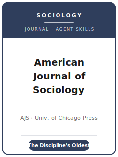

# American Journal of Sociology Skills

<p align="center">
  
</p>

[](LICENSE)
[](https://www.journals.uchicago.edu/journals/ajs)
[](https://www.journals.uchicago.edu/journals/ajs)
[](https://github.com/anthropics/claude-code)

English | [简体中文](README.zh-CN.md)

Agent skill stack for manuscripts targeted at the **American Journal of Sociology (AJS)** — the
discipline's **oldest** journal, founded in **1895** by **Albion Small** and housed for its entire
history at the **University of Chicago Department of Sociology**, published by the **University of
Chicago Press** (NOT SAGE/ASA). AJS is a generalist sociology venue with a strong reputation for
**theoretical ambition** and **comparative-historical** work, welcoming quantitative, qualitative,
ethnographic, network, and formal scholarship across sociology and related social sciences.

This repository is opinionated. It is **not** a generic social-science writing toolbox and it is
**not** the American Sociological Review (ASR) pack renamed. AJS and ASR are both sociology flagships
but very different journals: different publisher (UChicago Press vs. SAGE/ASA), different house style
(AJS's own vs. the ASA Style Guide), a distinctive **student-run double-blind** review, a **$30
submission fee**, **no fixed word cap**, and a long **Comment-and-Reply** tradition.

---

## What Is AJS, and Why a Dedicated Stack?

AJS's constraints differ from ASR and from field/methods journals:

| Constraint            | AJS                                                                          | Implication                                                       |
|-----------------------|-------------------------------------------------------------------------------|------------------------------------------------------------------|
| Owner / publisher     | **University of Chicago** (Dept. of Sociology) / **University of Chicago Press** | Not SAGE/ASA; submit via Editorial Manager                    |
| Premium on            | **Theoretical ambition** + dialogue with current sociology                    | A bare finding or opinion piece is off-fit (AJS "prejects" these) |
| Methods               | Quantitative, comparative-historical, ethnographic, network, formal — each on its own terms | Do not force one template onto every paper          |
| Review model          | **Double-blind**, student-run assignment; no reviewers from the author's network | Anonymize the manuscript; cover page is a **separate file**    |
| Fee                   | **$30 submission fee**; waived for **sole-author graduate students**           | Budget the fee unless the waiver applies                         |
| Length                | **No fixed word cap**; concision encouraged (referees may need more time over ~18,000 words) | Long is tolerated, not rewarded; **abstract ~150 words**  |
| Style                 | **AJS's own author-date house style**                                          | **Not** the ASA Style Guide; confirm forms on the prep pages     |
| Transparency          | **No advertised mandatory editor-verified replication deposit**                | Document well; verify current policy before claiming any deposit gate |
| Distinctive features  | **Comment-and-Reply** tradition; substantial **book-review** section; Roger V. Gould Prize | Choose the right piece type up front                  |

Volatile specifics (current editor and term, the exact fee/waiver, length and abstract expectations,
citation-style details, any data policy) change. The refresh notes in
[`resources/official-source-map.md`](resources/official-source-map.md) route each fact to an official
UChicago Press, Editorial Manager, or University of Chicago source, and operational details should be
live-checked in a browser immediately before upload.

### AJS vs. ASR at a glance

- **AJS** — UChicago Press; theory-forward, comparative-historical strength; double-blind, student-run
  review; $30 fee (grad sole-author waiver); no word cap; **own house style**; Comment-and-Reply.
- **ASR** — SAGE / ASA; discipline-wide flagship; masked review; $25 fee (ASA student waiver);
  ~15,000-word cap; **ASA Style Guide**.

---

## Quick Start

### Option A — Claude Code Plugin (recommended)

```bash
/plugin marketplace add https://github.com/brycewang-stanford/ajs-skills
/plugin install ajs-skills
/reload-plugins
```

### Option B — Manual Copy

```bash
git clone https://github.com/brycewang-stanford/ajs-skills.git
cd ajs-skills

mkdir -p ~/.claude/skills && cp -R skills/ajs-* ~/.claude/skills/
# or
mkdir -p ~/.codex/skills && cp -R skills/ajs-* ~/.codex/skills/
```

### First Prompt

```
Use ajs-workflow to tell me which skill I should use next for my AJS manuscript.
```

---

## Default Workflow

```text
ajs-topic-selection
        ▼
ajs-literature-positioning
        ▼
ajs-theory-building
        ▼
ajs-research-design
        ▼
ajs-data-analysis
        ▼
ajs-tables-figures
        ▼
ajs-writing-style          (polish)
        ▼
ajs-data-and-transparency
        ▼
ajs-review-process
        ▼
ajs-submission
        ▼
ajs-rebuttal
```

`ajs-workflow` is the router — it tells you which skill to use next based on where you are and whether
the piece is a **research article**, a **Comment/Reply**, or a **book review**. AJS papers typically
loop theory ↔ design ↔ analysis several times before writing-style; the theoretical contribution
usually sharpens late.

---

## Skills

| Skill                          | Purpose                                                                       |
|--------------------------------|-------------------------------------------------------------------------------|
| `ajs-workflow`                 | Router — decides which sub-skill to invoke next                               |
| `ajs-topic-selection`          | Fit: in dialogue with current sociology + a portable theoretical payoff       |
| `ajs-literature-positioning`   | Locate the contribution in a live sociological debate (incl. Comments)        |
| `ajs-theory-building`          | Turn evidence into a portable theory (quant, comparative-historical, ethnographic, formal) |
| `ajs-research-design`          | Defend the design on its own methodological terms                             |
| `ajs-data-analysis`            | Analysis norms, uncertainty, robustness, triangulation                        |
| `ajs-tables-figures`           | AJS exhibit conventions; discrete numbering; mandatory figure alt text        |
| `ajs-writing-style`            | AJS's own author-date house style (NOT the ASA Style Guide); generalist-legible prose |
| `ajs-data-and-transparency`    | Documentation and sharing; do not over-state requirements (no verified deposit) |
| `ajs-review-process`           | Double-blind, student-run review; the "preject"; decision categories          |
| `ajs-submission`               | Editorial Manager preflight ($30 fee, separate cover page, abstract, alt text)|
| `ajs-rebuttal`                 | R&R response letter + author Reply in the Comment-and-Reply tradition         |

### Resources

- [`resources/external_tools.md`](resources/external_tools.md) — sociology data sources (GSS / IPUMS / PSID / V-Dem / network & qualitative data) + R / Stata / Python and CAQDAS/QCA tooling
- [`resources/official-source-map.md`](resources/official-source-map.md) — official UChicago Press / AJS URLs behind every fact, plus live-check notes for volatile items

---

## What This Repo Does Not Do

- It does not write a submittable manuscript for you
- It does not simulate any specific editor's or reviewer's taste
- It does not assert volatile metadata (current editor and term, exact fee/waiver, length/abstract
  rules, citation-style forms, data policy) without a current official-source route; live-check those
  items on the official page before submission
- It does not decide whether your work is theoretically ambitious enough for AJS — that is the researcher's call

---

## Related

- [awesome-journal-skills](https://github.com/brycewang-stanford/awesome-journal-skills) — Index of journal-specific skill packs
- [American Journal of Sociology (UChicago Press)](https://www.journals.uchicago.edu/journals/ajs) — publisher home, instructions, editorial policy
- [AJS Instructions for Authors](https://www.journals.uchicago.edu/journals/ajs/instruct) — current author guidance and submission mechanics

---

## License

MIT
