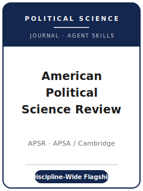

# American Political Science Review Skills

<p align="center">
  
</p>

[](LICENSE)
[](https://www.cambridge.org/core/journals/american-political-science-review)
[](https://apsanet.org/publications/journals/american-political-science-review/)
[](https://github.com/anthropics/claude-code)

English | [简体中文](README.zh-CN.md)

Agent skill stack for manuscripts targeted at the **American Political Science Review (APSR)** — the
**flagship general-interest journal of the American Political Science Association (APSA)**, founded in
**1906** and published by **Cambridge University Press**. APSR publishes the best scholarship across
the **whole discipline**: American politics, comparative politics, international relations, political
theory, public policy, and political methodology — quantitative, qualitative, formal, experimental,
computational, and interpretive alike.

This repository is opinionated. It is **not** a generic social-science writing toolbox and it is
**not** an economics pack repurposed for politics. It is an **APSR-specific** stack: a question of
**general significance to political science**, an argument that speaks **past its own subfield**, a
design defended on its own methodological terms, **double-anonymous** preparation, and a **verified
reproducibility package** deposited to the **APSR Dataverse** on Harvard Dataverse.

---

## What Is APSR, and Why a Dedicated Stack?

APSR's constraints differ from a field journal or a methods journal:

| Constraint            | APSR                                                                          | Implication                                                       |
|-----------------------|-------------------------------------------------------------------------------|------------------------------------------------------------------|
| Scope                 | **Whole discipline** of political science                                     | The paper must matter beyond its subfield                        |
| Premium on            | **General significance** + a clear theoretical contribution                   | A narrow, subfield-only result is off-fit                        |
| Methods               | Quantitative, qualitative, formal, experimental, interpretive — judged on own terms | Do not force one template onto every paper                 |
| Publisher / owner     | **Cambridge University Press** / **APSA**                                      | Submitted via **Editorial Manager**, not Editorial Express/OUP   |
| Review model          | **Double-anonymous**                                                          | Anonymize the manuscript; remove obvious self-references         |
| Fee                   | **No submission fee** stated; no membership requirement                       | Do not budget a submission fee                                   |
| Length                | Most **Articles < 11,000 words**; **Research Notes < 7,000**; **abstract ≤ 150** | Word count goes on the front page                            |
| Style                 | **APSA Style Manual for Political Science** (author-date)                      | Not Chicago-generic; ORCID required for corresponding author     |
| Transparency          | **Reproducibility package to the APSR Dataverse**, verified at conditional acceptance | Build it as you go; the editors actually run it          |
| Distinctive tracks    | Registered Reports + Replications and Reappraisals + Syntheses                | Choose the right track up front                                  |

Volatile specifics (editors and term, exact caps, fee/APC, policy wording) change — items not directly
confirmed are marked **待核实** in [`resources/official-source-map.md`](resources/official-source-map.md).
**Verify on the official journal page.**

### Five publication tracks

- **Regular Articles** — most **< 11,000 words**; the discipline's main research format.
- **Research Notes** — focused contributions, **< 7,000 words** (see 待核实 on the exact cap).
- **Replications and Reappraisals** — replicate, reproduce, or reassess prior findings.
- **Syntheses** — integrative pieces that consolidate a literature or debate.
- **Registered Reports** — Stage 1 design + analysis plan reviewed and accepted **before** results.

---

## Quick Start

### Option A — Claude Code Plugin (recommended)

```bash
/plugin marketplace add https://github.com/brycewang-stanford/apsr-skills
/plugin install apsr-skills
/reload-plugins
```

### Option B — Manual Copy

```bash
git clone https://github.com/brycewang-stanford/apsr-skills.git
cd apsr-skills

mkdir -p ~/.claude/skills && cp -R skills/apsr-* ~/.claude/skills/
# or
mkdir -p ~/.codex/skills && cp -R skills/apsr-* ~/.codex/skills/
```

### First Prompt

```
Use apsr-workflow to tell me which skill I should use next for my APSR manuscript.
```

---

## Default Workflow

```text
apsr-topic-selection
        ▼
apsr-literature-positioning
        ▼
apsr-theory-building
        ▼
apsr-research-design
        ▼
apsr-data-analysis
        ▼
apsr-tables-figures
        ▼
apsr-writing-style          (polish)
        ▼
apsr-transparency-and-data-policy
        ▼
apsr-review-process
        ▼
apsr-submission
        ▼
apsr-rebuttal
```

`apsr-workflow` is the router — it tells you which skill to use next based on where you are. If your
design is **prospective**, route to `apsr-review-process` early to consider the **Registered Reports**
track; if you are reassessing a published finding, consider **Replications and Reappraisals**.

---

## Skills

| Skill                                | Purpose                                                                       |
|--------------------------------------|-------------------------------------------------------------------------------|
| `apsr-workflow`                      | Router — decides which sub-skill to invoke next                               |
| `apsr-topic-selection`               | General-significance fit across the discipline; pick the right track          |
| `apsr-literature-positioning`        | Speak past your subfield; engage the literatures APSR readers expect          |
| `apsr-theory-building`               | Build the argument (formal, interpretive, or empirical) into a contribution   |
| `apsr-research-design`               | Defend the design — causal inference, case selection, experiments, formal     |
| `apsr-data-analysis`                 | Analysis norms, uncertainty, robustness, multiple-method triangulation        |
| `apsr-tables-figures`                | Accessible, self-contained exhibits in APSA style                             |
| `apsr-writing-style`                 | APSA Style Manual; reach the whole discipline within the word cap             |
| `apsr-transparency-and-data-policy`  | APSR Dataverse reproducibility package; qualitative transparency; exemptions  |
| `apsr-review-process`                | Double-anonymous review, desk screening, track choice, decision categories    |
| `apsr-submission`                    | Editorial Manager preflight (anonymization, word count, ORCID, abstract)      |
| `apsr-rebuttal`                      | R&R response-letter strategy for multiple reviewers + editor                  |

### Resources

- [`resources/external_tools.md`](resources/external_tools.md) — political-science data sources (ANES / CCES / V-Dem / CSES / COW / ACLED / Manifesto Project) + R / Stata / Python and qualitative/CAQDAS tooling
- [`resources/official-source-map.md`](resources/official-source-map.md) — official APSA / Cambridge URLs behind every fact, with 待核实 markers on unverified items

---

## What This Repo Does Not Do

- It does not write a submittable manuscript for you
- It does not simulate any specific editor's or reviewer's taste
- It does not assert volatile metadata (current editors and term, exact caps, fee/APC, policy wording) — verify on the official page; unverified items are marked 待核实
- It does not decide whether your question is of general disciplinary significance — that is the researcher's call

---

## Related

- [awesome-journal-skills](https://github.com/brycewang-stanford/awesome-journal-skills) — Index of journal-specific skill packs
- [American Political Science Review (Cambridge Core)](https://www.cambridge.org/core/journals/american-political-science-review) — publisher home
- [APSR at APSA](https://apsanet.org/publications/journals/american-political-science-review/) — owner, submission guidelines, policies

---

## License

MIT
