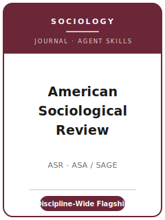

# 美国社会学评论（ASR）技能包

<p align="center">
  
</p>

[](LICENSE)
[](https://journals.sagepub.com/home/asr)
[](https://www.asanet.org/publications/journals/american-sociological-review/)
[](https://github.com/anthropics/claude-code)

[English](README.md) | 简体中文

面向 **《美国社会学评论》（American Sociological Review, ASR）** 投稿的 Agent 技能栈。ASR 是
**美国社会学会（ASA）的旗舰综合性期刊**，创刊于 **1936 年**，由 **SAGE** 出版。它发表社会学各领域的
研究：社会分层与流动、人口学、比较历史社会学、民族志与访谈、社会网络、政治与经济社会学、计算社会学等。

本仓库是**有主见的**。它**不是**通用社会科学写作工具箱，**也不是**把政治学或经济学包改个名字套用过来。
它是 **ASR 专属** 技能栈：一个具有广泛社会学意义的问题、能够迁移的理论、按各自方法论标准站得住的设计、
一份正确**匿名化（masked）**的稿件，以及通过 **Sage Track** 投稿、缴纳期刊 **$25 处理费**、遵循
**ASA 数据共享** 规范。

---

## ASR 是什么，为何需要专属技能栈？

ASR 的约束不同于子领域刊或方法刊：

| 约束 | ASR | 含义 |
|------|------|------|
| 范围 | **整个社会学** | 论文必须超越自身子领域 |
| 看重 | 广泛意义 + 可迁移的理论收益 | 窄而描述性的结果不合适 |
| 方法 | 定量/人口学/比较历史/民族志/网络/计算——各按其标准评判 | 不要把同一模板硬套所有论文 |
| 出版方 / 所有者 | **SAGE** / **ASA** | 通过 **Sage Track**（ScholarOne）投稿，非 Editorial Manager |
| 评审模式 | **匿名（masked）**——匿名正文 + 单独标题页 | **可以**引用自己的成果，只是不能暴露身份 |
| 费用 | **$25 不退** 处理费（ASA 学生会员免） | 非 ASA 学生须预算此费 |
| 篇幅 | **论文 ≤ 15,000 词**，含正文+参考文献+脚注；**评论/回应 ≤ 3,000** | 参考文献计入字数 |
| 摘要 | **150–200 词**，不含身份信息 | 与上限 150 词的期刊不同 |
| 体例 | 双倍行距、**Times New Roman 12 号**、页边距 ≥1 英寸、**ASA 体例指南** | 具体的稿件格式 |
| 透明度 | **ASA 数据共享政策**（发表后可获取） | 是规范，非编辑部实跑的复现核验 |

易变的具体信息（编辑与任期、费用、确切上限、数据政策）会变化——未直接核实项在
[`resources/official-source-map.md`](resources/official-source-map.md) 中标 **待核实**。
**请以官方页面为准。**

---

## 快速开始

### 方式 A — Claude Code 插件（推荐）

```bash
/plugin marketplace add https://github.com/brycewang-stanford/asr-skills
/plugin install asr-skills
/reload-plugins
```

### 方式 B — 手动复制

```bash
git clone https://github.com/brycewang-stanford/asr-skills.git
cd asr-skills

mkdir -p ~/.claude/skills && cp -R skills/asr-* ~/.claude/skills/
# 或
mkdir -p ~/.codex/skills && cp -R skills/asr-* ~/.codex/skills/
```

### 第一条提示

```
用 asr-workflow 告诉我，我的 ASR 稿件下一步该用哪个技能。
```

---

## 默认工作流

```text
asr-topic-selection
        ▼
asr-literature-positioning
        ▼
asr-theory-building
        ▼
asr-research-design
        ▼
asr-data-analysis
        ▼
asr-tables-figures
        ▼
asr-writing-style          （润色）
        ▼
asr-data-and-transparency
        ▼
asr-review-process
        ▼
asr-submission
        ▼
asr-rebuttal
```

`asr-workflow` 是路由器——根据你所处阶段告诉你下一步用哪个技能。

---

## 技能列表

| 技能 | 用途 |
|------|------|
| `asr-workflow` | 路由器——决定下一步调用哪个子技能 |
| `asr-topic-selection` | 广泛的社会学意义；论文 vs 评论/回应 |
| `asr-literature-positioning` | 把贡献放进可迁移的社会学论争中 |
| `asr-theory-building` | 打造可迁移的理论论证（而非仅一个发现） |
| `asr-research-design` | 为设计辩护——定量、人口学、比较历史、民族志、网络 |
| `asr-data-analysis` | 跨社会学方法的分析规范、不确定性、稳健性 |
| `asr-tables-figures` | 清晰、自洽的图表（不计入字数） |
| `asr-writing-style` | ASA 体例指南；在 15,000 词内触达整个学科 |
| `asr-data-and-transparency` | ASA 数据共享政策；保密；文档化 |
| `asr-review-process` | 匿名评审、决定、评审人看重什么 |
| `asr-submission` | Sage Track 投稿前检查（匿名化、$25 费、摘要 150–200、15,000 词） |
| `asr-rebuttal` | 面向多位评审 + 编辑的 R&R 回应信策略 |

### 资源

- [`resources/external_tools.md`](resources/external_tools.md) — 社会学数据源（GSS / PSID / IPUMS / LIS）+ R / Stata / Python 与 CAQDAS/QCA 工具
- [`resources/official-source-map.md`](resources/official-source-map.md) — 每条事实背后的 SAGE / ASA 官方 URL，未核实项标 待核实

---

## 本仓库不做什么

- 不替你写出可直接投稿的稿件
- 不模拟任何特定编辑或评审人的口味
- 不臆断易变元数据（现任编辑与任期、费用、确切上限、数据政策）——请以官方页面为准；未核实项标 待核实
- 不替你判断你的问题是否具有广泛社会学意义——那是研究者的判断

---

## 相关

- [awesome-journal-skills](https://github.com/brycewang-stanford/awesome-journal-skills) — 期刊专属技能包索引
- [American Sociological Review（SAGE）](https://journals.sagepub.com/home/asr) — 出版方主页
- [ASA 上的 ASR](https://www.asanet.org/publications/journals/american-sociological-review/) — 所有者、投稿信息、政策

---

## 许可

MIT
