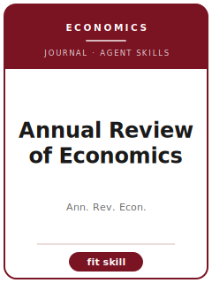

# Annual Review of Economics Skills

<p align="center"></p>

[](LICENSE)
[](https://www.annualreviews.org/journal/economics)
[](https://www.annualreviews.org/journal/economics)

English | [简体中文](README.zh-CN.md)

Twelve agent skills for manuscripts targeted at **Annual Review of Economics (AREcon)**. The pack is tuned to commissioned review articles synthesizing major areas of economics for specialists and adjacent economists; it keeps the manuscript distinct from Journal of Economic Literature, Journal of Economic Perspectives, Handbook chapters, and Academy of Management Annals and emphasizes agenda-setting synthesis that clarifies what the field knows, disputes, and should do next.

**Official basis checked 2026-06** (re-check volatile details before submission): see [`resources/official-source-map.md`](resources/official-source-map.md).

## Why a separate stack?

| AREcon constraint | What it forces |
|-------------------------|----------------|
| Scope | The main claim must speak to commissioned review articles synthesizing major areas of economics for specialists and adjacent economists |
| Sibling boundary | The paper must explain why it belongs here rather than Journal of Economic Literature, Journal of Economic Perspectives, Handbook chapters, and Academy of Management Annals |
| Evidence standard | Designs, models, reviews, or qualitative evidence must match agenda-setting synthesis that clarifies what the field knows, disputes, and should do next |
| Source discipline | Current process facts are cited or marked 待核实 |

## Quick Start

```text
/plugin marketplace add ./Annual-Review-of-Economics-Skills
/plugin install annual-review-of-economics-skills
```

Manual use: start with [`skills/arecon-workflow/SKILL.md`](skills/arecon-workflow/SKILL.md).

## Default Workflow

```text
arecon-workflow → arecon-topic-selection → arecon-proposal-framing → arecon-literature-synthesis → arecon-organizing-framework → arecon-evidence-standards → arecon-tables-figures → arecon-writing-style → arecon-editor-strategy → arecon-submission → arecon-review-process → arecon-revision
```

## Skills

| # | Skill | What it does |
|---|-------|--------------|
| 1 | [`arecon-workflow`](skills/arecon-workflow/SKILL.md) | Workflow Router for AREcon manuscripts |
| 2 | [`arecon-topic-selection`](skills/arecon-topic-selection/SKILL.md) | Topic Selection for AREcon manuscripts |
| 3 | [`arecon-proposal-framing`](skills/arecon-proposal-framing/SKILL.md) | Proposal Framing for AREcon manuscripts |
| 4 | [`arecon-literature-synthesis`](skills/arecon-literature-synthesis/SKILL.md) | Literature Synthesis for AREcon manuscripts |
| 5 | [`arecon-organizing-framework`](skills/arecon-organizing-framework/SKILL.md) | Organizing Framework for AREcon manuscripts |
| 6 | [`arecon-evidence-standards`](skills/arecon-evidence-standards/SKILL.md) | Evidence Standards for AREcon manuscripts |
| 7 | [`arecon-tables-figures`](skills/arecon-tables-figures/SKILL.md) | Tables and Figures for AREcon manuscripts |
| 8 | [`arecon-writing-style`](skills/arecon-writing-style/SKILL.md) | Writing Style for AREcon manuscripts |
| 9 | [`arecon-editor-strategy`](skills/arecon-editor-strategy/SKILL.md) | Editor Strategy for AREcon manuscripts |
| 10 | [`arecon-submission`](skills/arecon-submission/SKILL.md) | Submission Preflight for AREcon manuscripts |
| 11 | [`arecon-review-process`](skills/arecon-review-process/SKILL.md) | Review Process for AREcon manuscripts |
| 12 | [`arecon-revision`](skills/arecon-revision/SKILL.md) | Revision Strategy for AREcon manuscripts |

## Resources

- [`resources/README.md`](resources/README.md) — resource index
- [`resources/official-source-map.md`](resources/official-source-map.md) — official URLs and volatile checks
- [`resources/external_tools.md`](resources/external_tools.md) — databases, methods, and software aids
- [`resources/worked-examples/01-introduction.md`](resources/worked-examples/01-introduction.md) — fictional before/after introduction
- [`resources/exemplars/library.md`](resources/exemplars/library.md) — real-paper slots with source discipline
- [`resources/code/`](resources/code/) — empirical code kit where applicable

## Related Links

- https://www.annualreviews.org/journal/economics
- https://www.annualreviews.org/page/authors/general-information

## License

MIT (c) 2026 Bryce Wang. See [LICENSE](LICENSE).
