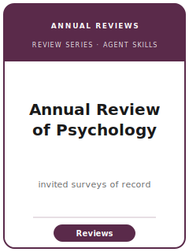

# 《心理学年度评论》技能包（Annual Review of Psychology Skills）

<p align="center"></p>

[](LICENSE)
[](https://www.annualreviews.org/journal/psych)
[](https://www.annualreviews.org/journal/psych)
[](https://www.annualreviews.org/journal/psych)

[English](README.md) | 简体中文

面向 **《心理学年度评论》（Annual Review of Psychology, ARPsych）特约综述文章** 的十二个智能体技能。ARPsych 由非营利机构 **Annual Reviews** 出版，创刊于 1950 年，是心理学领域影响力最高的期刊之一。本技能包针对的是 **受邀撰写的权威综述**：跨认知、社会、发展、临床、生物/神经、工业-组织以及方法学心理学，为整个领域及相邻学科系统梳理某一主题。它将稿件与 **《心理学公报》（Psychological Bulletin，投稿制综述/元分析）**、**《临床心理学年度评论》（姊妹刊）** 以及 **《心理科学展望》（Perspectives on Psychological Science，评论性短文）** 严格区分，并强调一篇"立此存照"式综述的成败关键：用一个 **组织性框架** 把文献变成论证，而非文献罗列。

**官方信息核查于 2026-06**（投递前请复核易变细节）：见 [`resources/official-source-map.md`](resources/official-source-map.md)。

## 为什么需要独立技能栈？

| ARPsych 约束 | 带来的要求 |
|--------------|------------|
| 仅限受邀 | 文章由 **编委会约稿**；需获得邀请，不能冷投（检索于 2026-06；以官网为准） |
| 是综述而非原创研究 | 作品是 **评估他人研究**；没有自己的预注册或功效分析 |
| 组织性框架 | 框架（分类法/过程模型/分析层级/理论之争）才是贡献；文献罗列必败 |
| 平衡是编辑硬通货 | 编委会以 **准确、严谨、平衡** 为标准；自我推销与单边立场会被惩罚 |
| 读者面广 | 既权威 **又要让子领域外的心理学家读得懂** |
| 姊妹刊边界 | 必须属于此刊，而非 Psychological Bulletin / 临床年评 / Perspectives |
| 来源纪律 | 易变流程事实须引用或标注 待核实 |

## 快速开始

```text
/plugin marketplace add ./Annual-Review-of-Psychology-Skills
/plugin install annual-review-of-psychology-skills
```

手动使用：从 [`skills/arpsych-workflow/SKILL.md`](skills/arpsych-workflow/SKILL.md) 开始。

## 默认工作流

```text
arpsych-workflow → arpsych-topic-selection → arpsych-proposal-and-commissioning → arpsych-literature-synthesis → arpsych-organizing-framework → arpsych-comprehensiveness-and-balance → arpsych-tables-figures → arpsych-writing-style → arpsych-transparency-and-reproducibility → arpsych-editor-strategy → arpsych-submission → arpsych-revision
```

## 技能清单

| # | 技能 | 作用 |
|---|------|------|
| 1 | [`arpsych-workflow`](skills/arpsych-workflow/SKILL.md) | ARPsych 特约综述的工作流路由 |
| 2 | [`arpsych-topic-selection`](skills/arpsych-topic-selection/SKILL.md) | 主题是否成熟、重要、可综述 |
| 3 | [`arpsych-proposal-and-commissioning`](skills/arpsych-proposal-and-commissioning/SKILL.md) | 编委会约稿/受邀流程 |
| 4 | [`arpsych-literature-synthesis`](skills/arpsych-literature-synthesis/SKILL.md) | 系统、可复核的文献覆盖 |
| 5 | [`arpsych-organizing-framework`](skills/arpsych-organizing-framework/SKILL.md) | 支撑综述的分析主轴 |
| 6 | [`arpsych-comprehensiveness-and-balance`](skills/arpsych-comprehensiveness-and-balance/SKILL.md) | 均衡覆盖、按可信度加权、杜绝自我推销 |
| 7 | [`arpsych-tables-figures`](skills/arpsych-tables-figures/SKILL.md) | 框架图与综述汇总表 |
| 8 | [`arpsych-writing-style`](skills/arpsych-writing-style/SKILL.md) | 权威而易读的 ARPsych 语体 |
| 9 | [`arpsych-transparency-and-reproducibility`](skills/arpsych-transparency-and-reproducibility/SKILL.md) | 记录检索；元分析可复现 |
| 10 | [`arpsych-editor-strategy`](skills/arpsych-editor-strategy/SKILL.md) | 范围、篇幅、截稿与生产时间线 |
| 11 | [`arpsych-submission`](skills/arpsych-submission/SKILL.md) | Annual Reviews 交付前检查 |
| 12 | [`arpsych-revision`](skills/arpsych-revision/SKILL.md) | 回应主编与编委会 |

## 资源

- [`resources/README.md`](resources/README.md) — 资源索引
- [`resources/official-source-map.md`](resources/official-source-map.md) — 官方 URL 与易变项核查
- [`resources/external_tools.md`](resources/external_tools.md) — 数据库、检索工具与元分析软件
- [`resources/worked-examples/01-introduction.md`](resources/worked-examples/01-introduction.md) — 虚构的引言改写前后对照
- [`resources/exemplars/library.md`](resources/exemplars/library.md) — 已联网核实的真实 ARPsych 文章 + 姊妹刊护栏

## 与姊妹刊的区别

| 刊物 | 来稿方式 | 体裁 | 本技能包立场 |
|------|----------|------|--------------|
| **Annual Review of Psychology** | 编委会邀稿 | 权威综述（立此存照） | 目标刊——以框架为先的综述写作 |
| **Psychological Bulletin** | **投稿** | 综述/元分析 | 若要投递独立元分析，改投此刊 |
| **Annual Review of Clinical Psychology** | 邀稿（姊妹刊） | 临床科学综述 | 若读者是临床科学家，改投此刊 |
| **Perspectives on Psychological Science** | 投稿 | 较短的观点性短文 | 若是挑战性论点而非综述，改投此刊 |

## 相关链接

- https://www.annualreviews.org/journal/psych
- https://www.annualreviews.org/page/authors/general-information
- https://www.annualreviews.org/page/authors/editorial-policies

## 许可证

MIT (c) 2026 Bryce Wang。见 [LICENSE](LICENSE)。
