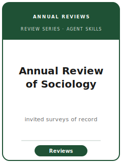

# 社会学年评技能包（Annual Review of Sociology Skills）

<p align="center"></p>

[](LICENSE)
[](https://www.annualreviews.org/content/journals/soc)
[](https://www.annualreviews.org/content/journals/soc)
[](https://www.annualreviews.org/content/journals/soc)

[English](README.md) | 简体中文

面向 **《社会学年评》（Annual Review of Sociology, ARSoc）** **特邀综述文章** 的十二个智能体技能。ARSoc 由非营利机构 Annual Reviews 出版（创刊于 1975 年），其编辑委员会**约稿/委托**权威综述，系统梳理社会学各分支领域（分层、文化、组织、社会网络、种族/族裔、性别、人口学、政治与经济社会学等），面向全学科的社会学读者。由于 ARSoc 不发表原创实证发现，本技能包以**综述写作工艺**取代识别策略与复制包工艺：判断某一文献是否够"年评体量"、约稿/委托的投稿路径、系统而全面的文献覆盖、用分析骨架取代"带注释的参考书目"、对各理论流派与方法的公允处理、"谁发现了什么"的图表、权威而易读并以研究议程收尾的文风，以及覆盖说明（coverage account）的透明度。

**官方依据核对于 2026-06**（投稿前请复核易变细节）：见 [`resources/official-source-map.md`](resources/official-source-map.md)。

## 为何需要独立技能包？

| ARSoc 约束 | 带来的要求 |
|------------|------------|
| 投稿机制 | 编辑委员会**约稿**选题/作者；**不接受未经约稿的完整稿件**——你呈递的是*选题*，而非成稿 |
| 成果形态 | **特邀综述**，综合他人成果——没有自己的识别策略，也没有自己的复制包 |
| 读者 | 面向**本分支领域之外的社会学家**，而不仅是专家 |
| 骨架 | 贡献在于**分析框架**，而非带注释的参考书目 |
| 平衡 | 对各理论**流派与方法**（量化、质性、计算、理论）公允；不自我推销 |
| 同门边界 | 区别于 **ASR / AJS**（原创实证）、**Sociological Theory**（理论建构）及姊妹刊 **Annual Review of Psychology / Economics** |
| 来源纪律 | 编辑、限额、格式、开放获取状态须有出处或标注 待核实 |

## 快速开始

```text
/plugin marketplace add ./Annual-Review-of-Sociology-Skills
/plugin install annual-review-of-sociology-skills
```

手动使用：从 [`skills/arsoc-workflow/SKILL.md`](skills/arsoc-workflow/SKILL.md) 开始。

## 默认工作流

```text
arsoc-workflow → arsoc-topic-selection → arsoc-proposal-and-commissioning → arsoc-literature-synthesis →
arsoc-organizing-framework → arsoc-comprehensiveness-and-balance → arsoc-tables-figures → arsoc-writing-style →
arsoc-transparency-and-reproducibility → arsoc-editor-strategy → arsoc-submission → arsoc-revision
```

## 技能列表

| # | 技能 | 作用 |
|---|------|------|
| 1 | [`arsoc-workflow`](skills/arsoc-workflow/SKILL.md) | ARSoc 特邀综述的工作流路由 |
| 2 | [`arsoc-topic-selection`](skills/arsoc-topic-selection/SKILL.md) | 选题是否够"年评体量"：四项契合度检验 |
| 3 | [`arsoc-proposal-and-commissioning`](skills/arsoc-proposal-and-commissioning/SKILL.md) | 约稿/委托的投稿路径与选题呈递 |
| 4 | [`arsoc-literature-synthesis`](skills/arsoc-literature-synthesis/SKILL.md) | 跨流派、跨方法的系统覆盖 |
| 5 | [`arsoc-organizing-framework`](skills/arsoc-organizing-framework/SKILL.md) | 确立分析骨架（取代带注释书目） |
| 6 | [`arsoc-comprehensiveness-and-balance`](skills/arsoc-comprehensiveness-and-balance/SKILL.md) | 全面性、取舍与对流派/方法的公允 |
| 7 | [`arsoc-tables-figures`](skills/arsoc-tables-figures/SKILL.md) | "谁发现了什么"表与概念框架图 |
| 8 | [`arsoc-writing-style`](skills/arsoc-writing-style/SKILL.md) | 权威易读的文风 + 前瞻议程式收尾 |
| 9 | [`arsoc-transparency-and-reproducibility`](skills/arsoc-transparency-and-reproducibility/SKILL.md) | 覆盖说明 + 综述自身的元分析 |
| 10 | [`arsoc-editor-strategy`](skills/arsoc-editor-strategy/SKILL.md) | 与编委会协作 + 年度卷期时间表 |
| 11 | [`arsoc-submission`](skills/arsoc-submission/SKILL.md) | Annual Reviews 交稿前自检 |
| 12 | [`arsoc-revision`](skills/arsoc-revision/SKILL.md) | 回应编委会/审稿人对综述的意见 |

## 资源

- [`resources/README.md`](resources/README.md) — 资源索引
- [`resources/official-source-map.md`](resources/official-source-map.md) — 官方网址与易变项核对
- [`resources/external_tools.md`](resources/external_tools.md) — 数据库、综述工具与存放仓库
- [`resources/worked-examples/01-introduction.md`](resources/worked-examples/01-introduction.md) — 虚构的综述引言改写前后对照
- [`resources/exemplars/library.md`](resources/exemplars/library.md) — 经联网核实的真实 ARSoc 文章 + 带护栏的占位

本技能包不含 `code/` 目录：ARSoc 综述不报告任何原创估计，因而没有实证复制包。共享方法参考仅作背景——用于*评估*综述所综合的研究，而非进行你自己的分析。

## 与同门刊物的区别

| 刊物 | 与 ARSoc 的关系 |
|------|-----------------|
| **ASR / AJS** | 社会学原创实证旗舰——发表原创发现；ARSoc 综述它们，不与之竞争 |
| **Sociological Theory** | 理论*建构*，而非对既有证据的综述 |
| **Annual Review of Psychology / Economics** | 姊妹年评刊系；同样的约稿模式，相邻学科 |
| **手册章节（Handbook）** | 更深、更长、力求穷尽；ARSoc 综述有篇幅边界且跨分支易读 |

## 相关链接

- https://www.annualreviews.org/content/journals/soc
- https://www.annualreviews.org/page/authors/general-information
- https://www.annualreviews.org/page/authors/editorial-policies

## 许可证

MIT (c) 2026 Bryce Wang。见 [LICENSE](LICENSE)。
