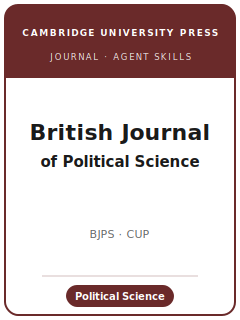

# British Journal of Political Science Skills

<p align="center">
  
</p>

[](LICENSE)
[](https://www.cambridge.org/core/journals/british-journal-of-political-science)
[](https://www.cambridge.org/core/journals/british-journal-of-political-science)
[](https://github.com/anthropics/claude-code)

English | [简体中文](README.zh-CN.md)

Agent skill stack for manuscripts targeted at the **British Journal of Political Science (BJPS /
BJPolS)** — a leading **general** political-science journal, founded in **1971** and published by
**Cambridge University Press**. BJPS is **broadly based and internationally oriented**: it aims to cover
developments across a wide range of **countries and specialisms**, publishing across the whole
discipline — comparative politics, international relations, political theory, political behaviour and
public opinion, political economy, and political methodology — quantitative, qualitative, formal,
experimental, computational, and interpretive alike, and it welcomes work from related disciplines
(sociology, social psychology, economics, philosophy).

This repository is opinionated. It is **not** a generic social-science writing toolbox and it is **not**
an economics pack repurposed for politics. It is a **BJPS-specific** stack: a question of **wide
political-science interest** that travels beyond a single subfield *and* a single country, an argument
that is portable, a design defended on its own methodological terms, **double-blind** preparation, and a
**replication-data package** deposited to the **BJPolS Dataverse** on Harvard Dataverse at acceptance.

**Official basis checked 2026-06** (检索于 2026-06；以官网为准) — see
[`resources/official-source-map.md`](resources/official-source-map.md) for every source URL and the
`待核实` markers on unverified items.

---

## What Is BJPS, and Why a Dedicated Stack?

BJPS's constraints differ from a US flagship, a comparative specialist, or a methods journal:

| Constraint            | BJPS                                                                          | Implication                                                       |
|-----------------------|-------------------------------------------------------------------------------|------------------------------------------------------------------|
| Scope                 | **Whole discipline**, **internationally** oriented                            | The paper must travel beyond one subfield *and* one country      |
| Premium on            | **Wide interest** + a clear, portable contribution                            | A narrow, single-case-framed result is off-fit                   |
| Methods               | Quantitative, qualitative, formal, experimental, interpretive — judged on own terms | Do not force one template onto every paper                 |
| Publisher / owner     | **Cambridge University Press** (assoc. British Academy)                        | Submitted via the journal's online portal, not a US system       |
| Review model          | **Double-blind**, usually ≥ 2 referees                                         | Anonymize the manuscript; remove funding notes + self-references |
| Fee                   | No submission fee stated; **Comments carry no APC**                            | Do not budget a submission fee; verify any OA APC                |
| Length                | Research Articles **~10,000 words**; Letters **~4,000**; abstract **≤ 150** (待核实) | Choose the right format up front                            |
| Style                 | **Cambridge house style — Harvard author-date**                               | Not Chicago/APSA; MS Word or LaTeX accepted                      |
| Transparency          | **DA-RT signatory**; replication data + code to the **BJPolS Dataverse** at acceptance | Build the package as you go                              |
| Distinctive formats   | Research Articles + Letters (short papers) + Comments                          | A Letter is a complete short paper, not a truncated Article      |

Volatile specifics (editors and term, exact caps, fee/APC, portal URL, policy wording) change — items
not directly confirmed are marked **待核实** in
[`resources/official-source-map.md`](resources/official-source-map.md). **Verify on the official
journal page.**

### Three publication formats

- **Research Articles** — the discipline's main research format, **~10,000 words** (待核实).
- **Letters** — focused, complete short contributions, **~4,000 words** (待核实).
- **Comments** — critiques, corrections, or reappraisals of a specific published BJPS article (no APC).

---

## Quick Start

### Option A — Claude Code Plugin (recommended)

```bash
/plugin marketplace add https://github.com/brycewang-stanford/british-journal-of-political-science-skills
/plugin install british-journal-of-political-science-skills
/reload-plugins
```

### Option B — Manual Copy

```bash
git clone https://github.com/brycewang-stanford/british-journal-of-political-science-skills.git
cd british-journal-of-political-science-skills

mkdir -p ~/.claude/skills && cp -R skills/bjps-* ~/.claude/skills/
# or
mkdir -p ~/.codex/skills && cp -R skills/bjps-* ~/.codex/skills/
```

### First Prompt

```
Use bjps-workflow to tell me which skill I should use next for my BJPS manuscript.
```

---

## Default Workflow

```text
bjps-topic-selection
        ▼
bjps-literature-positioning
        ▼
bjps-theory-building
        ▼
bjps-research-design
        ▼
bjps-data-analysis
        ▼
bjps-tables-figures
        ▼
bjps-writing-style          (polish)
        ▼
bjps-transparency-and-data
        ▼
bjps-review-process
        ▼
bjps-submission
        ▼
bjps-rebuttal
```

`bjps-workflow` is the router — it tells you which skill to use next based on where you are. If your
contribution is a focused single result, consider the **Letter** format; if you are critiquing a
published BJPS finding, consider a **Comment**.

---

## Skills

| Skill                          | Purpose                                                                       |
|--------------------------------|-------------------------------------------------------------------------------|
| `bjps-workflow`                | Router — decides which sub-skill to invoke next                               |
| `bjps-topic-selection`         | Wide-interest fit across subfields and countries; pick the right format        |
| `bjps-literature-positioning`  | Engage the cross-subfield, cross-national debate BJPS readers expect           |
| `bjps-theory-building`         | Build the argument (formal, interpretive, or empirical) into a portable contribution |
| `bjps-research-design`         | Defend the design — causal inference, case selection, experiments, formal      |
| `bjps-data-analysis`           | Analysis norms, uncertainty, robustness, cross-national measurement            |
| `bjps-tables-figures`          | Accessible, self-contained exhibits sized to Cambridge's limits                |
| `bjps-writing-style`           | Cambridge Harvard author-date; reach a broad readership within the word cap    |
| `bjps-transparency-and-data`   | BJPolS Dataverse replication package; DA-RT; qualitative transparency; exemptions |
| `bjps-review-process`          | Double-blind review, desk screen, referee count, decision categories           |
| `bjps-submission`              | Submission preflight (anonymization, word count, ORCID, abstract)              |
| `bjps-rebuttal`                | R&R response-letter strategy for multiple referees + editor                    |

### Resources

- [`resources/code/`](resources/code/) — reproducible Stata + Python causal-inference skeleton (DiD / IV / RDD / DML / mechanism / robustness / tables), vendored for self-containment
- [`resources/external_tools.md`](resources/external_tools.md) — political-science data sources (V-Dem / CSES / ESS / WVS / COW / ACLED / Manifesto Project / KOF) + R / Stata / Python and qualitative/CAQDAS tooling
- [`resources/worked-examples/01-introduction.md`](resources/worked-examples/01-introduction.md) — a before→after BJPS-style introduction (fictional)
- [`resources/exemplars/library.md`](resources/exemplars/library.md) — verified real BJPS papers by subfield × method, with a sibling-journal guardrail
- [`resources/official-source-map.md`](resources/official-source-map.md) — official Cambridge / BJPS URLs behind every fact, with 待核实 markers on unverified items

---

## Differences vs. sibling journals

| Journal | Owner / publisher | Identity vs. BJPS |
|---------|-------------------|-------------------|
| **BJPS** | Cambridge University Press | The broad, **internationally-oriented general** political-science journal; values wide interest across countries and subfields |
| **APSR** | APSA / Cambridge University Press | US discipline-wide flagship; double-anonymous; APSA Style; APSR Dataverse — a US generalist sibling |
| **AJPS** | Midwest PSA / Wiley | US general flagship with a strong empirical/quantitative reputation; not CUP |
| **Comparative Political Studies (CPS)** | SAGE | Comparative-politics **specialist**, not a discipline-wide generalist |
| **World Politics** | Cambridge University Press / Princeton | Comparative + IR specialist with a theory premium; narrower than BJPS's full-discipline remit |

Do not misattribute famous papers across these venues — see the omissions list in
[`resources/exemplars/library.md`](resources/exemplars/library.md).

---

## What This Repo Does Not Do

- It does not write a submittable manuscript for you
- It does not simulate any specific editor's or referee's taste
- It does not assert volatile metadata (current editors and term, exact caps, fee/APC, portal, policy wording) — verify on the official page; unverified items are marked 待核实
- It does not decide whether your question is of wide disciplinary interest — that is the researcher's call

---

## Related

- [awesome-journal-skills](https://github.com/brycewang-stanford/awesome-journal-skills) — Index of journal-specific skill packs
- [British Journal of Political Science (Cambridge Core)](https://www.cambridge.org/core/journals/british-journal-of-political-science) — publisher home, submission guidelines, policies
- [BJPolS Dataverse (Harvard Dataverse)](https://dataverse.harvard.edu/dataverse/BJPolS) — replication-materials collection

---

## License

MIT
