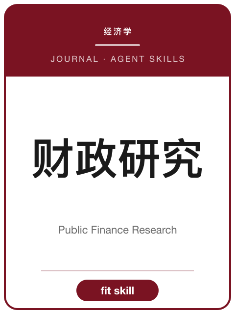

<!-- AJS-ROOT-JOURNAL-ENTRY -->
# 《财政研究》

> 侧重财政基础理论研究的全国性财政核心期刊。

| 期刊概览 | |
|---|---|
| **学科** | 财政学 |
| **主办/出版** | 财政部主管 · 中国财政学会主办 |
| **创刊** | 1980 |
| **ISSN** | 1003-2878 · CN 11-1077/F |
| **周期** | 月刊 |
| **收录/地位** | CSSCI · 北大中文核心 |
| **官网** | [czyj.cbpt.cnki.net](https://czyj.cbpt.cnki.net/) |
| **核验日期** | 2026-06-17 |

**▶ 调用 skill —— [`public-finance-research`](../Chinese-SocialScience-Journal-Skills/skills/public-finance-research/)：** 选题契合度、框架、方法与证据门槛、写作体例与拒稿雷区。

属于 **[中文社会科学期刊 Skills](../Chinese-SocialScience-Journal-Skills/)** 合集。投稿前请以官网最新《投稿须知》为准。

---

<!-- 机器可读的规范指针——请勿删除或改动（由 tools/audit_repo.py 校验）。 -->

- Canonical skill: [Chinese-SocialScience-Journal-Skills/skills/public-finance-research/](../Chinese-SocialScience-Journal-Skills/skills/public-finance-research/)
- Skill name: `public-finance-research`
- Bundle: [Chinese-SocialScience-Journal-Skills/](../Chinese-SocialScience-Journal-Skills/)

此目录刻意不包含 `SKILL.md`；真正可安装的 skill 保留在 bundle 内，确保插件路径和 skill 计数保持稳定。
