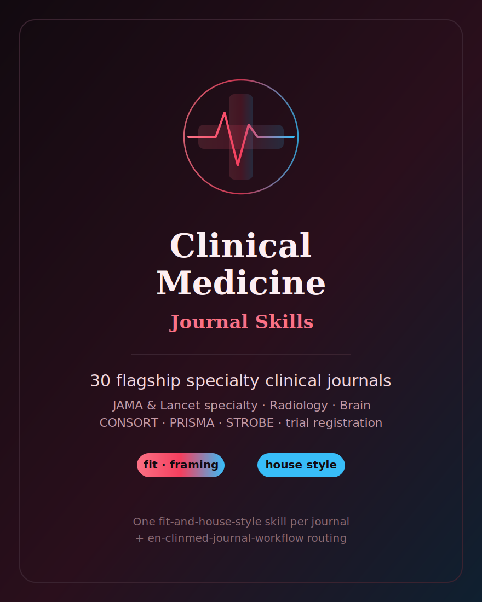

# 临床医学期刊 Skills（Clinical Medicine Journal Skills）

  

[English](README.md) | 简体中文

面向 **30 个旗舰英文临床专科期刊** 的 agent skill 合集 —— 在综合四大刊（NEJM、Lancet、JAMA、BMJ）与自然科学合集已覆盖的宽专科刊之上，进一步加深临床医学版图。覆盖 JAMA Network 专科子刊（内科、肿瘤、心脏、神经、儿科、精神、外科），Lancet 专科子刊（呼吸、糖尿病与内分泌、公共卫生、精神病学），以及肿瘤、呼吸/重症、肾脏、内分泌、肝病/消化、变态反应/免疫、风湿、神经病学、放射、麻醉、妇产、泌尿等领域的学会/专科旗舰刊。

本合集是 [`English-NaturalScience-Journal-Skills`](../English-NaturalScience-Journal-Skills/) 的临床专科姊妹包（综合四大刊与宽专科刊在自然科学合集内）。与姊妹包一致：**每刊一张自洽的「定位 + 写作风格」skill**，外加 `en-clinmed-journal-workflow` 路由卡。每张 skill 回答：*我的研究是否对口该专科刊、该如何框定、该刊期待什么临床证据与报告规范、投稿前必须回官网复核哪些细则（文章类型、报告清单、试验注册、伦理、利益冲突披露）。*

> 这些 skill 仅为**选刊定位与写作风格**辅助，**不构成临床、诊断或监管建议**。

## 覆盖

| 分组 | 数量 |
|---|--:|
| JAMA Network 专科子刊 | 7 |
| Lancet 专科子刊 | 4 |
| 肿瘤·呼吸/重症·肾脏·内分泌 | 8 |
| 肝病/消化·变态反应/免疫·风湿·神经病学 | 6 |
| 放射·麻醉·妇产·泌尿 | 5 |
| **单刊 skill 合计** | **30** |
| 路由 workflow（`en-clinmed-journal-workflow`） | 1 |

## 怎么用

1. **先路由**：从 `en-clinmed-journal-workflow` 起步，按专科、研究设计（RCT/观察性/诊断准确性/综述）与证据强度分类，拿到候选短名单。
2. **再对口**：打开首选期刊的单刊 skill，检验 scope、框定、临床证据门槛、写作风格与最可能的 desk-reject 触发点。
3. **最后复核官网**：每张 skill 都以 official-submission checklist 收尾。投稿前打开该刊当前作者须知（见 `resources/official-source-map.md`），确认适用报告规范（CONSORT/PRISMA/STROBE/STARD）与试验注册 —— **以官网为准**。

## 设计铁律（与姊妹包一致）

- **不写易变事实**：不写影响因子、接受率、ISSN、精确字数/版面费/编辑姓名。
- **不捏造文献**：文献一律泛指。
- **不给临床建议**：仅作选刊与写作风格辅助。
- **只用稳定惯例**：仅用持久结构性事实（结构化摘要、证据等级、ICMJE 试验注册与署名规则、EQUATOR 报告规范、学会归属）辅助判断对口。
- **官网优先**：官网现行规定与 skill 冲突时，以官网为准。

## 许可

MIT © 2026 Bryce Wang，见 [LICENSE](LICENSE)。
