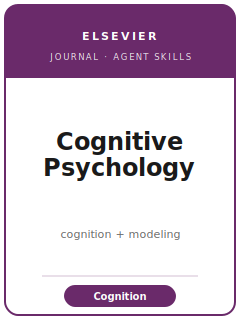

# 《认知心理学》（Cognitive Psychology）技能包

<p align="center">
  
</p>

[](LICENSE)
[](https://www.sciencedirect.com/journal/cognitive-psychology)
[](https://www.sciencedirect.com/journal/cognitive-psychology)
[](https://github.com/anthropics/claude-code)

[English](README.md) | 简体中文

面向 **《认知心理学》（Cognitive Psychology，Elsevier 出版）** 投稿的 Agent 技能栈。它是 **认知科学领域
的一流期刊**，涵盖注意、知觉、记忆、学习、语言、范畴化、推理、问题解决以及判断与决策。该刊的鲜明特色是
发表 **更长、更具整合性、以模型为驱动** 的论文：偏好 **将严格受控的认知实验与形式化的计算/数学建模相结合
的多实验研究项目**，通过“实验—模型拟合”循环来发展并检验认知理论。

本仓库是**有主见的**。它**不是**通用心理学写作工具箱，**也不是**把短报告包改名套用。它是
**《认知心理学》专属**：贡献形态围绕一个**被拟合并被比较的形式化模型**、一个每项研究都增添推断的
**多实验项目**、带**参数/模型可恢复性**的**模型比较**，以及与数据一并存放的**可复现模型代码**。投稿
通过 **Elsevier Editorial Manager**。

---

## 《认知心理学》是什么，为何需要专属技能栈？

它的约束与短报告刊或纯实证社科刊截然不同：

| 约束 | Cognitive Psychology | 含义 |
|------|------|------|
| 贡献形态 | **更长、整合性、以模型为驱动** 的论文（多实验 + 形式化模型） | 单一孤立效应是错误形态 |
| 理论 | 一个参数可解释的 **形式化/计算模型** | 仅口头理论或“只是曲线拟合”会被惩罚 |
| 设计 | 实验须能 **区分相互竞争的模型** | 两个对手模型预测相同的设计是浪费 |
| 分析 | **模型拟合 + 比较**（AIC/BIC/贝叶斯因子）+ **可恢复性** | 无对手、无恢复的单次拟合没有说服力 |
| 层级结构 | 跨被试/项目方差用 **（广义）线性混合模型 / 分层贝叶斯** | 聚合到格均值会抬高假阳性 |
| 图表 | 图须**将模型拟合叠加在数据上**；并附模型比较表 | 柱状均值图掩盖该刊真正关心的东西 |
| 出版方 / 投稿 | **Elsevier** / **Editorial Manager** | 须完成 Elsevier 研究数据声明与利益冲突声明 |
| 开放科学 | 共享 **数据 + 模型/分析代码 + 材料**；拟合可从代码重生成 | 代码透明是该刊的专属硬要求 |

易变的具体信息（现任编辑、评审模式、篇幅指引、摘要限制、数据/代码政策措辞、文章类型）会变化——未直接
核实项在 [`resources/official-source-map.md`](resources/official-source-map.md) 中标 **待核实**。
**请以官方页面为准。**

---

## 快速开始

### 方式 A — Claude Code 插件（推荐）

```bash
/plugin marketplace add https://github.com/brycewang-stanford/cognitive-psychology-skills
/plugin install cognitive-psychology-skills
/reload-plugins
```

### 方式 B — 手动复制

```bash
git clone https://github.com/brycewang-stanford/cognitive-psychology-skills.git
cd cognitive-psychology-skills

mkdir -p ~/.claude/skills && cp -R skills/cogpsych-* ~/.claude/skills/
# 或
mkdir -p ~/.codex/skills && cp -R skills/cogpsych-* ~/.codex/skills/
```

### 第一条提示

```
用 cogpsych-workflow 告诉我，我的 Cognitive Psychology 稿件下一步该用哪个技能。
```

---

## 默认工作流

```text
cogpsych-topic-selection
        ▼
cogpsych-theory-and-hypotheses    （先形式化模型与对手模型）
        ▼
cogpsych-literature-positioning
        ▼
cogpsych-study-design             （设计能区分模型的实验）
        ▼
cogpsych-data-analysis            （拟合 + 比较 + 恢复）
        ▼
cogpsych-tables-figures           （将模型拟合叠加在数据上）
        ▼
cogpsych-writing-style            （把整个项目整合为一个论证）
        ▼
cogpsych-open-science-and-transparency
        ▼
cogpsych-review-process
        ▼
cogpsych-submission
        ▼
cogpsych-rebuttal
```

`cogpsych-workflow` 是路由器。因为**模型即贡献**，应先形式化理论再做定位，并让实验与模型协同设计——
在 `cogpsych-theory-and-hypotheses` 与 `cogpsych-study-design` 之间迭代。

---

## 技能列表

| 技能 | 用途 |
|------|------|
| `cogpsych-workflow` | 路由器——决定下一步调用哪个子技能 |
| `cogpsych-topic-selection` | 模型驱动的契合度；多实验 vs 实验+模型 vs 综述 |
| `cogpsych-theory-and-hypotheses` | 形式化模型与对手模型；推导区分性预测 |
| `cogpsych-literature-positioning` | 针对对手模型而非编年史进行定位 |
| `cogpsych-study-design` | 混淆控制、平衡设计、关键对比的检验力 |
| `cogpsych-data-analysis` | 模型拟合 + 比较（AIC/BIC/BF）+ 恢复；混合/分层 |
| `cogpsych-tables-figures` | 将模型拟合叠加在数据上的图表；模型比较表 |
| `cogpsych-writing-style` | 把多实验项目 + 模型织成一个论证 |
| `cogpsych-open-science-and-transparency` | 开放数据 + 模型/分析代码 + 材料；拟合可复现、DOI |
| `cogpsych-review-process` | 编辑初筛 + 专家建模审查；修改周期 |
| `cogpsych-submission` | Editorial Manager 投稿前检查（形态、建模、代码、声明） |
| `cogpsych-rebuttal` | 针对追加实验/模型比较的修改回应策略 |

### 资源

- [`resources/external_tools.md`](resources/external_tools.md) — 建模框架（Stan/JAGS/PyMC）、模型比较（`loo`、贝叶斯因子）、混合模型（`lme4`/`brms`）、数据仓库（OSF/Mendeley Data/Zenodo）、可复现工具
- [`resources/official-source-map.md`](resources/official-source-map.md) — 每条事实背后的 Elsevier / ScienceDirect 官方 URL，未核实项标 待核实
- [`resources/worked-examples/01-introduction.md`](resources/worked-examples/01-introduction.md) — 按该刊模型驱动体例写的引言 before→after 范例（虚构）
- [`resources/exemplars/library.md`](resources/exemplars/library.md) — 经网络核实的真实 _Cognitive Psychology_ 论文（按主题 × 方法），含同源期刊误标防护

---

## 与同源期刊的区别

| 期刊 | 它想要什么 | 本包的差异 |
|------|------------|------------|
| **Cognitive Psychology**（本包） | 长篇、整合性、**模型驱动**的多实验项目 | 以“实验—模型拟合”循环、模型比较 + 恢复、代码透明为核心 |
| **Cognition**（Elsevier） | 更宽泛、更以效应/现象为先的认知科学 | Cognition 收更短、现象优先的论文；模型驱动项目请投本刊 |
| **JEP: General**（APA） | 高影响力的实验认知 | 《认知心理学》更偏形式化建模 + 多实验项目 |
| **Psychological Science**（APS/SAGE） | 短篇、单一发现报告（正文核心 ≤ 2,000 词） | 篇幅/野心相反；单一效应在本刊是错误形态 |
| **Journal of Memory and Language**（Elsevier） | 范围更窄的记忆/语言研究 | 整合性、模型驱动的贡献请投《认知心理学》 |

---

## 本仓库不做什么

- 不替你写出可直接投稿的稿件
- 不模拟任何特定编辑或评审人的口味
- 不臆断易变元数据（现任编辑、评审模式、篇幅指引、数据/代码政策措辞）——请以官方页面为准；未核实项标 待核实
- 不替你判断你的模型是否构成真正的理论推进——那是研究者的判断

---

## 相关

- [awesome-journal-skills](https://github.com/brycewang-stanford/awesome-journal-skills) — 期刊专属技能包索引
- [Cognitive Psychology（Elsevier / ScienceDirect）](https://www.sciencedirect.com/journal/cognitive-psychology) — 范围、作者指南、投稿
- [Cognitive Psychology — 作者指南](https://www.sciencedirect.com/journal/cognitive-psychology/publish/guide-for-authors) — 投稿、数据/代码政策、声明

---

## 许可

MIT
