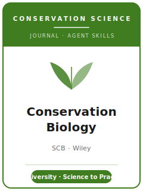

# 保护生物学（Conservation Biology）技能包

<p align="center">
  
</p>

[](LICENSE)
[](https://conbio.onlinelibrary.wiley.com/journal/15231739)
[](https://conbio.org/publications/conservation-biology/)
[](https://github.com/anthropics/claude-code)

[English](README.md) | 简体中文

面向 **《保护生物学》（Conservation Biology）** 投稿的 Agent 技能栈。该刊是 **国际保护生物学学会
（Society for Conservation Biology, SCB）的旗舰期刊**，创刊于 **1987 年**，由 **Wiley** 出版。它发表
开创性的研究、述评与综述，发展理论与方法、界定关键问题并提出解决方案，涵盖 **保护生物多样性的社会、
生态与哲学维度**——种群与景观生态学、灭绝风险、保护地设计、人与野生动物的关系，以及保护政策与实践，
兼采自然科学与社会科学。

本仓库是**有主见的**。它**不是**通用生态学写作工具箱，**也不是**把经济学或方法学技能包改名套用到保护
领域。它是 **《保护生物学》专属** 技能栈：一项对**保护生物多样性具有直接、可迁移意义**的结果、一个
与生态问题相匹配的设计（检测率、尺度、反事实）、**双盲**的稿件准备、一份**数据可得性声明**，并在可
共享时归档数据/代码，以及**衔接科学与实践**、不夸大证据的保护建议。

---

## 《保护生物学》是什么，为何需要专属技能栈？

它的约束不同于一般生态学刊或方法刊：

| 约束 | Conservation Biology | 含义 |
|------|----------------------|------|
| 看重 | **直接的保护意义** + 新颖性 + 可迁移性 | 仅严谨但无足轻重的研究不合适 |
| 范围 | 保护**生物多样性**——生态 + 实践 + 政策 | 结果须能服务于真实的保护决策 |
| 方法 | 野外生态、建模、综合、人文维度——各按其标准评判 | 设计与问题匹配，不要硬套同一模板 |
| 出版方 / 所有者 | **Wiley** / **国际保护生物学学会（SCB）** | 通过 **ScholarOne Manuscript Central** 投稿 |
| 评审模式 | **双盲**（2014 年起） | 稿件**与作者身份**均须匿名 |
| 篇幅 | Wiley 当前列表中 Contributed Papers 为 **7,000 词**；**摘要 ≤ 300 词** | 字数从摘要首词到 Literature Cited 末词（不含表格） |
| 图表 | 约**每四页正文一个表/图** | 每个图表都要物有所值，其余进 SI |
| 透明度 | **数据可得性声明**；鼓励存放可共享的数据/代码 | 边做边建；保护敏感物种数据 |
| 敏感数据 | 遮蔽受威胁/被贩运物种的精确位置 | 地图不得助长盗猎或干扰 |

这些事实背后的来源见 [`resources/official-source-map.md`](resources/official-source-map.md)。最终投稿周
仍应打开 Wiley Instructions for Authors 页面，核对文章类型是否开放、Contributed Papers 之外的各类型
上限、声明项与生产文件提示。

### 主要文章类型

- **Contributed Papers（贡献论文）**——完整实证研究，IMRAD 结构，意义广泛（Wiley 当前列表显示
  7,000 词）。
- **Research Notes（研究札记）**——聚焦或初步的贡献。
- **Reviews（综述）**——对成熟文献的全面综合。
- **Essays（述评）**——基于证据、面向未来的保护议题论证。
- **Conservation Practice and Policy（保护实践与政策）**——应用工具、政策与管理经验。
- **Comments / Diversity / Letters**——短篇（无摘要）。在开放时亦有 Registered Reports。

---

## 快速开始

### 方式 A — Claude Code 插件（推荐）

```bash
/plugin marketplace add https://github.com/brycewang-stanford/conbio-skills
/plugin install conbio-skills
/reload-plugins
```

### 方式 B — 手动复制

```bash
git clone https://github.com/brycewang-stanford/conbio-skills.git
cd conbio-skills

mkdir -p ~/.claude/skills && cp -R skills/conbio-* ~/.claude/skills/
# 或
mkdir -p ~/.codex/skills && cp -R skills/conbio-* ~/.codex/skills/
```

### 第一条提示

```
用 conbio-workflow 告诉我，我的 Conservation Biology 稿件下一步该用哪个技能。
```

---

## 默认工作流

```text
conbio-topic-selection
        ▼
conbio-literature-positioning
        ▼
conbio-study-design
        ▼
conbio-data-analysis
        ▼
conbio-figures-and-tables
        ▼
conbio-reporting-and-data-policy
        ▼
conbio-writing-style          （润色）
        ▼
conbio-conservation-relevance-and-implications
        ▼
conbio-review-process
        ▼
conbio-submission
        ▼
conbio-revision-and-rebuttal
```

`conbio-workflow` 是路由器——根据你所处阶段告诉你下一步用哪个技能。若设计是**前瞻性**的，尽早走
`conbio-review-process` 考虑 **Registered Reports** 通道；多数论文会在最终写作前多次循环
设计 ↔ 分析 ↔ 保护意义。

---

## 技能列表

| 技能 | 用途 |
|------|------|
| `conbio-workflow` | 路由器——决定下一步调用哪个子技能 |
| `conbio-topic-selection` | 保护意义契合；新颖性 + 可迁移性；选对文章类型 |
| `conbio-literature-positioning` | 对话保护领域文献；精确界定空白 |
| `conbio-study-design` | 为设计辩护——检测率、尺度、反事实、建模、综合 |
| `conbio-data-analysis` | 恰当模型、诚实的不确定性、稳健性、可复现 |
| `conbio-figures-and-tables` | 自洽、可读的图表与地图；遮蔽敏感位置 |
| `conbio-reporting-and-data-policy` | 数据可得性声明 + 可共享数据/代码归档；受限数据 |
| `conbio-writing-style` | 期刊体例指南；在各类型字数上限内的可读文风 |
| `conbio-conservation-relevance-and-implications` | 凝练「所以呢」；可行、可迁移的建议 |
| `conbio-review-process` | 双盲评审、编辑筛查、决定类别、Registered Reports |
| `conbio-submission` | ScholarOne 投稿前检查（匿名化、上限、体例、数据声明） |
| `conbio-revision-and-rebuttal` | 面向多位评审 + 责任编辑的回应信策略 |

### 资源

- [`resources/external_tools.md`](resources/external_tools.md) — 保护数据源（GBIF / IUCN 红色名录 / WDPA / Movebank / Global Forest Watch）+ R / Python / GIS 与综合工具
- [`resources/official-source-map.md`](resources/official-source-map.md) — 每条期刊专属事实背后的 Wiley / SCB 官方 URL 与投稿周 live-check 边界

---

## 本仓库不做什么

- 不替你写出可直接投稿的稿件
- 不模拟任何特定编辑或评审人的口味
- 不冻结投稿周才应确认的元数据，例如文章类型开放状态、全部类型上限、文件提示或 masthead 细节；投稿前以官方页面为准
- 不替你判断你的结果是否具有真正的保护意义——那是研究者的判断

---

## 相关

- [awesome-journal-skills](https://github.com/brycewang-stanford/awesome-journal-skills) — 期刊专属技能包索引
- [Conservation Biology（Wiley Online Library）](https://conbio.onlinelibrary.wiley.com/journal/15231739) — 出版方主页
- [SCB 上的 Conservation Biology](https://conbio.org/publications/conservation-biology/) — 所有者学会、期刊信息

---

## 许可

MIT
