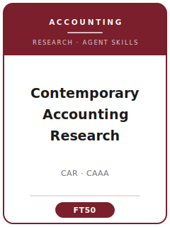

# Contemporary Accounting Research (CAR) Skills

<p align="center">
  
</p>

[](LICENSE)
[](https://www.caaa.ca/journals-and-research/contemporary-accounting-research-car)
[](https://www.caaa.ca/journals-and-research/contemporary-accounting-research-car)
[](https://github.com/anthropics/claude-code)

English | [简体中文](README.zh-CN.md)

Agent skill stack for manuscripts targeted at **Contemporary Accounting Research (CAR)** — the premier research journal of the **Canadian Academic Accounting Association (CAAA)**, published by **Wiley** (publishing partnership since 2010) and appearing quarterly (Mar/Jun/Sep/Dec).

This repository is opinionated. It is **not** a generic "accounting writing" toolbox. It is a **CAR-specific** stack built around CAR's defining feature: it is **deliberately method-agnostic**, welcoming "interesting and intellectually rigorous work in all topic areas of accounting, using any appropriate method, and based in any discipline or research tradition." In practice the published mix is dominated by archival/capital-markets work, but CAR is also one of the most receptive top-tier outlets for **experimental, analytical/modeling, field, survey, and qualitative** accounting research — so this stack routes you by research tradition and bakes in CAR's distinctive submission machinery (submission fee, blind manuscript + separate title page, mandatory ethics-approval verification, the Data Integrity & Code Sharing Policy, and bilingual English/French abstracts).

> Durable norms only. Editors, fees, exact page limits, the CAR Style Guide, and the Data Integrity policy change — always verify on the official CAAA/CAR author-guideline pages and in Editorial Manager.

---

## Why a Separate CAR Skill Stack?

CAR imposes constraints that differ materially from US-based accounting and management journals:

| Constraint              | Contemporary Accounting Research (CAR)                                  | Implication                                                        |
|-------------------------|------------------------------------------------------------------------|-------------------------------------------------------------------|
| Scope                   | All topic areas of accounting; **any appropriate method**              | One stack must handle archival, experimental, analytical, qualitative |
| Dominant method         | Archival/capital-markets in practice, but broad-tent by policy         | Analysis advice must branch by tradition, not assume one method   |
| Submission fee          | **CA/US $250 members / $600 non-members** (Visa/Mastercard)            | Unusual vs. fee-free management journals; budget and upload receipt |
| Length                  | **50 pages overall, 30-page main text**; overflow → online appendix    | Page-based governance, not a word count                            |
| Abstract                | **≤ 300 words** + up to six keywords; published in **English + French**| Write to translate cleanly; the CAAA translates every abstract    |
| Ethics                  | Mandatory **REB/IRB verification** for any human participants          | A bare assertion is rejected; documentation must be uploaded       |
| Reproducibility         | **Data Integrity & Code Sharing Policy** (2020): repo link, code, 6-yr | Plan variable definitions and code-sharing from day one            |
| Review & decisions      | Double-anonymous; **two reviewers**; subject Editor disposes; **EIC approves all acceptances** | First-round accepts are essentially unheard of           |
| Process quirks          | CAR Conference acknowledgement footnote; appeals need a new fee; author X/Twitter handles at final stage | Venue-specific norms with no US peer equivalent |

Generic "scientific writing" or "social-science methods" packs do not address these constraints.

---

## Quick Start

### Option A — Claude Code Plugin (recommended)

```bash
/plugin marketplace add https://github.com/brycewang-stanford/car-skills
/plugin install car-skills
/reload-plugins
```

### Option B — Manual Copy

```bash
git clone https://github.com/brycewang-stanford/car-skills.git
cd car-skills

mkdir -p ~/.claude/skills && cp -R skills/car-* ~/.claude/skills/
# or
mkdir -p ~/.codex/skills && cp -R skills/car-* ~/.codex/skills/
```

### First Prompt

```
Use car-workflow to tell me which skill I should use next for my CAR manuscript.
```

---

## Default Workflow

```text
car-topic-selection
        ▼
car-theory-development
        ▼
car-literature-positioning
        ▼
car-methods
        ▼
car-data-analysis
        ▼
car-contribution-framing
        ▼
car-tables-figures
        ▼
car-writing-style        (polish)
        ▼
car-submission
        ▼
car-review-process
        ▼
car-rebuttal
```

`car-workflow` is the router — it tells you which skill to use next based on where you are, starting from which research tradition (archival / experimental / analytical / qualitative) your paper is in.

---

## Skills

| Skill                        | Purpose                                                                       |
|------------------------------|-------------------------------------------------------------------------------|
| `car-workflow`               | Router — decides which sub-skill to invoke next, by research tradition        |
| `car-topic-selection`        | Accounting question + CAR fit; pick the research tradition the question needs  |
| `car-theory-development`     | Mechanism / predictions / model, adapted to archival, experimental, analytical |
| `car-literature-positioning` | Join an accounting conversation; disclose own-work overlap (author declaration) |
| `car-methods`                | Match design + identification; mandatory ethics-approval verification          |
| `car-data-analysis`          | Estimators by tradition, robustness, Data Integrity & Code Sharing Policy       |
| `car-contribution-framing`   | Explicit accounting contribution + practice/standard-setting implications       |
| `car-tables-figures`         | Variable-definitions appendix, results/cell-means tables, CAR Style Guide format |
| `car-writing-style`          | Front-loaded question, ≤300-word abstract, footnotes, author-date references     |
| `car-submission`             | Editorial Manager preflight (blind file, title page, fee, ethics, declarations)  |
| `car-review-process`         | Double-anonymous, two-reviewer, EIC-approved process; appeals                    |
| `car-rebuttal`               | R&R revision plan + point-by-point response to two reviewers and the subject Editor |

### Resources

- [`resources/external_tools.md`](resources/external_tools.md) — accounting-research data sources (Compustat / CRSP / I/B/E/S / Audit Analytics / WRDS / Qualtrics / Prolific) and analysis software (Stata `reghdfe`/`csdid` / SAS / R `fixest` / PROCESS / Mathematica) mapped to CAR's code-sharing policy
- [`resources/official-source-map.md`](resources/official-source-map.md) — official CAAA/CAR URLs behind every verified fact in this pack (accessed 2026-06-01)

---

## Differences vs. TAR / JAR / JAE / RAST

| Dimension          | CAR                                   | TAR                          | JAR                                | JAE                          |
|--------------------|---------------------------------------|------------------------------|------------------------------------|------------------------------|
| Owner / publisher  | CAAA / Wiley (Canada)                 | American Accounting Assoc.   | Chicago Booth / Wiley              | Elsevier                     |
| Method stance      | **Deliberately method-agnostic**      | Broad, archival-leaning      | Broad, archival/empirical-leaning  | Archival/economics-based     |
| Distinctive norms  | Submission fee; **bilingual EN/FR abstracts**; CAR Conference; REB verification | — | Registered-report tradition | Strong economics framing |
| Best fit           | Rigorous accounting work in any tradition | General accounting        | High-impact empirical accounting   | Economics-based accounting   |

If your question is pure finance or pure economics dressed in accounting data, CAR is a weaker fit than a paper whose answer changes how we understand **accounting** itself.

---

## Related

- [awesome-journal-skills](https://github.com/brycewang-stanford/awesome-journal-skills) — index of journal-specific skill packs
- [Academy-of-Management-Journal-Skills](https://github.com/brycewang-stanford) — AMJ skill pack

---

## License

MIT
