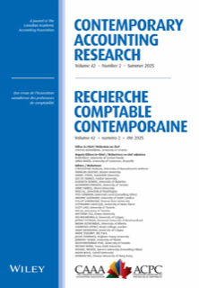

<!-- AJS-ROOT-JOURNAL-ENTRY -->
# Contemporary Accounting Research

> Publishes research on accounting's role within organizations, markets, and society using diverse disciplinary methods.

| At a glance | |
|---|---|
| **Field** | Accounting |
| **Publisher** | Wiley (for the Canadian Academic Accounting Association) |
| **Founded** | 1984 |
| **ISSN** | 0823-9150 (print) · 1911-3846 (online) |
| **Frequency** | Quarterly |
| **Standing** | FT50 |
| **Official** | [caaa.ca](https://www.caaa.ca/journals-and-research/contemporary-accounting-research-car) |
| **Checked** | 2026-06-17 |

**▶ Use the skill — [`contemporary-accounting-research`](../English-SocialScience-Journal-Skills/skills/contemporary-accounting-research/):** venue fit, framing, the method-and-evidence bar, house style, and desk-reject heuristics.

Part of the **[English Social-Science Journal Skills](../English-SocialScience-Journal-Skills/)** bundle. Always re-check the live author guidelines on the official site before submitting.

---

<!-- Machine-readable canonical pointer — do not remove or alter (validated by tools/audit_repo.py). -->

- Canonical skill: [English-SocialScience-Journal-Skills/skills/contemporary-accounting-research/](../English-SocialScience-Journal-Skills/skills/contemporary-accounting-research/)
- Skill name: `contemporary-accounting-research`
- Bundle: [English-SocialScience-Journal-Skills/](../English-SocialScience-Journal-Skills/)

This folder intentionally does not contain a `SKILL.md`; the installable skill stays inside the bundle so plugin paths and skill counts remain stable.
