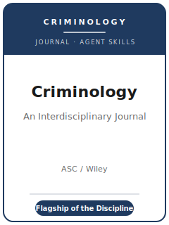

# Criminology Skills

<p align="center">
  
</p>

[](LICENSE)
[](https://onlinelibrary.wiley.com/journal/17459125)
[](https://asc41.org/publications/criminology-an-interdisciplinary-journal/)
[](https://github.com/anthropics/claude-code)

English | [简体中文](README.zh-CN.md)

Agent skill stack for manuscripts targeted at **Criminology** — the **flagship, interdisciplinary
journal of the American Society of Criminology (ASC)**, established in **1963** (as *Criminologica*,
renamed in **1970**) and published **quarterly** by **Wiley**. *Criminology* publishes the leading
scholarship on the **etiology, patterning, and control of crime and deviance**: criminological theory,
criminal-career and life-course processes, victimization, neighborhoods and crime, deterrence and
procedural justice, and the criminal-legal system — drawing on sociology, psychology, economics, and
related fields, in quantitative, qualitative, and mixed-methods traditions alike.

This repository is opinionated. It is **not** a generic social-science writing toolbox and it is
**not** a policy-evaluation pack repurposed for crime. It is a **Criminology-specific** stack: a
**theory-forward** contribution rather than a bare crime correlation, careful **crime measurement**
(the dark figure; UCR / NIBRS / NCVS / self-report), **within- vs. between-person** discipline in
life-course claims, a **blinded/anonymized** manuscript, **bias-free, person-first** language, and a
credible **data-and-transparency** path.

---

## What Is Criminology, and Why a Dedicated Stack?

*Criminology*'s constraints differ from a generic sociology journal or a policy outlet:

| Constraint            | Criminology                                                                   | Implication                                                       |
|-----------------------|-------------------------------------------------------------------------------|------------------------------------------------------------------|
| Scope                 | **Etiology, patterning & control of crime** across disciplines                | The paper must advance criminology, not just use crime data      |
| Premium on            | A **theoretical contribution** + an explicit mechanism                        | A descriptive crime correlation is off-fit                       |
| Methods               | Quantitative, qualitative, mixed — judged on own terms                        | Do not force one template onto every paper                       |
| Crime measurement     | Reported (**UCR/NIBRS**), victimization (**NCVS**), self-report differ        | State the construct; address the **dark figure**                 |
| Life-course claims    | **Within- vs. between-person** change must be separated                       | Fixed-effects / hybrid models for developmental arguments        |
| Publisher / owner     | **Wiley** / **American Society of Criminology**                               | Use the official online submission link from ASC/Wiley            |
| Review model          | **Double anonymized**                                                         | Anonymized main document + separate title page                   |
| Style                 | **A form of APA** (fall back to APA 6th); bias-free, person-first language    | Not Chicago; double-spaced; < 100-word author bios               |
| Exclusivity           | **One journal at a time** — simultaneous submission not allowed               | Submission is a commitment to publish in *Criminology*           |
| Sister journal        | Policy evaluation belongs at **Criminology & Public Policy**                  | Route program evaluations there, not here                        |

Volatile specifics still change. The pack now encodes only source-backed current facts in
[`resources/official-source-map.md`](resources/official-source-map.md): interim editor text, Wiley ACT
review/OA/ORCID/preprint fields, and the Research Note track. It deliberately does **not** encode a
word/page cap or abstract cap; use the live Wiley author-guidelines page at upload.

### Article types

- **Articles** — full original studies advancing criminological theory or measurement; the field's main format.
- **Research Notes** — focused, self-contained contributions; *Criminology* hosts a distinct Research Note
  track; the pack does not encode a numeric cap, so check the live Wiley Research Note description before
  committing to the format.
- **Replication / reappraisal** studies — re-examining or reproducing an influential published finding.

---

## Quick Start

### Option A — Claude Code Plugin (recommended)

```bash
/plugin marketplace add https://github.com/brycewang-stanford/crim-skills
/plugin install crim-skills
/reload-plugins
```

### Option B — Manual Copy

```bash
git clone https://github.com/brycewang-stanford/crim-skills.git
cd crim-skills

mkdir -p ~/.claude/skills && cp -R skills/crim-* ~/.claude/skills/
# or
mkdir -p ~/.codex/skills && cp -R skills/crim-* ~/.codex/skills/
```

### First Prompt

```
Use crim-workflow to tell me which skill I should use next for my Criminology manuscript.
```

---

## Default Workflow

```text
crim-topic-selection
        ▼
crim-literature-positioning
        ▼
crim-theory-building
        ▼
crim-research-design
        ▼
crim-data-analysis
        ▼
crim-tables-figures
        ▼
crim-writing-style          (polish)
        ▼
crim-data-and-transparency
        ▼
crim-review-process
        ▼
crim-submission
        ▼
crim-rebuttal
```

`crim-workflow` is the router — it tells you which skill to use next based on where you are. If your
design is **prospective**, route to `crim-data-and-transparency` early to **preregister** before you see
outcomes; if you are reassessing a published finding, treat it as a **replication/reappraisal** and lean
on `crim-research-design` + `crim-data-and-transparency`.

---

## Skills

| Skill                          | Purpose                                                                       |
|--------------------------------|-------------------------------------------------------------------------------|
| `crim-workflow`                | Router — decides which sub-skill to invoke next                               |
| `crim-topic-selection`         | Criminological fit and contribution; Article vs. Research Note; vs. *CPP*      |
| `crim-literature-positioning`  | Engage the theoretical debate across the field's disciplines                  |
| `crim-theory-building`         | Build the mechanism, scope conditions, and observable implications            |
| `crim-research-design`         | Defend the design — causal inference, longitudinal/life-course, trajectories  |
| `crim-data-analysis`           | Count/trajectory/survival models, within vs. between, robustness              |
| `crim-tables-figures`          | Age-crime curves, trajectory & survival plots, crime maps — self-contained    |
| `crim-writing-style`           | APA-based style; bias-free, person-first language; reach the whole field      |
| `crim-data-and-transparency`   | Data-availability, reproducibility package, preregistration, restricted data  |
| `crim-review-process`          | Blinded review, editorial screening, decision categories, expert reviewers    |
| `crim-submission`              | Online submission preflight (anonymized doc, title page, APA, single-submit)   |
| `crim-rebuttal`                | R&R response-letter strategy for multiple expert reviewers + editor           |

### Resources

- [`resources/external_tools.md`](resources/external_tools.md) — crime & life-course data (UCR / NIBRS / NCVS / NACJD / Add Health / NLSY / PHDCN / Pathways) + R / Stata / Python (trajectory, survival, spatial) and CAQDAS
- [`resources/official-source-map.md`](resources/official-source-map.md) — official ASC / Wiley URLs behind every encoded current fact

---

## What This Repo Does Not Do

- It does not write a submittable manuscript for you
- It does not simulate any specific editor's or reviewer's taste
- It does not guess volatile metadata missing from official sources; live Wiley/ASC pages govern submission-day caps and portal behavior
- It does not decide whether your question makes a criminological contribution — that is the researcher's call

---

## Related

- [awesome-journal-skills](https://github.com/brycewang-stanford/awesome-journal-skills) — Index of journal-specific skill packs
- [Criminology (Wiley Online Library)](https://onlinelibrary.wiley.com/journal/17459125) — publisher home
- [Criminology at ASC](https://asc41.org/publications/criminology-an-interdisciplinary-journal/) — owner, scope, editors

---

## License

MIT
