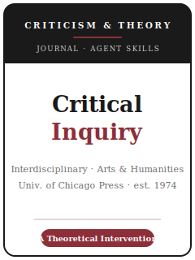

# 《批评探索》（Critical Inquiry）技能包

<p align="center">
  
</p>

[](LICENSE)
[](https://criticalinquiry.uchicago.edu/)
[](https://www.journals.uchicago.edu/journals/ci/about)
[](https://github.com/anthropics/claude-code)

[English](README.md) | 简体中文

面向 **《批评探索》（Critical Inquiry, CI）** 投稿的 Agent 技能栈。CI 是艺术与人文领域**首屈一指的
跨学科批评与理论期刊**，由 Wayne Booth、Arthur Heiserman 与 Sheldon Sacks 于 **1974 年** 创刊，
由 **芝加哥大学出版社** 出版。它"不依附任何单一学派，不囿于任何单一学科"，发表跨越**文学理论、艺术与
视觉文化、电影与媒介、哲学与美学、政治与政治理论、历史、文化批评** 的顶尖批评思想，被《纽约时报》称为
"学界最具声望的理论期刊"。

本仓库是**有主见的**。它**不是**通用人文写作工具箱，**也不是**文学系式的细读包。CI 是**跨学科理论**：
其核心单位是一个能**跨领域重新定向某场对话的、大胆的理论介入（intervention）**，并在**被细读的对象**
（文本、图像、艺术品、电影、案例）上得到检验，让**理论真正发挥作用**，配以**配得上其主张的文章风格**。
这里**没有数据集、没有统计、没有可复现材料包**。

---

## CI 是什么，为何需要专属技能栈？

CI 的约束不同于领域刊、方法刊或社会科学刊：

| 约束 | Critical Inquiry | 含义 |
|------|------------------|------|
| 范围 | **跨学科批评与理论**，艺术与人文 | 文章必须超越单一院系发声 |
| 看重 | 具有**跨领域意义**的**理论介入** | 没有赌注的细读不合适 |
| 证据 | **被细读的对象**——文本、图像、艺术品、电影、案例（非数据） | 无数据集、无统计、无复现 |
| 理论 | 作为**工具**对对象发挥作用 | 把术语当装饰是典型失败 |
| 出版方 | **芝加哥大学出版社**；CI 创刊于 1974 年 | 通过 **Editorial Manager** 投稿（`editorialmanager.com/ci/`） |
| 评审模式 | **同行评审**；主编与编辑团队共同细读 | 须说服严肃的通才型批评家，而非仅专家 |
| 投稿规则 | **不接受一稿多投 / 同时投稿** | 只投 CI |
| 篇幅 | **论文 ≤ 9,500 词**（含论述性脚注与**全部**文献信息） | 脚注算字数——纳入预算 |
| 其他体裁 | **批评回应（Critical Response）≤ 3,000**；**书评 ≤ 500** | 投稿前选对体裁 |
| 引注 | **《芝加哥手册》（第 17 版）** 脚注；**无参考文献表** | 非作者—年份；完整信息置于脚注 |
| 稿件 / 图片 | **Microsoft Word**；图片为**单独的 300 ppi JPEG/TIFF**，作者自清版权 | 自行尽早办理图片授权 |
| 费用 | 投稿说明未列单独投稿费；可选金色开放获取费用 **$2,500** | 只有选择 Gold OA 时才现场复核 OA 费用 |

`resources/official-source-map.md` 已于 2026-06-20 按 CI 投稿、简介和编辑团队页面刷新；其中记录了当前编辑、
篇幅上限、Gold OA、CMOS 表述、图片授权和正式上传前需要重开的官方页面。

### 三种投稿体裁

- **Article（论文）**——期刊的主力形式：完整的跨学科论证，**≤ 9,500 词**（含论述性脚注与全部文献信息）。
- **Critical Response（批评回应）**——对已发表 CI 文章的聚焦回应或论争，**≤ 3,000 词**。
- **Review（书评/展评）**——对书籍或展览的简短评介，**≤ 500 词**。

---

## 快速开始

### 方式 A — Claude Code 插件（推荐）

```bash
/plugin marketplace add https://github.com/brycewang-stanford/ci-skills
/plugin install ci-skills
/reload-plugins
```

### 方式 B — 手动复制

```bash
git clone https://github.com/brycewang-stanford/ci-skills.git
cd ci-skills

mkdir -p ~/.claude/skills && cp -R skills/ci-* ~/.claude/skills/
# 或
mkdir -p ~/.codex/skills && cp -R skills/ci-* ~/.codex/skills/
```

### 第一条提示

```
用 ci-workflow 告诉我，我的 Critical Inquiry 文章下一步该用哪个技能。
```

---

## 默认工作流

```text
ci-topic-selection
        ▼
ci-scholarly-positioning
        ▼
ci-argument-and-intervention
        ▼
ci-evidence-and-objects
        ▼
ci-theory-and-method
        ▼
ci-structure-and-exposition
        ▼
ci-writing-style            （润色）
        ▼
ci-citation-and-style
        ▼
ci-review-process
        ▼
ci-submission
        ▼
ci-revision-and-response
```

`ci-workflow` 是路由器——根据你所处阶段告诉你下一步用哪个技能。CI 文章很少线性推进：多数会在
**论证 ↔ 对象 ↔ 理论** 之间循环多次，文字才定型。若写 **批评回应**，论证与定位技能承担主要分量；
**书评** 则几乎直接进入写作风格与投稿。

---

## 技能列表

| 技能 | 用途 |
|------|------|
| `ci-workflow` | 路由器——决定下一步调用哪个子技能 |
| `ci-topic-selection` | CI 契合度：具跨领域赌注的理论介入；选对体裁 |
| `ci-scholarly-positioning` | 指明跨领域进入的对话；定位你的介入点 |
| `ci-argument-and-intervention` | 把核心主张锻造为真正的介入，而非一次细读 |
| `ci-evidence-and-objects` | 选择并细读对象——文本、图像、艺术品、案例 |
| `ci-theory-and-method` | 让理论作为工具发挥作用；使方法可见 |
| `ci-structure-and-exposition` | 为跨领域读者编排长篇人文散文（非 IMRaD） |
| `ci-writing-style` | 在字数上限内（脚注计入）写出有抱负而清晰的文字 |
| `ci-citation-and-style` | 芝加哥（第 17 版）脚注、无参考文献表；300 ppi 图片与授权 |
| `ci-review-process` | 同行 + 编辑评审、抱负门槛、不一稿多投规则 |
| `ci-submission` | Editorial Manager 投稿前检查（含脚注的字数、Word、图片、授权） |
| `ci-revision-and-response` | 修订策略 + 面向读者与编辑的回应信 |

### 资源

- [`resources/external_tools.md`](resources/external_tools.md) — 档案、文本与图像来源（HathiTrust / 博物馆开放获取 / Artstor / EEBO）、理论与批评参考书架、芝加哥脚注与图片处理工具
- [`resources/official-source-map.md`](resources/official-source-map.md) — 每条事实背后的 CI / 芝加哥大学出版社官方 URL，2026-06-20 已刷新

---

## 本仓库不做什么

- 不替你写出可直接投稿的文章
- 不模拟任何特定编辑或读者的口味
- 不把批评变成数据——无数据集、无统计、无复现
- 不把易变元数据永久写死；给出编辑、篇幅、OA 费用、CMOS 表述、授权或投稿路径建议前，先重开官方 source map
- 不替你判断你的想法是否构成真正的介入——那是批评者的判断

---

## 相关

- [awesome-journal-skills](https://github.com/brycewang-stanford/awesome-journal-skills) — 期刊专属技能包索引
- [Critical Inquiry（期刊站点）](https://criticalinquiry.uchicago.edu/) — 投稿、编辑、信息
- [Critical Inquiry（芝加哥大学出版社）](https://www.journals.uchicago.edu/journals/ci/about) — 出版方主页、简介、当期

---

## 许可

MIT
