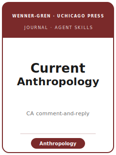

# Current Anthropology Skills

<p align="center">
  
</p>

[](LICENSE)
[](https://www.journals.uchicago.edu/journals/ca/about)
[](https://wennergren.org/)
[](https://github.com/anthropics/claude-code)

English | [简体中文](README.zh-CN.md)

Agent skill stack for manuscripts targeted at **Current Anthropology (CA)** — the transnational,
**all-subfields** journal **published by the University of Chicago Press for the Wenner-Gren Foundation
for Anthropological Research**, founded in **1959** by Sol Tax. CA publishes scholarship across the
**whole of anthropology**: **sociocultural anthropology, archaeology, biological/physical anthropology,
and linguistic anthropology**, plus ethnohistory, prehistory, and applied work. It is distinctively
strong on theory, synthesis, and field-shaping interventions for a worldwide audience.

What makes CA unlike any sibling is the **CA✩ Treatment**: when a **Major Article** is accepted, the
editors solicit **signed Comments from an international range of anthropologists**, publish those Comments
**alongside the article**, and print the **author's Reply** with them. The accepted paper appears *with*
its critics and the author's response, all at once. This comment-and-reply apparatus shapes the entire
lifecycle — you write to be **bold enough to be worth commenting on** and **robust enough to survive
public, signed critique**.

This repository is opinionated. It is **not** a generic social-science writing toolbox and it is **not**
an econometrics pack repurposed for anthropology. It is a **CA-specific** stack: a contribution of
**all-fields, agenda-setting significance**, an argument that speaks **past its own subfield** and
**rewards the CA✩ commentary**, **ethnographic and qualitative inference treated as first-class**,
**reflexivity and positionality** made explicit, and — at the center — **research ethics and
accountability**: informed consent, anonymization, protection of vulnerable communities, and
heritage/repatriation obligations, alongside the **Wenner-Gren copyright assignment**.

---

## What Is CA, and Why a Dedicated Stack?

CA's constraints differ from a single-subfield journal or a quantitative social-science venue:

| Constraint            | Current Anthropology                                                              | Implication                                                       |
|-----------------------|----------------------------------------------------------------------------------|------------------------------------------------------------------|
| Scope                 | **All subfields** of anthropology, transnational                                 | The paper must matter beyond its subfield                        |
| Signature process     | **CA✩ Treatment** — published signed Comments + author's Reply (Major Articles)   | Build the argument to reward *and* survive public critique       |
| Premium on            | **Field-shaping, agenda-setting intervention** worth international debate          | A narrow, subfield-only description is off-fit for a Major Article|
| Methods               | **Ethnographic/qualitative first-class**; also material, lab, computational       | Do not force ethnography into a hypothesis-test template          |
| Publisher / sponsor   | **University of Chicago Press** for the **Wenner-Gren Foundation**               | Submitted via **Editorial Manager**; Wenner-Gren copyright        |
| Length                | **Major Article 6,000–10,000** words; **Report 3,000–5,000**; **abstract ≤ 200** | Counts include references and endnotes                            |
| Article types         | Major Article · Report · Forum · Discussion/Comment (≤ 800 words) · Current Applications | Only Major Articles get the full CA✩ commentary          |
| Files                 | **`.doc`/`.rtf`** text + **separate TIFF/EPS** figures (not embedded PDF)         | Common avoidable upload failure                                  |
| Style                 | **Free-format** accepted; final files **Chicago author-date**, refs alphabetized  | DOIs in references; jargon discouraged; legible to nonspecialists |
| Ethics                | **Consent, anonymization, heritage/repatriation, accountability** are central     | Ethics is designed in, and is exposed to public Comment           |

> **Official basis checked 2026-06** — facts are anchored to the CA Instructions for Authors (UChicago
> Press), Wenner-Gren editorial pages, and the journal's About page. Live Editorial Manager prompts,
> editorial roster, anonymity model, and acceptance figures can change; verify those at submission.

### Article types at a glance

- **Major Article** — field-shaping intervention, **6,000–10,000 words**, abstract ≤ 200, up to 12
  figures/tables. **Receives the CA✩ Treatment** (published Comments + Reply).
- **Report** — sharp finding/provocation/new framework, **3,000–5,000 words**, up to 4 figures/tables.
- **Forum** — curated multi-author debate on a pressing issue.
- **Discussion / Comment** — reply/critique of a recent CA piece, **≤ 800 words** including references.
- **Current Applications** — open-access section bridging academic and applied anthropology.

---

## Quick Start

### Option A — Claude Code Plugin (recommended)

```bash
/plugin marketplace add https://github.com/brycewang-stanford/current-anthropology-skills
/plugin install current-anthropology-skills
/reload-plugins
```

### Option B — Manual Copy

```bash
git clone https://github.com/brycewang-stanford/current-anthropology-skills.git
cd current-anthropology-skills

mkdir -p ~/.claude/skills && cp -R skills/curranthro-* ~/.claude/skills/
# or
mkdir -p ~/.codex/skills && cp -R skills/curranthro-* ~/.codex/skills/
```

### First Prompt

```
Use curranthro-workflow to tell me which skill I should use next for my Current Anthropology manuscript.
```

---

## Default Workflow

```text
curranthro-topic-selection
        ▼
curranthro-literature-positioning
        ▼
curranthro-theory-building
        ▼
curranthro-research-design
        ▼
curranthro-data-analysis
        ▼
curranthro-tables-figures
        ▼
curranthro-writing-style          (polish)
        ▼
curranthro-transparency-and-data  (ethics & accountability — also run EARLY)
        ▼
curranthro-review-process         (incl. the CA✩ Treatment)
        ▼
curranthro-submission
        ▼
curranthro-rebuttal               (R&R letter AND the public CA✩ Reply)
```

`curranthro-workflow` is the router — it tells you which skill to use next based on your stage, subfield,
and article type. The **ethics-and-accountability** skill (`curranthro-transparency-and-data`) should run
**early** as well as before submission. From the very start, ask: *who will be invited to comment under
the CA✩ Treatment, and what will they say?*

---

## Skills

| Skill                               | Purpose                                                                       |
|-------------------------------------|-------------------------------------------------------------------------------|
| `curranthro-workflow`               | Router — decides which sub-skill to invoke next (by stage, subfield, type)     |
| `curranthro-topic-selection`        | All-fields fit; field-shaping, commentary-worthy intervention; article type    |
| `curranthro-literature-positioning` | Speak past your subfield; transnational citational practice; map commentators  |
| `curranthro-theory-building`        | Build a portable, debatable concept + reflexive argument for the CA✩ Treatment  |
| `curranthro-research-design`        | Defend the design — fieldwork, archival/material, lab/quant — vs. published critique |
| `curranthro-data-analysis`          | Disciplined interpretation; honest evidence; quant rigor for bio/archaeology   |
| `curranthro-tables-figures`         | Exhibits: consent, permissions, heritage; figure caps + TIFF/EPS formats       |
| `curranthro-writing-style`          | Free-format → Chicago author-date; reach all subfields; jargon-light prose      |
| `curranthro-transparency-and-data`  | Ethics & accountability: consent, anonymization, repatriation, WG copyright    |
| `curranthro-review-process`         | Screening, peer review, and the distinctive CA✩ comment-and-reply Treatment     |
| `curranthro-submission`             | Editorial Manager preflight (caps, file formats, ethics, Wenner-Gren copyright) |
| `curranthro-rebuttal`               | Both the R&R response letter AND the published CA✩ Reply to Comments           |

### Resources

- [`resources/external_tools.md`](resources/external_tools.md) — anthropology data sources, archives, and software (CAQDAS, transcription, GIS, lab/quant) by subfield
- [`resources/official-source-map.md`](resources/official-source-map.md) — official CA / Wenner-Gren / UChicago Press URLs behind every fact and live-check guardrail
- [`resources/worked-examples/01-introduction.md`](resources/worked-examples/01-introduction.md) — before→after CA-style introduction (fictional)
- [`resources/exemplars/library.md`](resources/exemplars/library.md) — real, web-verified CA papers by subfield × method, with a sibling-journal guard

---

## Differences vs. Sibling Journals

| Journal                    | Scope / format                                                   | This pack's guard |
|----------------------------|-----------------------------------------------------------------|-------------------|
| **Current Anthropology (CA)** | **All-subfields**, transnational; **CA✩ comment-and-reply** Treatment; Wenner-Gren/UChicago Press | The target of this pack |
| *American Anthropologist* (AA) | Four-field AAA flagship (Wiley); **no** comment apparatus       | CA has the CA✩ Comments + Reply; AA does not; different owner/portal |
| *American Ethnologist* (AE) | Sociocultural ethnography (AAA/AES)                              | CA is all-subfields, not AE's sociocultural focus |
| *Cultural Anthropology* (CulAnth) | Sociocultural, theory-forward (SCA), often open access     | CA is all-subfields with the CA✩ format, not CulAnth's sociocultural-only remit |

---

## What This Repo Does Not Do

- It does not write a submittable manuscript for you
- It does not simulate any specific editor's, reviewer's, or commentator's taste
- It does not grant ethics waivers or replace IRB/community review
- It does not hard-code volatile metadata beyond sourced facts; verify Editorial Manager prompts, editorial roster, anonymity model, and acceptance figures on the live pages

---

## Related

- [awesome-journal-skills](https://github.com/brycewang-stanford/awesome-journal-skills) — Index of journal-specific skill packs
- [Current Anthropology (UChicago Press)](https://www.journals.uchicago.edu/journals/ca/about) — journal home, Instructions for Authors
- [Wenner-Gren Foundation](https://wennergren.org/) — sponsor; editorial announcements

---

## License

MIT
