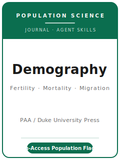

# Demography Skills

<p align="center">
  
</p>

[](LICENSE)
[](https://read.dukeupress.edu/demography)
[](https://www.populationassociation.org/demography/home)
[](https://github.com/anthropics/claude-code)

English | [简体中文](README.zh-CN.md)

Agent skill stack for manuscripts targeted at **Demography** — the **flagship journal of the
Population Association of America (PAA)**, founded in **1964** and published by **Duke University
Press** since **2021**. Demography is **fully open to readers** under a **Subscribe to Open (S2O)**
model and publishes the highest-quality research in **population science**: how populations change,
and the causes and consequences of fertility, mortality, and migration — drawing on anthropology,
biology, economics, epidemiology, geography, history, psychology, public health, sociology, and
statistics.

This repository is opinionated. It is **not** a generic social-science writing toolbox and it is
**not** an economics or sociology pack repurposed for population studies. It is a **Demography-specific**
stack: a genuine **population-change question** of general interest to demographers, an argument that
speaks **across components** (a mortality scholar should care about your fertility paper), a design
defended on **demographic** terms (the right life table, decomposition, event-history, or
age-period-cohort method), **double-blind** preparation, and a **data availability statement** with
**reproducible code** deposited in a FAIR repository.

---

## What Is Demography, and Why a Dedicated Stack?

Demography's constraints differ from a general social-science or methods journal:

| Constraint            | Demography                                                                       | Implication                                                       |
|-----------------------|----------------------------------------------------------------------------------|------------------------------------------------------------------|
| Scope                 | **Population science** — how populations change; fertility, mortality, migration | The paper must ask a real population question, not just use the data |
| Premium on            | **General interest to demographers** + a clear contribution                      | A narrow applied result using demographic data is off-fit        |
| Methods               | Life tables, decomposition, event history, APC, multistate, microsimulation, projections, causal — judged on own terms | Pick the demographic method that answers the question     |
| Publisher / owner     | **Duke University Press** (since 2021) / **PAA**                                  | Submitted via **ScholarOne**, not Editorial Manager (moved 2024) |
| Review model          | **Double-blind**                                                                 | Avoid self-identifying references; reviewers and authors anonymous |
| Access model          | **Subscribe to Open (S2O)** — **free to read**; **not** an APC journal           | The $1,000 fee is **not** an open-access charge                  |
| Fees                  | **$35 submission** + **$1,000 editorial-management at acceptance** (both waivable) | Budget the $35; the $1,000 is post-acceptance and waivable     |
| Length                | **Article <= 8,000 words**; **Note <= 4,000**; **Commentary <= 2,000**; **abstract <= 200** | Main-text counts exclude abstract/keywords/footnotes/refs |
| Front matter          | **3-5 highlights** (<= 85 chars each); **<= 5 keywords**; **loosely APA** style   | Highlights and keywords are required, formatted to spec          |
| Transparency          | **Data availability statement** + persistent IDs; **reproducible code** encouraged | Demography hosts no repository — you deposit in a FAIR one        |

Volatile specifics (editor and term, exact caps, fee amounts/waivers, which volume is open this year,
policy wording) change — items not directly confirmed are marked **待核实** in
[`resources/official-source-map.md`](resources/official-source-map.md). **Verify on the official
journal page.**

### Three article types

- **Research Article** — full original population study; **<= 8,000 words** main text.
- **Research Note** — one crisp, self-contained contribution; **<= 4,000 words**.
- **Commentary** — short response or invited perspective; **<= 2,000 words**.

---

## Quick Start

### Option A — Claude Code Plugin (recommended)

```bash
/plugin marketplace add https://github.com/brycewang-stanford/demog-skills
/plugin install demog-skills
/reload-plugins
```

### Option B — Manual Copy

```bash
git clone https://github.com/brycewang-stanford/demog-skills.git
cd demog-skills

mkdir -p ~/.claude/skills && cp -R skills/demog-* ~/.claude/skills/
# or
mkdir -p ~/.codex/skills && cp -R skills/demog-* ~/.codex/skills/
```

### First Prompt

```
Use demog-workflow to tell me which skill I should use next for my Demography manuscript.
```

---

## Default Workflow

```text
demog-topic-selection
        ▼
demog-literature-positioning
        ▼
demog-theory-building
        ▼
demog-research-design
        ▼
demog-data-analysis
        ▼
demog-tables-figures
        ▼
demog-writing-style          (polish)
        ▼
demog-data-and-reproducibility
        ▼
demog-review-process
        ▼
demog-submission
        ▼
demog-rebuttal
```

`demog-workflow` is the router — it tells you which skill to use next based on where you are. Most
demographic papers loop **theory ↔ design ↔ analysis** several times while choosing among life-table,
decomposition, event-history, or age-period-cohort framings before moving on to writing and the data
availability statement.

---

## Skills

| Skill                            | Purpose                                                                       |
|----------------------------------|-------------------------------------------------------------------------------|
| `demog-workflow`                 | Router — decides which sub-skill to invoke next                               |
| `demog-topic-selection`          | Population-question fit and general interest; pick the right article type     |
| `demog-literature-positioning`   | Speak across components; engage the demographic literatures readers expect    |
| `demog-theory-building`          | Build the mechanism, identity, or sharpened estimate into a contribution      |
| `demog-research-design`          | Choose and defend the demographic method (life table, decomposition, EHA, APC) |
| `demog-data-analysis`            | Rate/exposure construction, uncertainty, decomposition, APC, survival rigor   |
| `demog-tables-figures`           | Population pyramids, Lexis surfaces, survival curves, age schedules           |
| `demog-writing-style`            | House style (loosely APA); abstract, highlights, keywords; word/exhibit limits |
| `demog-data-and-reproducibility` | Data availability statement, FAIR-repository deposit, reproducible code        |
| `demog-review-process`           | Double-blind review, pre-review/desk screening, topic-area Deputy Editors     |
| `demog-submission`               | ScholarOne preflight (anonymization, limits, highlights, $35 fee)             |
| `demog-rebuttal`                 | R&R response-letter strategy for expert reviewers + the synthesizing editor   |

### Resources

- [`resources/external_tools.md`](resources/external_tools.md) — population data sources (HMD / HFD / IPUMS / DHS / HRS / WPP) + R / Stata / Python demographic packages (life tables, decomposition, survival, APC, microsimulation)
- [`resources/official-source-map.md`](resources/official-source-map.md) — official PAA / Duke URLs behind every fact, with 待核实 markers on unverified items

---

## What This Repo Does Not Do

- It does not write a submittable manuscript for you
- It does not simulate any specific editor's or reviewer's taste
- It does not assert volatile metadata (current editor and term, exact caps, fee amounts/waivers, which volume is open this year, policy wording) — verify on the official page; unverified items are marked 待核实
- It does not decide whether your question is of general interest to demographers — that is the researcher's call
- It does not treat the $1,000 editorial-management fee as an open-access charge — Demography is free to read under S2O

---

## Related

- [awesome-journal-skills](https://github.com/brycewang-stanford/awesome-journal-skills) — Index of journal-specific skill packs
- [Demography on Duke University Press](https://read.dukeupress.edu/demography) — publisher home, current issues
- [Demography at PAA](https://www.populationassociation.org/demography/home) — owner, author guidelines, policies
- [Demography Open-Access (Subscribe to Open) FAQ](https://www.dukeupress.edu/open-access/frequently-asked-questions-(faqs)-about-demography) — the S2O funding model

---

## License

MIT
