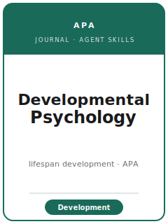

# Developmental Psychology 技能包

<p align="center">
  
</p>

[](LICENSE)
[](https://www.apa.org/pubs/journals/dev/)
[](https://www.apa.org/pubs/journals/dev/)
[](https://github.com/anthropics/claude-code)

[English](README.md) | 简体中文

面向 **Developmental Psychology（发展心理学）** 投稿的智能体技能包——这是 **美国心理学会（APA）** 旗下、聚焦
**人类毕生发展（lifespan development）** 的实证期刊：涵盖婴儿期、儿童期、青少年期、成年期与老年期，以及认知、社会、
情绪与生物层面的发展。该刊的核心要求是一个可信的 **发展性变化（developmental change）** 主张——年龄效应、个体内变化
或发展轨迹——并且贡献必须 **推进发展理论**。

本仓库立场鲜明。它 **不是** 通用的心理学写作工具箱，也 **不是** 改名换姓的社会科学模板，而是 **Developmental
Psychology 专属** 的：发展性变化研究设计（横断、纵向/队列、加速纵向、微观发生、实验），该领域的硬问题（**年龄 vs.
队列混淆、被试流失、跨年龄测量等值性、涉及未成年人的伦理**），变化建模分析（**增长曲线 / 多层模型 / 结构方程，
中介/调节**），**APA 第 7 版 + JARS** 报告规范，必备的 **公众意义陈述（Public Significance Statement）**，以及该刊的
**透明与开放促进（TOP）** 开放科学要求。

**官方依据核对于 2026-06。** 易变细节（主编、篇幅档位、摘要字数上限、匿名评审与 TOP 措辞）在
[`resources/official-source-map.md`](resources/official-source-map.md) 中标注 **待核实**。**请以官网为准。**

---

## 什么是 Developmental Psychology，为何需要专门的技能栈？

它的约束与一般实证心理学或社会科学期刊明显不同：

| 约束              | Developmental Psychology                                                        | 含义                                                       |
|-------------------|--------------------------------------------------------------------------------|------------------------------------------------------------|
| 核心主张          | **发展性变化**——年龄效应、个体内变化、发展轨迹                                   | 单一年龄段的相关不构成契合                                 |
| 研究设计          | 横断、**纵向/队列**、加速纵向、微观发生、实验                                    | 让设计能支撑变化主张                                       |
| 硬问题            | **年龄 vs. 队列**、**被试流失**、跨年龄 **测量等值性**                           | 解释变化前先检验等值性                                     |
| 分析方法          | **增长曲线 / 多层模型 / 结构方程**，中介/调节，FIML/多重插补处理流失             | 对变化建模，而非只取快照                                   |
| 报告规范          | **APA 第 7 版 + JARS**（JARS-Quant / JARS-Qual / MARS）                          | 效应量 + 置信区间；充分披露                                |
| 前置信息          | **公众意义陈述**（2–3 句，约 30–70 词）                                          | 面向公众、易懂、不夸大                                     |
| 篇幅              | 分档：约 4,500（简报）/ 10,500（常规）/ 15,000（多研究/纵向）                     | 选对档位（检索于 2026-06；以官网为准）                     |
| 伦理              | 知情同意 **+ 儿童赞同（assent）**；弱势群体保护                                  | 年龄适配的测量与数据处理                                   |
| 出版方 / 投稿系统 | **APA** / **Editorial Manager**（`editorialmanager.com/dvl`）；**匿名评审**     | 正文与共享链接都要匿名                                     |
| 透明度            | **TOP**——数据可得性声明、DOI、预注册、样本量论证                                | 尽早规划存储；未成年人数据经授权档案库共享                 |

Developmental Psychology 是 **APA 旗下面向毕生发展的综合性期刊**——区别于 **Child Development**（SRCD）、
**Developmental Science** 与 **JPSP**。未经核实的条目在
[`resources/official-source-map.md`](resources/official-source-map.md) 中标注 **待核实**。

---

## 快速开始

### 方式 A —— Claude Code 插件（推荐）

```bash
/plugin marketplace add https://github.com/brycewang-stanford/developmental-psychology-skills
/plugin install developmental-psychology-skills
/reload-plugins
```

### 方式 B —— 手动复制

```bash
git clone https://github.com/brycewang-stanford/developmental-psychology-skills.git
cd developmental-psychology-skills

mkdir -p ~/.claude/skills && cp -R skills/devpsych-* ~/.claude/skills/
# 或
mkdir -p ~/.codex/skills && cp -R skills/devpsych-* ~/.codex/skills/
```

### 第一条指令

```
使用 devpsych-workflow，告诉我针对我的 Developmental Psychology 稿件下一步应使用哪个技能。
```

---

## 默认工作流

```text
devpsych-topic-selection
        ▼
devpsych-theory-and-hypotheses
        ▼
devpsych-literature-positioning
        ▼
devpsych-study-design          （在此预注册并规划等值性/流失处理）
        ▼
devpsych-data-analysis
        ▼
devpsych-tables-figures
        ▼
devpsych-writing-style          （APA 第 7 版 + 公众意义陈述）
        ▼
devpsych-open-science-and-transparency
        ▼
devpsych-review-process
        ▼
devpsych-submission
        ▼
devpsych-rebuttal
```

`devpsych-workflow` 是路由器。若设计为 **前瞻性、验证性**，请尽早转入 `devpsych-study-design` 与
`devpsych-open-science-and-transparency`，以便在收集数据前就完成预注册与样本量论证。

---

## 技能列表

| 技能                                      | 用途                                                                          |
|-------------------------------------------|-------------------------------------------------------------------------------|
| `devpsych-workflow`                       | 路由器——决定下一步调用哪个子技能                                              |
| `devpsych-topic-selection`                | 契合度检验：贡献是否关乎发展性变化？选择篇幅档位                               |
| `devpsych-theory-and-hypotheses`          | 发展理论 + 年龄分级、有方向的假设；验证/探索区分                              |
| `devpsych-literature-positioning`         | 锚定发展性缺口（变化/年龄/机制）与贡献                                        |
| `devpsych-study-design`                   | 年龄 vs. 队列、流失、测量等值性、效力、涉及未成年人的伦理                      |
| `devpsych-data-analysis`                  | 增长曲线/多层/结构方程、等值性、中介/调节、效应量                            |
| `devpsych-tables-figures`                 | 展示随年龄变化的 APA 第 7 版图表（轨迹、置信区间）                            |
| `devpsych-writing-style`                  | APA 第 7 版 + JARS；篇幅档位；公众意义陈述                                    |
| `devpsych-open-science-and-transparency`  | TOP：数据可得性声明、DOI、预注册、未成年人数据                                |
| `devpsych-review-process`                 | 匿名评审；发展可信度与透明度作为评判因素                                      |
| `devpsych-submission`                     | Editorial Manager 投稿前检查（档位、摘要、匿名、等值性、TOP）                 |
| `devpsych-rebuttal`                       | R&R 回复信策略（等值性/流失/披露类要求）                                      |

### 资源

- [`resources/external_tools.md`](resources/external_tools.md) — 预注册（OSF）、存储库（OSF/ICPSR/Databrary/Dataverse/Zenodo）、发展数据档案、效力模拟、增长/SEM/等值性/缺失数据软件包、`papaja`
- [`resources/official-source-map.md`](resources/official-source-map.md) — 每条事实背后的 APA 官方链接，附 待核实 标注
- [`resources/worked-examples/01-introduction.md`](resources/worked-examples/01-introduction.md) — Developmental Psychology 引言 before→after 示例（虚构）
- [`resources/exemplars/library.md`](resources/exemplars/library.md) — 按方法 × 发展领域整理的、经核实的 Developmental Psychology 论文

---

## 与同类期刊的区别

| 维度        | Developmental Psychology（APA）       | Child Development（SRCD）           | Developmental Science（Wiley）       | JPSP（APA）                     |
|-------------|---------------------------------------|------------------------------------|--------------------------------------|---------------------------------|
| 核心范围    | 广义 **毕生** 发展                    | 学会旗舰，**儿童期**                | 常为 **婴儿/认知机制**               | 人格 / 社会过程                 |
| 定义性主张  | 发展 **变化** + 理论                  | 儿童发展 + 理论                    | 发展的机制                           | 非发展性变化主张               |
| 典型篇幅    | 分档报告（简报→多研究）               | 完整实证论文                       | 多为 **短文**、节奏快                | 长篇实证论文                   |
| 最契合时    | 毕生变化、广义理论推进                | 以儿童为中心、面向学会             | 短小、聚焦机制的发现                 | 不以年龄为核心的过程           |

---

## 本仓库不做什么

- 不替你写出可直接投稿的稿件
- 不模拟任何特定主编或审稿人的口味
- 不断言易变元数据（现任主编、确切篇幅档位、TOP 措辞）——请以官网为准；未核实项标注 待核实
- 不替你判断你的发现是否为可信的发展性推进——这是研究者的判断

---

## 相关链接

- [awesome-journal-skills](https://github.com/brycewang-stanford/awesome-journal-skills) — 期刊专属技能包索引
- [Developmental Psychology (APA)](https://www.apa.org/pubs/journals/dev/) — 范围、投稿指南、开放科学政策
- [APA JARS](https://apastyle.apa.org/jars) — 期刊文章报告标准

---

## 许可证

MIT
