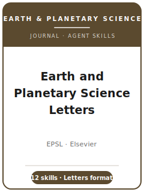

# 地球与行星科学快报（EPSL）技能包

<p align="center">
  
</p>

[](LICENSE)
[](https://www.sciencedirect.com/journal/earth-and-planetary-science-letters)
[](https://www.sciencedirect.com/journal/earth-and-planetary-science-letters)
[](https://github.com/anthropics/claude-code)

[English](README.md) | 简体中文

面向 **《地球与行星科学快报》（Earth and Planetary Science Letters, EPSL）** 投稿的 Agent 技能栈。
EPSL 是 **Elsevier 旗舰级的固体地球与行星科学快报期刊**（创刊于 1966 年，ISSN 0012-821X），发表
**简明、高显著性的 Letters**，聚焦地球及其他行星（含系外行星）的物理、化学与力学过程——从深部内部
到大气层，横跨地球化学、地球物理、地质年代学、地球动力学、岩石学、古地磁、宇宙化学与行星内部研究。

本仓库是**有主见的**。它**不是**通用地学写作工具箱，**也不是**把其他学科的技能包换个名词。它是
**EPSL 专属**技能栈，围绕真正决定一篇 EPSL 论文命运的要素构建：**快报体裁**（正文约 6,500 词上限、
只承载*一个*决定性进展）、**过程层面的科学主张**而非区域个案研究、同位素与年代学数据的**完整分析
不确定度报告**、在学科社区仓库中的 **FAIR 数据存储**（EarthChem、PANGAEA、IRIS/EarthScope、MagIC、
NASA PDS），以及面向**多学科地球—行星读者群**的表述方式。

---

## EPSL 是什么，为何需要专属技能栈？

EPSL 的约束既不同于专业地学期刊，也不同于泛科学期刊：

| 约束 | EPSL | 含义 |
|------|------|------|
| 体裁 | **Letters**——正文约 6,500 词上限（请复核） | 一个决定性结果；不鼓励姊妹篇（companion papers） |
| 看重 | 前沿性、**过程层面**的洞见 | 缺乏可迁移结论的区域个案研究会被桌面拒稿 |
| 范围 | **地球与行星**（含系外行星）的物理/化学/力学过程 | 行星研究在范围内，描述性的地方性工作不在 |
| 读者 | 地球化学家 + 地球物理学家 + 地球动力学家 + 行星科学家 | 审稿人通常横跨两个子领域 |
| 严谨性 | 完整不确定度预算、标样/空白/衰变常数、MSWD、分辨率检验 | 未定义的 ± 至少会招致审稿质询 |
| 数据 | 数据可得性声明 + **FAIR 仓库**（EarthChem、PANGAEA、IRIS、MagIC、PDS） | "available on request" 是红旗信号 |
| 出版方 / 系统 | Elsevier / **Editorial Manager** | Elsevier 各项声明：COI、CRediT、资助、AI 使用 |
| 文章类型 | Letters；**受邀** Frontiers Papers；Comments/Replies | 切勿自选 Frontiers 类型 |

易变的具体信息（确切字数上限、Highlights 要求、参考文献格式、编辑名单、APC）会变化——此类条目在
[`resources/official-source-map.md`](resources/official-source-map.md) 中标记为 **re-check（请复核）**。
**请以官方期刊页面为准。**

### 文章类型（细节请在官网复核）

- **Letter**——标准类型：简明、高显著性的原创研究（正文约 ≤ 6,500 词）。
- **Frontiers Paper**——领域综述性长文，**仅限编辑邀请**。
- **Comment / Reply**——针对已发表 EPSL 论文的正式学术商榷。
- **Erratum / Corrigendum**——更正。
- **专辑（Special Issue）论文**——按专辑征稿约定。

---

## 快速开始

### 方式 A — Claude Code 插件（推荐）

```bash
/plugin marketplace add https://github.com/brycewang-stanford/epsl-skills
/plugin install epsl-skills
/reload-plugins
```

### 方式 B — 手动复制

```bash
git clone https://github.com/brycewang-stanford/epsl-skills.git
cd epsl-skills

mkdir -p ~/.claude/skills && cp -R skills/epsl-* ~/.claude/skills/
# 或
mkdir -p ~/.codex/skills && cp -R skills/epsl-* ~/.codex/skills/
```

### 第一条提示

```
用 epsl-workflow 告诉我，我的 EPSL 稿件下一步该用哪个技能。
```

---

## 默认工作流

```text
epsl-topic-selection
        ▼
epsl-literature-positioning
        ▼
epsl-study-design
        ▼
epsl-data-analysis
        ▼
epsl-figures-and-tables
        ▼
epsl-reporting-and-reproducibility
        ▼
epsl-writing-style           （压缩至快报体裁）
        ▼
epsl-cover-letter
        ▼
epsl-review-process
        ▼
epsl-submission
        ▼
epsl-revision-and-rebuttal
```

`epsl-workflow` 是路由器——先定位阶段、再确认结果是否符合快报体裁，然后才动笔。年代学与同位素项目
通常在设计 ↔ 分析之间往复迭代，直到不确定度预算闭合。

---

## 技能列表

| 技能 | 用途 |
|------|------|
| `epsl-workflow` | 路由器——核查快报契合度，分派下一个技能 |
| `epsl-topic-selection` | 过程层面检验；前沿 vs 增量；契合或改投 |
| `epsl-literature-positioning` | 跨地化/地物/年代学/行星文献界定知识空白 |
| `epsl-study-design` | 样品背景、可溯源性、重复、判别性设计、模型可证伪性 |
| `epsl-data-analysis` | 完整不确定度阶梯、标样/空白/常数、MSWD、分辨率诊断 |
| `epsl-figures-and-tables` | 少而密的图件；背景图版；画出不确定度；拒绝彩虹色标 |
| `epsl-reporting-and-reproducibility` | 补充材料 + FAIR 存储（EarthChem/PANGAEA/IRIS/MagIC/PDS/Zenodo） |
| `epsl-writing-style` | 快报式压缩；过程导向标题；跨领域可读性 |
| `epsl-cover-letter` | 面向学科编辑的推介——进展、数字、可迁移性、干净的推荐审稿人 |
| `epsl-review-process` | 桌面初筛 + 跨子领域配对审稿；投稿前自我加固 |
| `epsl-submission` | Editorial Manager 投稿前检查（篇幅、声明、文件） |
| `epsl-revision-and-rebuttal` | 逐条回应策略；新增内容进补充材料，守住字数上限 |

### 资源

- [`resources/external_tools.md`](resources/external_tools.md) — FAIR 仓库（EarthChem、PANGAEA、IRIS/EarthScope、MagIC、NASA PDS）、GMT/PyGMT、GPlates、ObsPy、IsoplotR/ET_Redux/iolite、地球动力学与相平衡程序
- [`resources/official-source-map.md`](resources/official-source-map.md) — 每条事实背后的 Elsevier/EPSL 官方 URL（Checked: 2026-07-16），易变项标 re-check
- [`resources/exemplars/library.md`](resources/exemplars/library.md) — 按子领域整理的 EPSL 里程碑论文，各附一条自检问题
- [`resources/worked-examples/01-introduction.md`](resources/worked-examples/01-introduction.md) — EPSL 风格摘要 + 引言的改写前后对照

---

## 本仓库不做什么

- 不替你写出可直接投稿的稿件
- 不模拟任何特定编辑或审稿人的口味
- 不臆断易变元数据（确切字数上限、Highlights 规则、参考文献格式细节、编辑名单、APC）——无法钉死的条目均对照 [`resources/official-source-map.md`](resources/official-source-map.md) 标记 re-check
- 不替你判断你的结果是否推动了前沿——那是研究者自己的判断

---

## 相关

- [awesome-journal-skills](https://github.com/brycewang-stanford/awesome-journal-skills) — 期刊专属技能包索引
- [Earth and Planetary Science Letters（ScienceDirect）](https://www.sciencedirect.com/journal/earth-and-planetary-science-letters) — 期刊主页
- [EPSL 作者指南](https://www.sciencedirect.com/journal/earth-and-planetary-science-letters/publish/guide-for-authors) — 文章类型、篇幅、政策

---

## 许可

MIT
