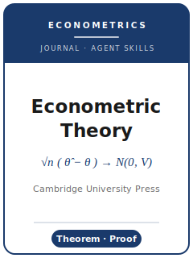

# Econometric Theory Skills

<p align="center">
  
</p>

[](LICENSE)
[](https://www.cambridge.org/core/journals/econometric-theory)
[](https://www.cambridge.org/core/journals/econometric-theory)
[](https://github.com/anthropics/claude-code)

English | [简体中文](README.zh-CN.md)

Agent skill stack for manuscripts targeted at **Econometric Theory (ET)** — the Cambridge University
Press journal founded by **Peter C. B. Phillips**, devoted to the **mathematical and statistical
foundations of econometrics**: asymptotic theory, probability-theoretic methods, time series and
nonstationarity, and high-dimensional and non-standard environments. Papers are **theorem-proof in
style**, with supporting lemmas, derivations, and often Monte Carlo or numerical illustration.

This repository is opinionated. It is **not** a generic econometrics toolbox. It is an **ET-specific**
stack: a general, foundational result stated and proved rigorously, with defensible assumptions,
clean proof exposition, simulations that show the asymptotics bite, the two-track **Article /
Miscellanea** structure, the **50-page** ceiling with overflow to the non-copyedited online
**Supplementary Material**, **single-anonymous** review, and **APA author-date** references.

> ET went through a major transition in **January 2026** — new editors and a new submission system.
> Volatile specifics are flagged; verify them on the official journal page. Items that could not be
> confirmed are marked **待核实** in [`resources/official-source-map.md`](resources/official-source-map.md).

---

## Why a Separate ET Skill Stack?

ET imposes constraints that differ materially from an empirical economics journal (QJE/AER) or an
applied econometrics outlet:

| Constraint            | Econometric Theory                                                    | Implication                                                       |
|-----------------------|----------------------------------------------------------------------|------------------------------------------------------------------|
| Contribution type     | A **general theory result** (asymptotics, proofs, theorems)          | An applied estimate with a thin theory wrapper is off-fit         |
| House style           | **Theorem-proof**, with supporting lemmas and derivations            | Prose-only "results" without rigorous proof do not clear the bar  |
| "Identification"      | Defensible **assumptions** + correct **limit theory**, not causal design | An unstated regularity condition is the classic referee objection |
| Data/code             | **No mandatory archive** (theory journal); voluntary Supplement only | Do not assume an AEA/JAE-style deposit applies                    |
| Length                | Regular Articles **<=50 pages**; overflow → online Supplement         | Pad past 50pp and it reads as undisciplined                       |
| Short-paper venue     | **Miscellanea** — one or two innovations, ~15 pages                   | A single sharp theorem has a dedicated home                       |
| Review                | **Single-anonymous** (referees see the author)                       | Do **not** double-blind-anonymize the manuscript                  |
| References            | **APA author-date**                                                  | Numeric/Chicago styles read as off-template                       |
| Submission            | **ScholarOne** single embedded-font PDF (since 28 Jan 2026)          | Editorial Express is retired for ET                               |

Generic "scientific writing" or "econ writing" packs do not address these. See the constraint sources
in [`resources/official-source-map.md`](resources/official-source-map.md).

---

## Quick Start

### Option A — Claude Code Plugin (recommended)

```bash
/plugin marketplace add https://github.com/brycewang-stanford/ectheory-skills
/plugin install ectheory-skills
/reload-plugins
```

### Option B — Manual Copy

```bash
git clone https://github.com/brycewang-stanford/ectheory-skills.git
cd ectheory-skills

mkdir -p ~/.claude/skills && cp -R skills/ectheory-* ~/.claude/skills/
# or
mkdir -p ~/.codex/skills && cp -R skills/ectheory-* ~/.codex/skills/
```

### First Prompt

```
Use ectheory-workflow to tell me which skill I should use next for my Econometric Theory manuscript.
```

---

## Default Workflow

```text
ectheory-topic-selection
        ▼
ectheory-literature-positioning
        ▼
ectheory-identification-strategy   (assumptions, regularity conditions, asymptotics, proof plan)
        ▼
ectheory-contribution-framing
        ▼
ectheory-data-analysis             (Monte Carlo / numerical illustration, if any)
        ▼
ectheory-tables-figures
        ▼
ectheory-writing-style             (proof exposition + APA references)
        ▼
ectheory-replication-and-data-policy
        ▼
ectheory-review-process
        ▼
ectheory-submission
        ▼
ectheory-rebuttal
```

`ectheory-workflow` is the router — it tells you which skill to use next based on where you are.

---

## Skills

| Skill                                | Purpose                                                                      |
|--------------------------------------|------------------------------------------------------------------------------|
| `ectheory-workflow`                  | Router — decides which sub-skill to invoke next                              |
| `ectheory-topic-selection`           | Is the result general + foundational? Article vs Miscellanea                 |
| `ectheory-literature-positioning`    | Stake the theorem against the frontier (APA author-date)                     |
| `ectheory-identification-strategy`   | Assumptions, regularity conditions, asymptotics, proof plan, generality      |
| `ectheory-contribution-framing`      | State the theorem so its generality is legible                              |
| `ectheory-data-analysis`             | Monte Carlo / numerical illustration showing the asymptotics bite            |
| `ectheory-tables-figures`            | Size/power/coverage tables, limit-behavior plots, ET figure specs            |
| `ectheory-writing-style`             | Proof exposition, notation discipline, ET prep specs, APA references         |
| `ectheory-replication-and-data-policy` | Reproducible computation + the online Supplementary Material file           |
| `ectheory-review-process`            | Single-anonymous review; war-game the proof-checking referee                 |
| `ectheory-submission`                | ScholarOne single-PDF preflight; Article vs Miscellanea; 50-page ceiling     |
| `ectheory-rebuttal`                  | Response-letter strategy for proof-checking referee reports                  |

### Resources

- [`resources/external_tools.md`](resources/external_tools.md) — LaTeX/theorem-proof tooling, the
  asymptotic toolkit (LLN/CLT, FCLT, empirical processes, mixing/NED), Monte Carlo, and
  reproducibility notes
- [`resources/official-source-map.md`](resources/official-source-map.md) — official ET URLs behind
  every fact, with **待核实** flags on unverified items

---

## ET-Specific Facts Baked In

- **Publisher:** Cambridge University Press; **founded by** Peter C. B. Phillips (ET Editor 1985–2025).
- **Editors (from 1 Jan 2026):** three joint Editors-in-Chief — Patrik Guggenberger (Penn State),
  Liangjun Su (Tsinghua), Yixiao Sun (UC San Diego).
- **Submission:** ScholarOne / Manuscript Central (`mc.manuscriptcentral.com/econ-theory`), effective
  28 Jan 2026, replacing Editorial Express; single embedded-font PDF.
- **Review:** single-anonymous (reviewers see the author).
- **Length:** Regular Articles <=50 pages (incl. everything); Miscellanea typically <20pp, ~15pp.
- **Abstract / specs:** <=200 words; 11pt min; >=1.5 spacing; >=1.25in margins; running head <=40 chars.
- **References:** APA author-date.
- **Supplementary Material:** voluntary, already-reviewed only, separate labeled file, not copyedited,
  no new material; the standard home for overflow proofs/derivations.
- **Fee / data archive:** no fee/APC stated and no mandatory data/code archive (**待核实** / ABSENT).
- **Signature genres:** the invited **ET Interview** (since 1985); the biennial **Peter C. B. Phillips
  Award**.

---

## Differences vs. Other Econometrics / Top-5 Stacks

| Dimension       | Econometric Theory                       | Econometrica                       | QJE / AER (empirical)              |
|-----------------|------------------------------------------|------------------------------------|------------------------------------|
| Lead with       | A general theorem / limit result         | A method or theorem                | A big empirical question           |
| Core test       | Assumptions + correct asymptotics        | Estimator properties + economics   | Credible causal identification     |
| Data/code       | No mandatory archive; voluntary Supplement | Mandatory replication              | Mandatory replication / Dataverse  |
| Review          | Single-anonymous                         | Varies                             | Often double-blind                 |
| References      | APA author-date                          | Author-date                        | Author-date                        |

---

## What This Repo Does Not Do

- It does not write or check your proofs for you — it structures the manuscript and process
- It does not simulate any specific editor's or referee's taste
- It does not assert volatile metadata (exact fee, OA APC) — unverified items are marked **待核实**
- It does not judge whether your result is genuinely general — that is the researcher's call

---

## Related

- [awesome-journal-skills](https://github.com/brycewang-stanford/awesome-journal-skills) — Index of journal-specific skill packs
- [Econometric Theory (official)](https://www.cambridge.org/core/journals/econometric-theory) — Cambridge University Press

---

## License

MIT
