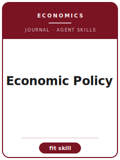

# Economic Policy Skills

<p align="center"></p>

[](LICENSE)
[](https://academic.oup.com/economicpolicy)
[](https://academic.oup.com/economicpolicy)

English | [简体中文](README.zh-CN.md)

Twelve agent skills for manuscripts targeted at **Economic Policy (Economic Policy)**. The pack is tuned to policy-relevant economics papers written for an expert but broad policy audience; it keeps the manuscript distinct from AEJ Economic Policy, Journal of Public Economics, IMF Economic Review, and World Bank Economic Review and emphasizes policy-first economics that states the decision problem, evidence, and limits plainly.

**Official basis checked 2026-06** (re-check volatile details before submission): see [`resources/official-source-map.md`](resources/official-source-map.md).

## Why a separate stack?

| Economic Policy constraint | What it forces |
|-------------------------|----------------|
| Scope | The main claim must speak to policy-relevant economics papers written for an expert but broad policy audience |
| Sibling boundary | The paper must explain why it belongs here rather than AEJ Economic Policy, Journal of Public Economics, IMF Economic Review, and World Bank Economic Review |
| Evidence standard | Designs, models, reviews, or qualitative evidence must match policy-first economics that states the decision problem, evidence, and limits plainly |
| Source discipline | Current process facts are cited or marked 待核实 |

## Quick Start

```text
/plugin marketplace add ./Economic-Policy-Skills
/plugin install economic-policy-skills
```

Manual use: start with [`skills/ecopol-workflow/SKILL.md`](skills/ecopol-workflow/SKILL.md).

## Default Workflow

```text
ecopol-workflow → ecopol-topic-selection → ecopol-literature-positioning → ecopol-identification → ecopol-theory-model → ecopol-robustness → ecopol-tables-figures → ecopol-writing-style → ecopol-replication-package → ecopol-referee-strategy → ecopol-submission → ecopol-rebuttal
```

## Skills

| # | Skill | What it does |
|---|-------|--------------|
| 1 | [`ecopol-workflow`](skills/ecopol-workflow/SKILL.md) | Workflow Router for Economic Policy manuscripts |
| 2 | [`ecopol-topic-selection`](skills/ecopol-topic-selection/SKILL.md) | Topic Selection for Economic Policy manuscripts |
| 3 | [`ecopol-literature-positioning`](skills/ecopol-literature-positioning/SKILL.md) | Literature Positioning for Economic Policy manuscripts |
| 4 | [`ecopol-identification`](skills/ecopol-identification/SKILL.md) | Identification Strategy for Economic Policy manuscripts |
| 5 | [`ecopol-theory-model`](skills/ecopol-theory-model/SKILL.md) | Theory and Model Craft for Economic Policy manuscripts |
| 6 | [`ecopol-robustness`](skills/ecopol-robustness/SKILL.md) | Robustness Strategy for Economic Policy manuscripts |
| 7 | [`ecopol-tables-figures`](skills/ecopol-tables-figures/SKILL.md) | Tables and Figures for Economic Policy manuscripts |
| 8 | [`ecopol-writing-style`](skills/ecopol-writing-style/SKILL.md) | Writing Style for Economic Policy manuscripts |
| 9 | [`ecopol-replication-package`](skills/ecopol-replication-package/SKILL.md) | Replication Package for Economic Policy manuscripts |
| 10 | [`ecopol-referee-strategy`](skills/ecopol-referee-strategy/SKILL.md) | Referee Strategy for Economic Policy manuscripts |
| 11 | [`ecopol-submission`](skills/ecopol-submission/SKILL.md) | Submission Preflight for Economic Policy manuscripts |
| 12 | [`ecopol-rebuttal`](skills/ecopol-rebuttal/SKILL.md) | Rebuttal Strategy for Economic Policy manuscripts |

## Resources

- [`resources/README.md`](resources/README.md) — resource index
- [`resources/official-source-map.md`](resources/official-source-map.md) — official URLs and volatile checks
- [`resources/external_tools.md`](resources/external_tools.md) — databases, methods, and software aids
- [`resources/worked-examples/01-introduction.md`](resources/worked-examples/01-introduction.md) — fictional before/after introduction
- [`resources/exemplars/library.md`](resources/exemplars/library.md) — real-paper slots with source discipline
- [`resources/code/`](resources/code/) — empirical code kit where applicable

## Related Links

- https://academic.oup.com/economicpolicy
- https://academic.oup.com/economicpolicy/pages/General_Instructions

## License

MIT (c) 2026 Bryce Wang. See [LICENSE](LICENSE).
