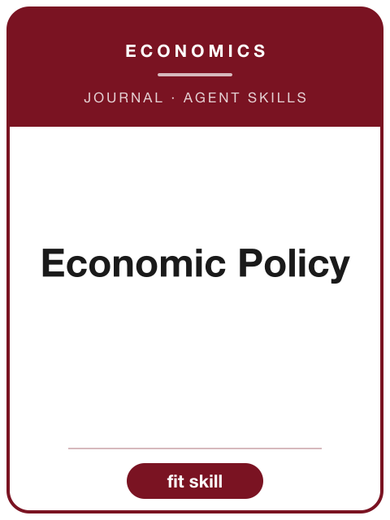

<!-- AJS-ROOT-JOURNAL-ENTRY -->
# Economic Policy

> Presents new research on urgent economic policy topics including macroeconomic stability, trade, public finance, labour markets, and climate policy.

| At a glance | |
|---|---|
| **Field** | Economics (economic policy) |
| **Publisher** | Oxford University Press (for CEPR, CESifo, and Sciences Po) |
| **Founded** | 1985 |
| **ISSN** | 0266-4658 (print) · 1468-0327 (online) |
| **Frequency** | Quarterly |
| **Official** | [academic.oup.com](https://academic.oup.com/economicpolicy) |
| **Checked** | 2026-06-17 |

**▶ Use the skill — [`economic-policy`](../English-SocialScience-Journal-Skills/skills/economic-policy/):** venue fit, framing, the method-and-evidence bar, house style, and desk-reject heuristics.

Part of the **[English Social-Science Journal Skills](../English-SocialScience-Journal-Skills/)** bundle. Always re-check the live author guidelines on the official site before submitting.

---

<!-- Machine-readable canonical pointer — do not remove or alter (validated by tools/audit_repo.py). -->

- Canonical skill: [English-SocialScience-Journal-Skills/skills/economic-policy/](../English-SocialScience-Journal-Skills/skills/economic-policy/)
- Skill name: `economic-policy`
- Bundle: [English-SocialScience-Journal-Skills/](../English-SocialScience-Journal-Skills/)

This folder intentionally does not contain a `SKILL.md`; the installable skill stays inside the bundle so plugin paths and skill counts remain stable.
