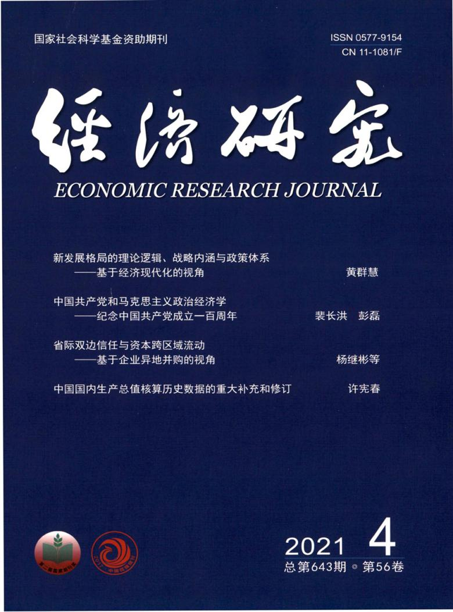

# 经济研究 Skills

<p align="center">
  
</p>

[](LICENSE)
[](https://erj.ajcass.com/)
[](https://erj.ajcass.com/)
[](https://erj.ajcass.com/)
[](skills/)
[](resources/code/)
[](https://github.com/anthropics/claude-code)

[English](README.md) | 简体中文

面向 **《经济研究》**（中国社会科学院经济研究所主办，ISSN 0577-9154，月刊，1955 年创刊）投稿的 Agent Skill 工具栈。**18 个 skill** 覆盖从选题到外审回复的全生命周期，并附**可一键复现的 Stata + Python 代码库**。

工具定位为**「生成 + 诊断」双模**：既能诊断稿件瓶颈、给出可填模板与 checklist，也能直接产出引言、机制段、摘要、回复信等发表级初稿段落供你打磨。

本仓库刻意**不通用**——它是面向《经济研究》编委审稿口味的方法论沉淀，不是泛化的"中文经济学写作助手"。

---

## 为什么要为《经济研究》单独做一套 Skills？

《经济研究》的约束维度与 AER / 海外顶刊**显著不同**（标 **[官]** 者为已联网核实的官方要求）：

| 维度       | 《经济研究》要求               | 隐含含义                                          |
|----------|-----------------------|---------------------------------------------|
| 学科定位    | 经济学（含宏观、制度、计量、产业、金融） | 偏纯管理学 / 案例的稿件不适合                       |
| 选题       | 理论贡献 + 中国问题；反对"唯定量倾向" [官]  | 仅"政策评估"易被认为"工作论文"                      |
| 边际贡献    | 引言必须明确写出，3–5 条               | "本文有以下创新"段落必须精炼                        |
| 文献综述    | 中英文献并重，**理论文献必引**            | 缺经典理论文献会被审稿人挑出                          |
| 识别策略    | 准实验 + 严密内生性讨论；现代估计量        | TWFE-only / OLS + 控制变量易被退稿               |
| 机制       | 几乎必备；**已弃用中介三步法**（江艇 2022）   | D→M + 理论论证 M→Y，不跑内生中介回归                |
| 参考文献    | **著者—出版年制**（作者，年份）[官]         | **不是**顺序编码制 `[1][2]`/`[J][M]`              |
| 摘要       | 中文提要约 300 字 + 英文梗概五要素 [官]      | 英文梗概另附中文对照供编校（仅供编校、不刊出；官方未定字数）|
| 关键词     | 3–5 个 + JEL 分类号                    | 不是 3–8 个                                    |
| 政策含义    | 偏"意义层"而非操作建议                   | 与《管理世界》"政策建议"可操作度有差异               |
| 署名      | 作者 ≤5、单位 ≤2、唯一通讯作者 [官]        | 信息置于独立页，正文匿名化                          |

> 这些事实已逐条核验并标注出处，见 [`resources/official-source-map.md`](resources/official-source-map.md)。凡字数/图表/公式上限等官方未明示者，工具一律按"经验值，以投稿当期官网为准"处理，不作硬断言。

---

## 18 个 Skill 一览

### 选题与框架
| Skill                     | 用途                                  |
|--------------------------|------------------------------------|
| `er-workflow`             | 路由器：判断当前阶段，推荐下一个 skill     |
| `er-topic-selection`      | 选题 + 理论贡献定位 + 边际贡献四句式      |
| `er-introduction`         | 引言五段漏斗 + hook 写法 + 贡献剧透       |
| `er-literature-review`    | 中英文献并重 + 理论文献必引 + 对话式综述  |
| `er-theory-hypotheses`    | 理论分析框架与可检验假设推导             |

### 实证主体
| Skill                     | 用途                                  |
|--------------------------|------------------------------------|
| `er-data-sample`          | 数据说明、变量定义表（给公式）、描述统计   |
| `er-identification`       | 现代准实验识别（交叠 DID / IV / RDD / DML）|
| `er-mechanism`            | 机制分析（**江艇 2022 范式**：D→M + 理论） |
| `er-heterogeneity`        | 异质性切分五维度优先级 + 理论指引         |
| `er-robustness`           | 稳健性检验体系（按识别威胁分类）          |
| `er-tables-figures`       | 三线表、变量定义表、图形美学（代码导出）   |

### 写作打磨与投稿
| Skill                     | 用途                                  |
|--------------------------|------------------------------------|
| `er-policy-implication`   | 政策含义（意义层，非操作层）              |
| `er-abstract`             | 中文提要 + 英文梗概五要素 + 黑名单清除    |
| `er-style`                | 全文语言 polish：空话套话 → 具体贡献      |
| `er-reviewer-lens`        | 投稿前高频审稿质疑自检（非模拟具体审稿人）  |
| `er-reproducibility`      | 一键复现包目录 + master + 数据可得性声明  |
| `er-submission`           | 投稿 checklist + 稿件模板             |
| `er-rebuttal`             | 修改回复信结构（致谢 → 逐条 → 修订对照） |

---

## 可复现代码库（Stata + Python）

[`resources/code/`](resources/code/) 是一套**复制即用、一键复现**的实证骨架，命令语法均已核对：

```
code/
 ├── stata/00_master.do        一键复现主控 + 固定随机种子
 ├── stata/01_clean.do         清洗：合并、筛选留痕、缩尾
 ├── stata/02_descriptive.do   描述统计 + 平衡性（三线表）
 ├── stata/03_did_modern.do    TWFE→Bacon分解→CS/BJS/SA/dCDH→事件研究
 ├── stata/04_iv.do            KP rk F + 有效 F + AR 弱工具稳健推断
 ├── stata/05_rdd.do           rdrobust 稳健偏差校正 CI + rddensity
 ├── stata/06_dml.do           ddml + pystacked 多学习器
 ├── stata/07_mechanism.do     只跑 D→M（江艇 2022 口径）
 ├── stata/08_robustness.do    按识别威胁分类 + 安慰剂分布 + wild bootstrap
 ├── stata/09_tables.do        esttab 三线表 + 事件研究图导出
 └── python/                   clean_panel / dml_doubleml / event_study_plot
```

每个脚本对应一个 skill 的方法论口径，正文报告要素与反模式见对应 `er-*`。

---

## 发表级范例工作库

[`resources/worked-examples/`](resources/worked-examples/) 用**一个连贯实证案例**（"金税三期与企业全要素生产率"）逐节演示一篇《经济研究》风格论文"好"长什么样——从引言、理论假设、识别、机制（江艇 2022 口径）、异质性、稳健性，到摘要、政策含义、修改回复信，**前后数字一致、可直接对标改稿**。

> 案例所用政策真实，但所有回归系数为**示意性虚构**、不来自任何已发表论文（详见该目录 README 声明）。它演示"生成"模式的目标水准：你可以让 Agent"照这个范例，把我的稿子改到这个程度"。

---

## 快速开始

### 方式 A —— Claude Code 插件（推荐）

```bash
/plugin marketplace add https://github.com/brycewang-stanford/Awesome-Journal-Skills
/plugin install economic-research-skills
/reload-plugins
```

### 方式 B —— 手动拷贝

```bash
mkdir -p ~/.claude/skills && cp -R skills/er-* ~/.claude/skills/
```

### 第一条 Prompt

```
用 er-workflow 告诉我这份《经济研究》目标稿子下一步该做什么。
```

---

## 默认工作流

```text
er-topic-selection → er-introduction → er-literature-review → er-theory-hypotheses
        ▼
er-data-sample → er-identification → er-mechanism → er-heterogeneity → er-robustness
        ▼
er-tables-figures → er-policy-implication → er-abstract（polish）→ er-style（polish）
        ▼
er-reviewer-lens → er-reproducibility → er-submission → er-rebuttal
```

`er-workflow` 是路由器，会根据当前阶段告诉你下一个该用哪个 Skill。

---

## 这套 Skills 的方法论立场（与一般"写作助手"的关键差异）

1. **机制分析按江艇（2022）范式**：弃用中介三步法 / Sobel / Bootstrap 间接效应占比，改为"只估计 D→M + 用理论论证 M→Y"。
2. **交叠 DID 必报异质性稳健估计量**：TWFE-only 会被诊断为高风险；提供 CS / BJS / SA / dCDH + Bacon 分解 + 事件研究的现成命令。
3. **参考文献严格著者—出版年制**：自动清除 `[1][2]`/`[J][M]`/`[27,28,29]` 顺序编码痕迹。
4. **范文只用已核实篇目**：避免把发表在《管理世界》《中国工业经济》的名篇误标为《经济研究》（见 source map 的避坑表）。

---

## 与《管理世界》Skill 包的差异

| 维度        | 《经济研究》              | 《管理世界》              |
|----------|-----------------------|----------------------|
| 学科定位    | 经济学（宏观 / 制度偏多）        | 管理 + 应用经济             |
| 政策含义    | "政策意义"，偏定性 / 宏观启示    | "政策建议"，偏可操作 / 部门级 |
| 案例 / 质性 | 较少接受                     | 接受                    |
| 理论文献    | **必引**                     | 可选                    |
| 写作风格    | 偏理论严谨                    | 偏实践契合                |

---

## 关于这个仓库不做什么

- 不替你判断"理论贡献"是否真有原创性——这是研究者本人的判断
- 不模拟具体审稿人偏好（`er-reviewer-lens` 只归纳高频、结构性质疑供自检）
- 不收录该刊拒稿率、影响因子等元数据
- 生成的初稿段落是**草稿**，需研究者据实修改与负责

---

## 相关仓库

- [Awesome-Journal-Skills](https://github.com/brycewang-stanford/Awesome-Journal-Skills) —— 期刊 Skill 索引
- [AER-skills](https://github.com/brycewang-stanford/AER-skills) —— American Economic Review 投稿工具栈

---

## License

MIT
