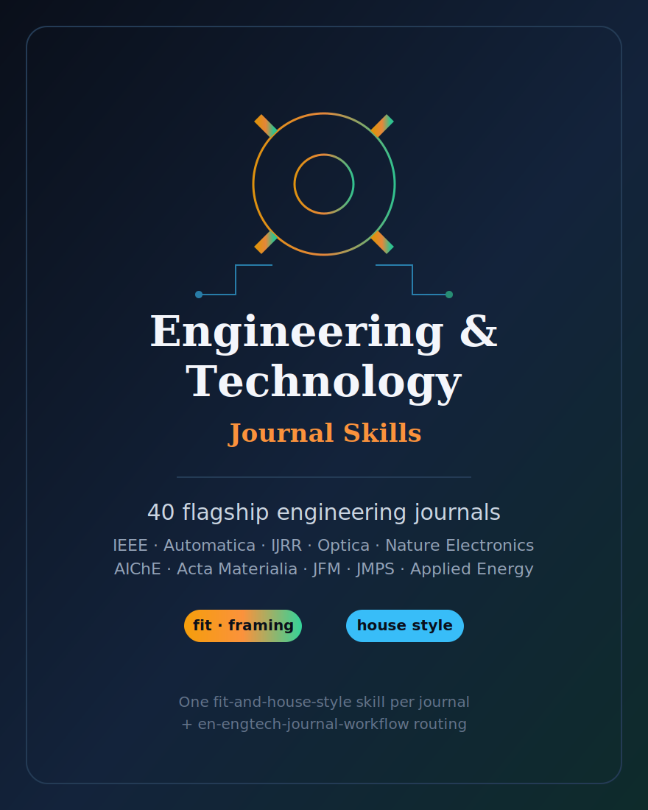

# Engineering & Technology Journal Skills

  

English | [简体中文](README.zh-CN.md)

An opinionated agent skill stack for **40 flagship English-language engineering and technology journals** — the venues the natural-science bundle deliberately leaves thin. It covers the IEEE Transactions / Proceedings family across control, information theory, signal processing, communications, power, industrial electronics, antennas, robotics, medical imaging and biomedical engineering; Automatica and IJRR; the optics/photonics flagships (Optica, Light: Science & Applications, Laser & Photonics Reviews); Nature Electronics and Nature Biomedical Engineering; the mechanics / fluids / manufacturing / aerospace venues; the AIChE and chemical/process and energy-engineering leaders; and the materials-engineering and civil/transportation flagships.

This is the engineering sibling of [`English-NaturalScience-Journal-Skills`](../English-NaturalScience-Journal-Skills/) and [`English-SocialScience-Journal-Skills`](../English-SocialScience-Journal-Skills/). Like them, it ships **one self-contained fit-and-house-style skill per journal**, plus `en-engtech-journal-workflow` for routing. Each journal skill helps answer: *is my manuscript on-target, how should it be framed, what method, validation and reproducibility does this venue expect, and what official submission details must be re-checked?*

## Coverage

| Group | Count |
|---|--:|
| Electrical · control · communications · signal · power (IEEE + Automatica) | 12 |
| Robotics · photonics · electronics · biomedical engineering | 10 |
| Mechanics · fluids · manufacturing · aerospace | 7 |
| Chemical · process · energy engineering | 7 |
| Materials engineering · civil · transportation | 4 |
| **Total journal skills** | **40** |
| Routing workflow (`en-engtech-journal-workflow`) | 1 |

## How to use

1. **Route first.** Start from `en-engtech-journal-workflow` to classify your
   manuscript by sub-discipline, contribution type, and validation shape, and get a
   ranked shortlist of candidate venues.
2. **Fit second.** Open the single-journal skill for your top candidate to test
   scope fit, framing, the method/validation bar, house style, and the likely
   desk-reject triggers.
3. **Re-check official rules last.** Every skill ends with an official-submission
   checklist. Before submitting, open the journal's current author instructions
   (see `resources/official-source-map.md`) — the live page always wins.

## Design rules (shared with the sibling bundles)

- **No volatile facts.** No impact factors, acceptance rates, ISSNs, exact limits,
  APC amounts, or editor names — those live on the official page and change.
- **No fabricated citations.** Literatures are referred to generically.
- **Stable conventions only.** Durable structural facts (the IEEE double-column
  format and article-type system, the IFAC affiliation of Automatica, the
  review/tutorial character of the Progress-in / Proceedings titles, standard
  data/code/reproducibility expectations) are used where they help fit.
- **Official page wins.** If a live instruction conflicts with a skill, follow the
  official instruction.

## License

MIT © 2026 Bryce Wang. See [LICENSE](LICENSE).
