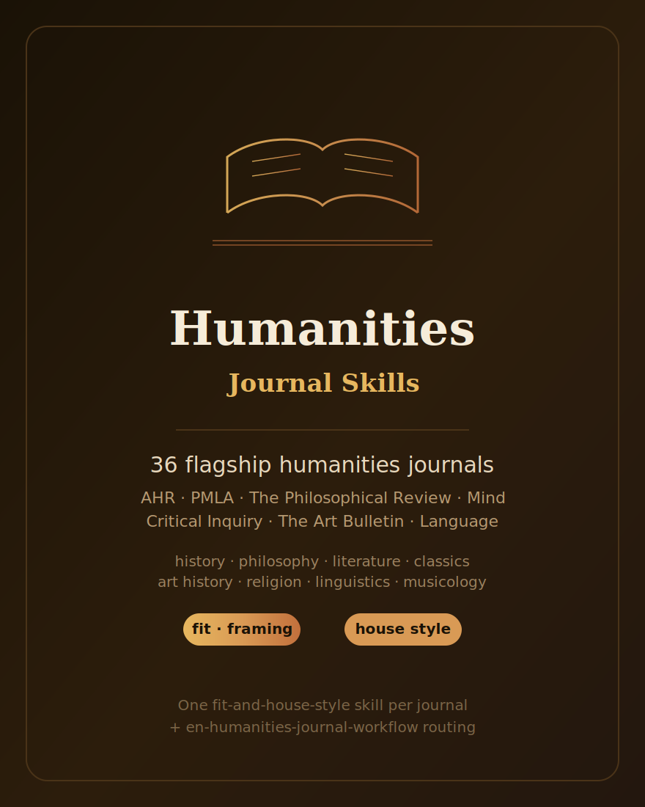

# English Humanities Journal Skills

  

English | [简体中文](README.zh-CN.md)

An opinionated agent skill stack for **36 flagship English-language humanities journals** — the category the existing breadth bundles leave thin. It covers the leading venues in history (The American Historical Review, Past & Present, The Journal of Modern History), philosophy (The Philosophical Review, Mind, Noûs, Ethics, Philosophy & Public Affairs), literary studies (PMLA, Critical Inquiry, New Literary History, Representations), classics (The Classical Quarterly, The Journal of Roman Studies), art and architectural history (The Art Bulletin, Art History, October, The Burlington Magazine), religious studies, linguistics (Language, Linguistic Inquiry), and musicology and aesthetics.

This is the humanities sibling of [`English-SocialScience-Journal-Skills`](../English-SocialScience-Journal-Skills/) and [`English-NaturalScience-Journal-Skills`](../English-NaturalScience-Journal-Skills/). Like them, it ships **one self-contained fit-and-house-style skill per journal**, plus `en-humanities-journal-workflow` for routing. Each journal skill helps answer: *is my argument on-target for this venue, how should it be framed, what command of sources and which theoretical idiom does it expect, and what official submission details (article type, citation style, anonymization, image permissions) must be re-checked?*

Several of these flagships also ship as first-party **depth packs** in the parent repo (The Art Bulletin, Critical Inquiry, PMLA, Mind, The American Historical Review); they are covered here as quick fit cards too — exactly as `american-economic-review` is covered both ways.

## Coverage

| Group | Count |
|---|--:|
| History | 7 |
| Philosophy | 7 |
| Literary studies | 6 |
| Classics | 2 |
| Art & architectural history | 4 |
| Religious studies | 3 |
| Linguistics | 4 |
| Musicology & aesthetics | 3 |
| **Total journal skills** | **36** |
| Routing workflow (`en-humanities-journal-workflow`) | 1 |

## How to use

1. **Route first.** Start from `en-humanities-journal-workflow` to classify your
   manuscript by sub-field, contribution type, and approach, and get a ranked shortlist.
2. **Fit second.** Open the single-journal skill for your top candidate to test scope
   fit, argument framing, source/evidence expectations, the theoretical idiom, house
   style, and the likely desk-reject triggers.
3. **Re-check official rules last.** Every skill ends with an official-submission
   checklist. Before submitting, open the journal's current submission guidelines and
   style sheet (see `resources/official-source-map.md`) — the live page always wins,
   and presses/styles do change.

## Design rules (shared with the sibling bundles)

- **No volatile facts.** No impact factors, acceptance rates, ISSNs, exact limits, fees,
  or editor names.
- **No fabricated citations or quotations.** Scholarship is referred to generically; no
  claims about specific articles or a living scholar's positions.
- **Stable conventions only.** Durable structural facts (society/press affiliations,
  field citation styles — Chicago / MLA / discipline styles, double-blind review, image
  permissions) are used where they help fit.
- **Official page wins.** If a live instruction conflicts with a skill, follow the
  official instruction.

## License

MIT © 2026 Bryce Wang. See [LICENSE](LICENSE).
