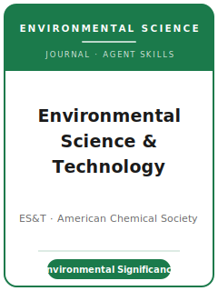

# 环境科学与技术（ES&T）技能包

<p align="center">
  
</p>

[](LICENSE)
[](https://pubs.acs.org/journal/esthag)
[](https://pubs.acs.org/page/esthag/about.html)
[](https://github.com/anthropics/claude-code)

[English](README.md) | 简体中文

面向 **《环境科学与技术》（Environmental Science & Technology, ES&T）** 投稿的 Agent 技能栈。ES&T 是
**美国化学会（ACS）的旗舰环境科学与工程** 研究期刊，以 **变革性、引领方向** 为目标，为多学科读者发表
严谨、扎实的研究：环境化学、环境工程、自然与工程系统中的迁移/转化/归趋、处理与资源回收、生态毒理与
环境健康、生物地球化学循环、可持续性与能源，以及科学—政策界面。

本仓库是**有主见的**。它**不是**通用科研写作工具箱，**也不是**把社会科学包改个名字套用到化学。
它是 **ES&T 专属** 技能栈，围绕真正决定一篇 ES&T 论文命运的要素构建：可被论证的**环境意义**、带有真实
**QA/QC** 的分析严谨性、闭合的**质量/能量平衡**、强制要求的 **TOC/图文摘要**、与正文一并提交的
**支持信息（SI）**，以及由公共数据库存储支撑的**数据可得性**声明。

---

## ES&T 是什么，为何需要专属技能栈？

ES&T 的约束不同于纯化学期刊或泛科学期刊：

| 约束 | ES&T | 含义 |
|------|------|------|
| 看重 | **环境意义** + 引领方向的新颖性 | 没有环境相关性的"干净"实验结果不合适 |
| 范围 | 环境**化学 + 工程 + 毒理/健康 + 生物地球化学 + 政策** | 论文须触达多学科读者 |
| 严谨性 | **QA/QC**、诚实的不确定性、**闭合的质量平衡** | 期待空白、回收率、LOD/LOQ、重复 |
| 出版方 | **美国化学会（ACS）** | 通过 **ACS Publishing Center** / **ACS Paragon Plus** 投稿 |
| 图表 | **强制 TOC/图文摘要**；图表可能计入字数 | 制作图文摘要；预算图表的"字数当量" |
| 透明度 | **数据可得性声明** + 公共数据库存储；**SI** 随稿提交 | 边做边建 SI 与数据存储 |
| 评审 | 编辑桌面初筛（大比例直接拒稿），再约 3 位专家评审 | 先过编辑的"意义"关 |
| 体例 | **ACS** 编号引用体例；SI 单位 | 非泛用"作者—年份"体例 |
| 姊妹刊 | **ES&T Letters**——紧急、高影响力的短篇结果 | 按紧迫程度选刊 |

易变的具体信息（确切字数上限与字数当量、投稿系统名称、盲审模式、现任编辑、指标、APC）会变化——
未直接核实项在 [`resources/official-source-map.md`](resources/official-source-map.md) 中标记 **待核实**。
**请以官方页面为准。**

### 文章类型（字数上限 待核实）

- **Research Article（研究论文）**——完整原创研究（约 7,000 词）；须配 TOC 图。
- **Critical Review（评述）**——全面的分析性综述（约 10,000 词）。
- **Feature（特稿）**——面向广泛读者的杂志式文章（约 5,000 词）。
- **Perspective（展望）**——聚焦的前瞻性观点/综述（约 4,000 词）。
- **Policy Analysis（政策分析）**——科学/工程的**政策界面**（约 7,000 词）。
- **Viewpoint / Correspondence / Letter to the Editor**——短篇观点/评论形式。
- **ES&T Letters**——快速披露**紧急**结果的姊妹刊（Letter ≤ 3,000 词）。

---

## 快速开始

### 方式 A — Claude Code 插件（推荐）

```bash
/plugin marketplace add https://github.com/brycewang-stanford/est-skills
/plugin install est-skills
/reload-plugins
```

### 方式 B — 手动复制

```bash
git clone https://github.com/brycewang-stanford/est-skills.git
cd est-skills

mkdir -p ~/.claude/skills && cp -R skills/est-* ~/.claude/skills/
# 或
mkdir -p ~/.codex/skills && cp -R skills/est-* ~/.codex/skills/
```

### 第一条提示

```
用 est-workflow 告诉我，我的 ES&T 稿件下一步该用哪个技能。
```

---

## 默认工作流

```text
est-topic-selection
        ▼
est-literature-positioning
        ▼
est-study-design
        ▼
est-data-analysis
        ▼
est-figures-and-tables
        ▼
est-reporting-and-reproducibility
        ▼
est-writing-style           （润色）
        ▼
est-cover-letter
        ▼
est-review-process
        ▼
est-submission
        ▼
est-revision-and-rebuttal
```

`est-workflow` 是路由器——根据你所处阶段告诉你下一步用哪个技能。若结果**紧急且高影响力**但篇幅短，
尽早走 `est-workflow` 考虑 **ES&T Letters** 姊妹刊，而非完整的 Research Article。

---

## 技能列表

| 技能 | 用途 |
|------|------|
| `est-workflow` | 路由器——决定下一步调用哪个子技能；选定文章类型 |
| `est-topic-selection` | 环境意义检验；契合度与文章类型选择 |
| `est-literature-positioning` | 明确知识空白；回应化学/工程/毒理/政策文献 |
| `est-study-design` | 环境相关性、对照、重复、质量平衡、QA/QC 内置设计 |
| `est-data-analysis` | QA/QC 报告、删失数据统计、不确定性、闭合质量平衡 |
| `est-figures-and-tables` | 自洽的图表 + 强制的 TOC/图文摘要 |
| `est-reporting-and-reproducibility` | 支持信息、数据可得性声明、公共数据库存储 |
| `est-writing-style` | ACS 体例；意义前置；符合文章类型字数上限 |
| `est-cover-letter` | 给编辑的推介——意义、契合、≥4 位无利益冲突推荐评审 |
| `est-review-process` | 编辑桌面初筛、约 3 位专家评审、决定流程、诚信核查 |
| `est-submission` | ACS Publishing Center 投稿前检查（类型、TOC 图、SI、数据声明、ACS） |
| `est-revision-and-rebuttal` | 面向多位评审 + 编辑的回应信策略 |

### 资源

- [`resources/external_tools.md`](resources/external_tools.md) — 环境数据源（EPA / PubChem / NIST / MassBank / GenBank）、仪器与 QA/QC、迁移转化模型，及 R / Python / 可复现工具
- [`resources/official-source-map.md`](resources/official-source-map.md) — 每条事实背后的 ACS / ES&T 官方 URL，未核实项标 待核实

---

## 本仓库不做什么

- 不替你写出可直接投稿的稿件
- 不模拟任何特定编辑或评审人的口味
- 不臆断易变元数据（确切字数上限/字数当量、投稿系统名称、盲审模式、编辑、指标、APC）——请以官方页面为准；未核实项标 待核实
- 不替你判断你的工作是否具有环境意义——那是研究者的判断

---

## 相关

- [awesome-journal-skills](https://github.com/brycewang-stanford/awesome-journal-skills) — 期刊专属技能包索引
- [Environmental Science & Technology（ACS Publications）](https://pubs.acs.org/journal/esthag) — 期刊主页
- [ES&T 作者指南（ACS Researcher Resources）](https://researcher-resources.acs.org/publish/author_guidelines?coden=esthag) — 文章类型、上限、政策

---

## 许可

MIT
