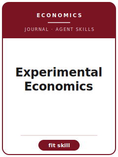

# Experimental Economics Skills

<p align="center"></p>

[English](README.md) | 简体中文

面向 **Experimental Economics（Experimental Economics）** 投稿的 12 个 agent skills。本包围绕 laboratory, field, online, and artefactual experiments in economics 设计，帮助稿件区别于 JEBO, Games and Economic Behavior, Management Science, and Journal of Risk and Uncertainty，并强调 protocol-transparent experimental economics with credible incentives and robust inference。

**官方依据核验日期：2026-06**（投稿前需复核易变细节）：见 [`resources/official-source-map.md`](resources/official-source-map.md)。

## 为什么需要单独的技能栈？

| Experimental Economics 约束 | 对稿件的要求 |
|-------------------|--------------|
| 范围 | 主张必须服务于 laboratory, field, online, and artefactual experiments in economics |
| 同门边界 | 说明为什么不是 JEBO, Games and Economic Behavior, Management Science, and Journal of Risk and Uncertainty |
| 证据标准 | 设计、模型、综述或质性证据必须匹配 protocol-transparent experimental economics with credible incentives and robust inference |
| 来源纪律 | 当前流程事实必须有来源，或明确标记 待核实 |

## 快速开始

```text
/plugin marketplace add ./Experimental-Economics-Skills
/plugin install experimental-economics-skills
```

手动使用：先打开 [`skills/expecon-workflow/SKILL.md`](skills/expecon-workflow/SKILL.md)。

## 默认工作流

```text
expecon-workflow → expecon-topic-selection → expecon-literature-positioning → expecon-identification → expecon-theory-model → expecon-robustness → expecon-tables-figures → expecon-writing-style → expecon-replication-package → expecon-referee-strategy → expecon-submission → expecon-rebuttal
```

## 技能列表

| # | Skill | 作用 |
|---|-------|------|
| 1 | [`expecon-workflow`](skills/expecon-workflow/SKILL.md) | 面向 Experimental Economics 稿件的 Workflow Router |
| 2 | [`expecon-topic-selection`](skills/expecon-topic-selection/SKILL.md) | 面向 Experimental Economics 稿件的 Topic Selection |
| 3 | [`expecon-literature-positioning`](skills/expecon-literature-positioning/SKILL.md) | 面向 Experimental Economics 稿件的 Literature Positioning |
| 4 | [`expecon-identification`](skills/expecon-identification/SKILL.md) | 面向 Experimental Economics 稿件的 Identification Strategy |
| 5 | [`expecon-theory-model`](skills/expecon-theory-model/SKILL.md) | 面向 Experimental Economics 稿件的 Theory and Model Craft |
| 6 | [`expecon-robustness`](skills/expecon-robustness/SKILL.md) | 面向 Experimental Economics 稿件的 Robustness Strategy |
| 7 | [`expecon-tables-figures`](skills/expecon-tables-figures/SKILL.md) | 面向 Experimental Economics 稿件的 Tables and Figures |
| 8 | [`expecon-writing-style`](skills/expecon-writing-style/SKILL.md) | 面向 Experimental Economics 稿件的 Writing Style |
| 9 | [`expecon-replication-package`](skills/expecon-replication-package/SKILL.md) | 面向 Experimental Economics 稿件的 Replication Package |
| 10 | [`expecon-referee-strategy`](skills/expecon-referee-strategy/SKILL.md) | 面向 Experimental Economics 稿件的 Referee Strategy |
| 11 | [`expecon-submission`](skills/expecon-submission/SKILL.md) | 面向 Experimental Economics 稿件的 Submission Preflight |
| 12 | [`expecon-rebuttal`](skills/expecon-rebuttal/SKILL.md) | 面向 Experimental Economics 稿件的 Rebuttal Strategy |

## 资源

- [`resources/README.md`](resources/README.md) — 资源索引
- [`resources/official-source-map.md`](resources/official-source-map.md) — 官方 URL 与易变信息
- [`resources/external_tools.md`](resources/external_tools.md) — 数据库、方法与软件工具
- [`resources/worked-examples/01-introduction.md`](resources/worked-examples/01-introduction.md) — 虚构引言改写示例
- [`resources/exemplars/library.md`](resources/exemplars/library.md) — 真实论文槽位与来源纪律
- [`resources/code/`](resources/code/) — 适用时使用的实证代码脚手架

## 许可

MIT (c) 2026 Bryce Wang。见 [LICENSE](LICENSE)。
