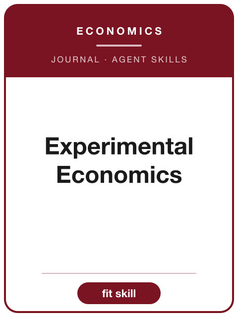

<!-- AJS-ROOT-JOURNAL-ENTRY -->
# Experimental Economics

> Publishes research using laboratory and field experimental methods that advances experimental economics and the wider discipline.

| At a glance | |
|---|---|
| **Field** | Experimental economics |
| **Publisher** | Cambridge University Press (for the Economic Science Association) |
| **Founded** | 1998 |
| **ISSN** | 1386-4157 (print) · 1573-6938 (online) |
| **Official** | [cambridge.org](https://www.cambridge.org/core/journals/experimental-economics) |
| **Checked** | 2026-06-17 |

**▶ Use the skill — [`experimental-economics`](../English-SocialScience-Journal-Skills/skills/experimental-economics/):** venue fit, framing, the method-and-evidence bar, house style, and desk-reject heuristics.

Part of the **[English Social-Science Journal Skills](../English-SocialScience-Journal-Skills/)** bundle. Always re-check the live author guidelines on the official site before submitting.

---

<!-- Machine-readable canonical pointer — do not remove or alter (validated by tools/audit_repo.py). -->

- Canonical skill: [English-SocialScience-Journal-Skills/skills/experimental-economics/](../English-SocialScience-Journal-Skills/skills/experimental-economics/)
- Skill name: `experimental-economics`
- Bundle: [English-SocialScience-Journal-Skills/](../English-SocialScience-Journal-Skills/)

This folder intentionally does not contain a `SKILL.md`; the installable skill stays inside the bundle so plugin paths and skill counts remain stable.
