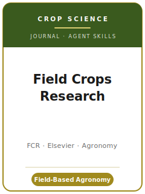

# Field Crops Research Skills

<p align="center">
  
</p>

[](LICENSE)
[](https://www.sciencedirect.com/journal/field-crops-research)
[](https://www.sciencedirect.com/journal/field-crops-research)
[](https://github.com/anthropics/claude-code)

English | [简体中文](README.zh-CN.md)

Agent skill stack for manuscripts targeted at **Field Crops Research (FCR)** — a leading international
**agronomy and crop-science** journal published by **Elsevier** (ISSN **0378-4290**). FCR publishes
**experimental and modelling research** on **crop ecology, crop physiology, agronomy, and crop
improvement** of field crops grown for **food, fibre, feed, and biofuel**, at the **crop, field, farm,
and landscape levels**. The inclusion of **yield data** is encouraged to show how field experiments
illuminate the biophysical processes behind crop growth, development, and yield formation.

This repository is opinionated. It is **not** a generic life-sciences writing toolbox and it is
**not** a controlled-environment plant-biology pack repurposed for the field. It is an **FCR-specific**
stack built around the journal's defining demand: **genuine field-based agronomy with multi-season
and/or multi-environment relevance**, a **novel contribution of general significance**, **sound
multi-environment experimental design**, **appropriate mixed-model statistics**, and full **agronomic
reporting** with a **data-availability statement** at submission.

---

## What Is FCR, and Why a Dedicated Stack?

FCR's constraints differ from a general plant-science or a controlled-environment journal:

| Constraint            | Field Crops Research                                                          | Implication                                                       |
|-----------------------|-------------------------------------------------------------------------------|------------------------------------------------------------------|
| Scope                 | **Field crops**: crop ecology, physiology, agronomy, crop improvement         | Tie the work to field-grown crops and their yield processes      |
| Environment           | **Field-based**, multi-season / multi-environment                             | Controlled-environment-only work is **out of scope**             |
| Multi-environment rule| Field experiments span **≥ 2 seasons and/or multiple environments**           | A single-site, single-season trial usually fails the gate        |
| Premium on            | **New scientific insight of general relevance** + yield/biophysical link      | Corroborative, descriptive, or local-only work is rejected       |
| Species               | Field crops for food/fibre/feed/biofuel                                       | Horticultural, woody-perennial, non-cultivated species off-fit   |
| Publisher / portal    | **Elsevier** / **Editorial Manager**                                          | Not OUP/Cambridge; submitted via Editorial Manager               |
| Review model          | **Single anonymized**, typically ≥ 2 reviewers                                | Authors are not anonymized; expect expert agronomy review        |
| Statistics            | **Appropriate** to the design (mixed models, G×E)                             | One-way ANOVA on pooled plots will not pass methods review       |
| Abstract / highlights | Abstract **≤ 400 words**; **3–5 highlights** of ≤ 85 characters               | Build them early; highlights are findings, not topics            |
| Data policy           | **State data availability at submission**; declare generative-AI use          | Draft the statement before you upload                            |

Use [`resources/official-source-map.md`](resources/official-source-map.md) for the official source
trail behind these claims. Final upload-week checks still belong on the live ScienceDirect / Elsevier
pages because editor names, prices, file prompts, and article-type menus can change.

### The scope boundary (read this first)

FCR explicitly **does not consider**:

- Studies conducted **exclusively under controlled conditions** — greenhouse, pots, or any system that **constricts root growth**.
- **One-year, single-location/-environment** field studies (the expectation is ≥ 2 seasons and/or multiple environments).
- Work that is **corroborative, descriptive, or of only local significance**.
- **Horticultural** (vegetable/fruit), **woody-perennial**, **medicinal**, and **non-cultivated** species, and natural grasslands.

If your project is on the wrong side of any of these, fix the framing or design **before** you invest
(see `fcr-topic-selection`).

---

## Quick Start

### Option A — Claude Code Plugin (recommended)

```bash
/plugin marketplace add https://github.com/brycewang-stanford/fcr-skills
/plugin install fcr-skills
/reload-plugins
```

### Option B — Manual Copy

```bash
git clone https://github.com/brycewang-stanford/fcr-skills.git
cd fcr-skills

mkdir -p ~/.claude/skills && cp -R skills/fcr-* ~/.claude/skills/
# or
mkdir -p ~/.codex/skills && cp -R skills/fcr-* ~/.codex/skills/
```

### First Prompt

```
Use fcr-workflow to tell me which skill I should use next for my Field Crops Research manuscript.
```

---

## Default Workflow

```text
fcr-topic-selection          (scope gate first)
        ▼
fcr-literature-positioning
        ▼
fcr-experimental-design
        ▼
fcr-data-analysis
        ▼
fcr-figures-and-tables
        ▼
fcr-reporting-and-data-policy
        ▼
fcr-writing-style            (polish)
        ▼
fcr-cover-letter
        ▼
fcr-review-process
        ▼
fcr-submission
        ▼
fcr-revision-and-rebuttal
```

`fcr-workflow` is the router — it runs the **scope gate** (field-based? multi-environment? a field
crop? more than local?) and then tells you which skill to use next based on where you are. If the
scope gate fails, it sends you back to `fcr-topic-selection` or `fcr-experimental-design` before you
write anything.

---

## Skills

| Skill                              | Purpose                                                                       |
|------------------------------------|-------------------------------------------------------------------------------|
| `fcr-workflow`                     | Router — scope gate + decides which sub-skill to invoke next                  |
| `fcr-topic-selection`              | Scope fit (field-based, multi-environment, field crop, general); article type |
| `fcr-literature-positioning`       | Stake a general contribution; avoid the "local/descriptive" rejection         |
| `fcr-experimental-design`          | Multi-environment design — randomization, replication, blocking, G×E, models  |
| `fcr-data-analysis`                | Mixed models, G×E/stability, adjusted means + SED/LSD, model evaluation        |
| `fcr-figures-and-tables`           | Self-contained exhibits with units and error; response curves and biplots     |
| `fcr-reporting-and-data-policy`    | Agronomic reporting completeness; data-availability statement; AI disclosure  |
| `fcr-writing-style`                | Concise results + interpretive discussion; abstract ≤400 words; highlights     |
| `fcr-cover-letter`                 | Editor-facing letter establishing scope fit and the novel contribution        |
| `fcr-review-process`               | Single-anonymized review, scope-based desk screening, decision categories     |
| `fcr-submission`                   | Editorial Manager preflight (scope, format, reporting, declarations)          |
| `fcr-revision-and-rebuttal`        | Response-letter strategy for major/minor revisions across reviewers + editor  |

### Resources

- [`resources/external_tools.md`](resources/external_tools.md) — agronomy data sources (GYGA / FAOSTAT / WorldClim / NASA POWER / SoilGrids) + design, mixed-model, G×E, and crop-model software (agricolae / asreml / metan / APSIM / DSSAT / STICS)
- [`resources/official-source-map.md`](resources/official-source-map.md) — official Elsevier / FCR URLs behind every journal-specific fact and upload-week live-check boundary

---

## What This Repo Does Not Do

- It does not write a submittable manuscript for you
- It does not simulate any specific editor's or reviewer's taste
- It does not freeze upload-week metadata such as editor names, prices, file prompts, or article-type menu changes; check the official page before submission
- It does not decide whether your study is genuinely field-based and of general significance — that is the researcher's call

---

## Related

- [awesome-journal-skills](https://github.com/brycewang-stanford/awesome-journal-skills) — Index of journal-specific skill packs
- [Field Crops Research (ScienceDirect)](https://www.sciencedirect.com/journal/field-crops-research) — publisher home, aims & scope
- [FCR Guide for Authors](https://www.sciencedirect.com/journal/field-crops-research/publish/guide-for-authors) — submission, article types, policies

---

## License

MIT
