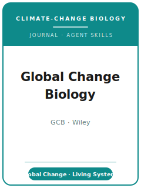

# 全球变化生物学（GCB）技能包

<p align="center">
  
</p>

[](LICENSE)
[](https://onlinelibrary.wiley.com/journal/13652486)
[](https://onlinelibrary.wiley.com/page/journal/13652486/homepage/productinformation.html)
[](https://github.com/anthropics/claude-code)

[English](README.md) | 简体中文

面向 **《全球变化生物学》（Global Change Biology, GCB）** 投稿的 Agent 技能栈。GCB 是研究 **全球环境变化
对生物系统影响** 的领军期刊，**创刊于 1995 年**，由 **Wiley（威立）** 出版。GCB 致力于推进对 **全球环境
变化**（气候变暖、CO2 与对流层臭氧升高、氮沉降、土地利用变化、海洋变化）与 **生物系统** 之界面的理解——
覆盖从 **分子到生物群系（biome）** 的任意组织层级，涵盖 **水生或陆生**、**人工管理或自然** 环境，既包括
生物对变化的 **响应**，也包括其 **反馈**。

本仓库是**有主见的**。它**不是**通用生态学写作工具箱，并且刻意与 **保护生物学（保护实践）技能包** 区分：
GCB 关注的是 **全球变化机制与生态系统过程**——即全球变化 **驱动因子** 与 **生物响应** 之间的因果联系——
而**不是**保护行动方案或管理处方。一篇 GCB 论文应以 **具有广泛意义的机制** 立论，论证其 **尺度与不确定性**，
配一张展示 **驱动—响应** 联系的 **图形摘要（graphical abstract）**，并将 **数据与代码以 DOI 形式归档** 作为
发表的前提条件。

---

## GCB 是什么，为何需要专属技能栈？

GCB 的约束不同于地区性生态刊或保护类期刊：

| 约束 | GCB | 含义 |
|------|------|------|
| 范围 | **全球环境变化 × 生物系统**（分子→生物群系） | 须有全球变化驱动因子与生物响应/反馈 |
| 看重 | **机制 + 广泛意义**，而非局地描述 | 无机制的单点结果不合适 |
| 区别于 | **保护实践**（行动/管理） | GCB 要机制/生态系统，而非保护处方 |
| 出版方 | **Wiley** | 通过 **ScholarOne / Manuscript Central** 投稿（非 Editorial Manager） |
| 评审模式 | 编辑介导的专家评审；匿名/透明评审选项以现行官方页为准 | 预先回应专家关切与数据访问要求 |
| 篇幅 | 研究论文当前按 **最高 8,000 词**正文上限处理 | 投稿前按文章类型核对现行上限 |
| 摘要 | **300 词上限**；**6–10 个关键词/短语** | 写明目的、方法、量化结果、结论 |
| 图形摘要 | **必需**——展示驱动—响应机制 | 不是研究地点图或系统发育树 |
| 数据与代码 | **存入带 DOI 的公共仓库**，作为发表前提条件 | **不接受“可应要求提供”**——须在发表前归档 |

易变的具体信息（确切篇幅上限、文章类型、费用/APC、政策措辞、评审模式）会变化。
[`resources/official-source-map.md`](resources/official-source-map.md) 现在为每条操作性事实标出 Wiley、
ScholarOne 或 DOI 仓库来源路径；投稿前请在浏览器中即时核对官方 Wiley 页面。

### 文章类型

- **Primary Research Articles（原创研究论文）**——具备全球变化机制的完整原创研究。
- **Technical Advances（技术进展）**——面向全球变化生物学的新工具、新方法或新建模手段。
- **Reviews / Research Reviews（综述）**——整合性综述；**GCB Reviews 为约稿**，而 **Research Reviews**
  栏目向自由投稿开放。
- **Opinions / Perspectives（观点/展望）**——有论点、面向未来的文章；选择该路线前即时核对现行字数上限与资格要求。

---

## 快速开始

### 方式 A — Claude Code 插件（推荐）

```bash
/plugin marketplace add https://github.com/brycewang-stanford/gcb-skills
/plugin install gcb-skills
/reload-plugins
```

### 方式 B — 手动复制

```bash
git clone https://github.com/brycewang-stanford/gcb-skills.git
cd gcb-skills

mkdir -p ~/.claude/skills && cp -R skills/gcb-* ~/.claude/skills/
# 或
mkdir -p ~/.codex/skills && cp -R skills/gcb-* ~/.codex/skills/
```

### 第一条提示

```
用 gcb-workflow 告诉我，我的 Global Change Biology 稿件下一步该用哪个技能。
```

---

## 默认工作流

```text
gcb-topic-selection
        ▼
gcb-literature-positioning
        ▼
gcb-study-design
        ▼
gcb-data-analysis
        ▼
gcb-figures-and-tables
        ▼
gcb-reporting-and-data-policy
        ▼
gcb-writing-style           （润色）
        ▼
gcb-cover-letter
        ▼
gcb-review-process
        ▼
gcb-submission
        ▼
gcb-revision-and-rebuttal
```

`gcb-workflow` 是路由器——根据你所处阶段与合适的**文章类型**告诉你下一步用哪个技能。若贡献是**方法/工具**，
按 **Technical Advance** 走 `gcb-study-design`；若是**综述**，走 `gcb-literature-positioning` 准备
**Research Review**（GCB Reviews 为约稿）。

---

## 技能列表

| 技能 | 用途 |
|------|------|
| `gcb-workflow` | 路由器——决定下一步调用哪个子技能；选定文章类型 |
| `gcb-topic-selection` | 全球变化契合测试：驱动→响应、机制、广泛意义 |
| `gcb-literature-positioning` | 在生态学/生物地球化学/地球系统科学文献中定位 |
| `gcb-study-design` | 实验、梯度/观测与建模——尺度、重复、真实性 |
| `gcb-data-analysis` | 混合模型、元分析、模型评估、诚实的不确定性 |
| `gcb-figures-and-tables` | 机制优先的图表 + 必需的图形摘要 |
| `gcb-reporting-and-data-policy` | 数据/代码 DOI 归档；数据可得性声明；敏感数据路径 |
| `gcb-writing-style` | 机制与意义前置；量化、可读、不超篇幅 |
| `gcb-cover-letter` | 面向编辑的范围契合 + 贡献，简洁投稿信 |
| `gcb-review-process` | 桌面筛查、2–3 位专家评审、决定类别 |
| `gcb-submission` | ScholarOne 投稿前检查（文章类型、摘要、图形摘要、数据） |
| `gcb-revision-and-rebuttal` | 逐条回应，捍卫机制、尺度与不确定性 |

### 资源

- [`resources/external_tools.md`](resources/external_tools.md) — 全球变化数据源（ERA5 / CMIP6 / FLUXNET / MODIS / GBIF / TRY）+ R / Python / 过程模型与元分析工具，及 DOI 仓库（Dryad / Zenodo / PANGAEA）
- [`resources/official-source-map.md`](resources/official-source-map.md) — 每条事实背后的 Wiley / GCB 官方 URL，以及易变项目的 live-check 提示

---

## 本仓库不做什么

- 不替你写出可直接投稿的稿件
- 不模拟任何特定编辑或评审人的口味
- 不在缺少官方来源路径时臆断易变元数据（确切上限、文章类型、费用/APC、政策措辞、评审模式）；投稿前请以官方页面即时核对
- 不会把保护管理或局地描述的论文“变成”全球变化机制——那是研究者自己的科学

---

## 相关

- [awesome-journal-skills](https://github.com/brycewang-stanford/awesome-journal-skills) — 期刊专属技能包索引
- [Global Change Biology（Wiley Online Library）](https://onlinelibrary.wiley.com/journal/13652486) — 出版方主页
- [GCB 作者指南](https://onlinelibrary.wiley.com/page/journal/13652486/homepage/forauthors.html) — 投稿指南与政策
- [ScholarOne / Manuscript Central](https://mc.manuscriptcentral.com/gcb) — 投稿门户

---

## 许可

MIT
