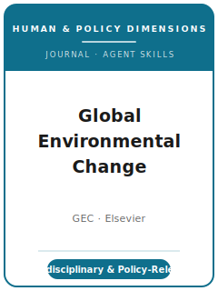

# 全球环境变化（GEC）技能包

<p align="center">
  
</p>

[](LICENSE)
[](https://www.sciencedirect.com/journal/global-environmental-change)
[](https://www.sciencedirect.com/journal/global-environmental-change)
[](https://github.com/anthropics/claude-code)

[English](README.md) | 简体中文

面向 **《全球环境变化》（Global Environmental Change, GEC）** 投稿的 Agent 技能栈。GEC 是研究全球环境变化
**人类与政策维度** 的国际权威期刊，创刊于 **1990 年**，由 **爱思唯尔（Elsevier）** 出版（ISSN 0959-3780）。
它发表在理论与经验上都严谨的研究，聚焦环境变化的 **社会驱动因素与后果**，以及应对这些问题的 **治理、政策
与行为过程**：气候适应、脆弱性、环境治理、社会—生态系统、可持续性转型、粮食与水系统、土地利用、海洋与
海岸、城市变化——定量、定性与混合方法兼收并蓄。

本仓库是**有主见的**。它**不是**通用社会科学写作工具箱，**也不是**在自然科学结果上硬加一句政策建议。
它是 **GEC 专属** 技能栈：一个具有**显著社会科学成分**的问题、一个**清晰的概念框架**、在各自方法标准下
站得住的**跨学科严谨性**、基于证据的**现实与政策含义**，以及一份配有 **数据可得性声明（Data Availability
Statement）** 的透明、可复现记录。

---

## GEC 是什么，为何需要专属技能栈？

GEC 的约束不同于单一学科的社会科学刊或自然科学刊：

| 约束 | GEC | 含义 |
|------|------|------|
| 范围 | 全球环境变化的**人类与政策维度** | 仅有生物物理结果不合适 |
| 看重 | **显著的社会科学成分** + 社会/政策意义 | 以人类维度立论，而非仅讲灾害趋势 |
| 方法 | 定量/定性/混合——各按其标准评判 | 方法要匹配问题；混合方法须说明整合逻辑 |
| 出版方 | **爱思唯尔 Elsevier**（ISSN 0959-3780 / 1872-9495） | 通过 Elsevier 在线投稿系统提交 |
| 评审模式 | **双向匿名 / double-anonymized**；通常至少两位专家评审 | title page 与匿名稿件分开提交 |
| 篇幅 | Research Article **8,000 词以内**；Perspective **3,000 词以内**；摘要 **≤250 词** | 把方法细节移入补充材料 |
| Highlights | 必须提交：**3-5 条要点，每条 ≤85 字符**，单独可编辑文件 | 作为贡献的橱窗来撰写 |
| 框架 | 理论严谨；框架必须**发挥作用** | 不要无理论、纯描述的论文 |
| 透明度 | 爱思唯尔 **Option C** 研究数据政策；**数据可得性声明** | deposit/cite/link 数据，或解释为何不能共享 |
| 意义 | 多尺度：地方过程伴随**全球/跨尺度后果** | 把案例连接到超越地方的尺度 |

官方 ScienceDirect 页面已于 **2026-06-20** 刷新进
[`resources/official-source-map.md`](resources/official-source-map.md)。投稿级建议前仍须重开 live 页面，
因为 APC、编辑名单、special call 与政策文字可能变化。

### GEC 看重什么

- **人类/政策贡献**——环境变化的社会驱动、后果或治理。
- **能发挥作用的概念框架**——生成问题并组织分析。
- **跨学科严谨性**——定量、定性或混合方法，每一种都做扎实。
- **现实相关性**——基于证据的含义，明确指出行动者与政策杠杆。

---

## 快速开始

### 方式 A — Claude Code 插件（推荐）

```bash
/plugin marketplace add https://github.com/brycewang-stanford/gec-skills
/plugin install gec-skills
/reload-plugins
```

### 方式 B — 手动复制

```bash
git clone https://github.com/brycewang-stanford/gec-skills.git
cd gec-skills

mkdir -p ~/.claude/skills && cp -R skills/gec-* ~/.claude/skills/
# 或
mkdir -p ~/.codex/skills && cp -R skills/gec-* ~/.codex/skills/
```

### 第一条提示

```
用 gec-workflow 告诉我，我的《全球环境变化》稿件下一步该用哪个技能。
```

---

## 默认工作流

```text
gec-topic-selection
        ▼
gec-literature-positioning
        ▼
gec-conceptual-framework
        ▼
gec-research-design
        ▼
gec-data-analysis
        ▼
gec-figures-and-tables
        ▼
gec-writing-style          （润色）
        ▼
gec-policy-relevance-and-implications
        ▼
gec-review-process
        ▼
gec-submission
        ▼
gec-revision-and-rebuttal
```

`gec-workflow` 是路由器——根据你所处阶段告诉你下一步用哪个技能。它的首要任务是确认论文具有**显著的社会科学
成分**与真实的政策价值；多数论文在进入写作润色前，会在 **框架 ↔ 设计 ↔ 分析** 之间循环多次。

---

## 技能列表

| 技能 | 用途 |
|------|------|
| `gec-workflow` | 路由器——决定下一步调用哪个子技能 |
| `gec-topic-selection` | 人类/政策契合与意义；选对文章类型 |
| `gec-literature-positioning` | 对话多个文献；定位在其跨学科交叉处 |
| `gec-conceptual-framework` | 构建能生成问题、组织分析的框架 |
| `gec-research-design` | 为设计辩护——因果推断、案例研究、实验、混合方法 |
| `gec-data-analysis` | 分析规范、不确定性、稳健性、定性与混合整合 |
| `gec-figures-and-tables` | 自洽、可读的图表与必备的 Highlights |
| `gec-writing-style` | 跨学科可读的严谨写作，控制在字数与摘要上限内 |
| `gec-policy-relevance-and-implications` | 现实含义：行动者、杠杆、适用范围、公平、不确定性 |
| `gec-review-process` | 双向匿名评审、范围/社会科学筛查、决定类别 |
| `gec-submission` | Elsevier 投稿前检查（匿名化、上限、Highlights、数据声明） |
| `gec-revision-and-rebuttal` | 面向跨学科评审 + 编辑的回应信策略 |

### 资源

- [`resources/external_tools.md`](resources/external_tools.md) — 环境变化数据源（IPCC / ND-GAIN / FAOSTAT / WVS / Global Forest Watch）+ R / Stata / Python 与定性/CAQDAS 及系统方法工具
- [`resources/official-source-map.md`](resources/official-source-map.md) — 当前流程事实背后的爱思唯尔 / ScienceDirect 官方 URL，2026-06-20 已刷新

---

## 本仓库不做什么

- 不替你写出可直接投稿的稿件
- 不模拟任何特定编辑或评审人的口味
- 不冻结易变元数据（APC、编辑名单、special call、政策措辞）；真正投稿前必须重新核验 live 页面
- 不替你判断你的问题是否具有真正的人类维度贡献——那是研究者的判断

---

## 相关

- [awesome-journal-skills](https://github.com/brycewang-stanford/awesome-journal-skills) — 期刊专属技能包索引
- [Global Environmental Change（ScienceDirect）](https://www.sciencedirect.com/journal/global-environmental-change) — 出版方主页、目标与范围
- [作者指南 Guide for Authors](https://www.sciencedirect.com/journal/global-environmental-change/publish/guide-for-authors) — 文章类型、篇幅、Highlights、数据政策

---

## 许可

MIT
