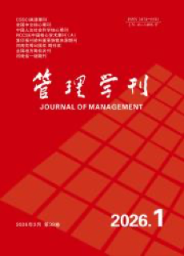

<!-- AJS-ROOT-JOURNAL-ENTRY -->
# 《管理学刊》

> 报道管理理论与实践研究的学术双月刊。

| 期刊概览 | |
|---|---|
| **学科** | 管理学 |
| **主办/出版** | 河南省教育厅主管 · 新乡学院主办 |
| **创刊** | 2009 |
| **ISSN** | 1674-6511 · CN 41-1408/F |
| **周期** | 双月刊 |
| **官网** | [xxxy.cbpt.cnki.net](https://xxxy.cbpt.cnki.net/) |
| **核验日期** | 2026-06-17 |

**▶ 调用 skill —— [`journal-of-management`](../Chinese-SocialScience-Journal-Skills/skills/journal-of-management/)：** 选题契合度、框架、方法与证据门槛、写作体例与拒稿雷区。

属于 **[中文社会科学期刊 Skills](../Chinese-SocialScience-Journal-Skills/)** 合集。投稿前请以官网最新《投稿须知》为准。

---

<!-- 机器可读的规范指针——请勿删除或改动（由 tools/audit_repo.py 校验）。 -->

- Canonical skill: [Chinese-SocialScience-Journal-Skills/skills/journal-of-management/](../Chinese-SocialScience-Journal-Skills/skills/journal-of-management/)
- Skill name: `journal-of-management`
- Bundle: [Chinese-SocialScience-Journal-Skills/](../Chinese-SocialScience-Journal-Skills/)

此目录刻意不包含 `SKILL.md`；真正可安装的 skill 保留在 bundle 内，确保插件路径和 skill 计数保持稳定。
