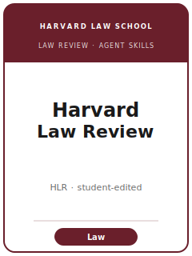

# Harvard Law Review Skills

<p align="center">
  
</p>

[](LICENSE)
[](https://harvardlawreview.org/)
[](https://harvardlawreview.org/about/)
[](https://github.com/anthropics/claude-code)

English | [简体中文](README.zh-CN.md)

Agent skill stack for legal scholarship targeted at the **Harvard Law Review (HLR)** — one of the oldest
operating **student-edited** American law reviews (first issue **April 15, 1887**), generalist across all
of law, published by the **Harvard Law Review Association** and affiliated with **Harvard Law School**.
HLR publishes **Articles, Essays, and Book Reviews** by outside authors, student-written **Notes**
(unsigned), and the annual **Supreme Court issue** each November with its signature **Foreword**.

This repository is opinionated. It is **not** a peer-review pack repurposed for law, and **not** a generic
academic-writing toolbox. It is an **HLR-specific** stack built around the distinctive U.S. law-review
reality: you write a **near-final, heavily footnoted** article, run a **preemption check** before drafting,
place it through **Scholastica** to many journals at once, leverage offers with **expedite** requests across
the **February-March** and **August** seasons, cite per **The Bluebook** (which HLR co-publishes), and then
survive an intensive **student-editor edit** plus a full **cite-check / source-pull**.

---

## What Is HLR, and Why a Dedicated Stack?

HLR's constraints differ from a peer-reviewed journal:

| Constraint            | HLR                                                                            | Implication                                                       |
|-----------------------|-------------------------------------------------------------------------------|------------------------------------------------------------------|
| Review model          | **Student-edited** (not peer-reviewed)                                         | Pitch to smart generalist students; expect a hands-on edit       |
| Scope                 | **Generalist** — all of law                                                    | The claim must matter beyond one specialty bar                   |
| Premium on            | An **original, normative** claim with a clear payoff                           | A descriptive doctrinal survey is off-fit                        |
| Originality test      | A **preemption check** (SSRN / Westlaw / HeinOnline) before writing            | Discovering the claim is taken *after* drafting is a wasted summer|
| Submission model      | **Multi-submit + expedite** via **Scholastica** (some also ExpressO)           | Single-submitting forgoes your only leverage                    |
| Timing                | **Feb-Mar** main season + smaller **Aug** season                               | Submit early; slots fill fastest at the top                      |
| Citations             | **The Bluebook** (HLR is a co-publisher) — pincited footnotes                  | Loose, un-pinpointed cites will not survive the source-pull      |
| Editing               | Intensive substantive + technical edit; **full cite-check / source-pull**      | Be pull-ready before you submit; respond fast                    |
| What it publishes     | Articles, Essays, Book Reviews; student Notes; the Supreme Court Foreword       | Notes are written in-house; the Foreword is invited              |
| Owner / publisher     | **Harvard Law Review Association** / Harvard Law School                         | Submitted via Scholastica, not a peer-review portal              |

Volatile specifics (exact length guidance, fee, channel, expedite/seven-day policy, current masthead)
change — items not directly confirmed are marked **待核实** in
[`resources/official-source-map.md`](resources/official-source-map.md). **Verify on the official page.**

### What HLR publishes

- **Articles** — long, heavily footnoted original legal arguments with a normative claim.
- **Essays** — shorter, focused interventions in a live debate.
- **Book Reviews** — an independent claim provoked by a recent book, not a summary.
- **Notes & comments** — **student-written and unsigned** (an in-house track, not for outside authors).
- **The Supreme Court issue (November)** — the **Foreword** (usually by a leading scholar, by invitation),
  a faculty Case Comment, and student Case Notes on the Term's major decisions; plus an April
  **Developments in the Law** issue.

---

## Quick Start

### Option A — Claude Code Plugin (recommended)

```bash
/plugin marketplace add https://github.com/brycewang-stanford/harvard-law-review-skills
/plugin install harvard-law-review-skills
/reload-plugins
```

### Option B — Manual Copy

```bash
git clone https://github.com/brycewang-stanford/harvard-law-review-skills.git
cd harvard-law-review-skills

mkdir -p ~/.claude/skills && cp -R skills/hlr-* ~/.claude/skills/
# or
mkdir -p ~/.codex/skills && cp -R skills/hlr-* ~/.codex/skills/
```

### First Prompt

```
Use hlr-workflow to tell me which skill I should use next for my Harvard Law Review article.
```

---

## Default Workflow

```text
hlr-topic-selection
        ▼
hlr-thesis-and-contribution
        ▼
hlr-preemption-check          (run EARLY — before drafting)
        ▼
hlr-argument-structure
        ▼
hlr-sources-and-bluebook
        ▼
hlr-footnotes-and-cite-check
        ▼
hlr-writing-style             (polish)
        ▼
hlr-placement-strategy
        ▼
hlr-submission
        ▼
hlr-student-editor-review     (after an offer)
        ▼
hlr-revision-and-editing
```

`hlr-workflow` is the router — it tells you which skill to use next based on where you are. Run the
**preemption check early**; iterate thesis ↔ argument ↔ sources before polishing prose; and plan placement
and expedites before you upload.

---

## Skills

| Skill                          | Purpose                                                                       |
|--------------------------------|-------------------------------------------------------------------------------|
| `hlr-workflow`                 | Router — decides which sub-skill to invoke next                               |
| `hlr-topic-selection`          | Timely, generalist-legible, placeable topic for the student-edited market     |
| `hlr-thesis-and-contribution`  | The original normative legal claim and its payoff, stated early               |
| `hlr-preemption-check`         | Has this argument been made? Search SSRN / Westlaw / HeinOnline before writing |
| `hlr-argument-structure`       | The doctrine → theory → normative-prescription arc                            |
| `hlr-sources-and-bluebook`     | Pinpoint cites, the authority hierarchy, The Bluebook                          |
| `hlr-writing-style`            | Generalist, student-edited prose; the text/footnote division of labor         |
| `hlr-placement-strategy`       | Scholastica multi-submit + expedite mechanics + timing the seasons            |
| `hlr-student-editor-review`    | Working with student editors; the cite-check / source-pull; responsiveness     |
| `hlr-submission`               | Scholastica preflight (near-final manuscript, footnotes, expedite setup)       |
| `hlr-revision-and-editing`     | The intensive multi-round editing cycle through to page proofs                 |
| `hlr-footnotes-and-cite-check` | The heavy footnote apparatus + source-pull readiness                          |

### Resources

- [`resources/external_tools.md`](resources/external_tools.md) — legal research databases (Westlaw / Lexis / HeinOnline / SSRN), citation tooling (The Bluebook / Shepard's / KeyCite / Perma.cc), and the submission ecosystem (Scholastica / ExpressO)
- [`resources/official-source-map.md`](resources/official-source-map.md) — official HLR URLs behind every fact, with 待核实 markers on unverified items
- [`resources/worked-examples/01-introduction.md`](resources/worked-examples/01-introduction.md) — a before→after HLR-style introduction (fictional)
- [`resources/exemplars/library.md`](resources/exemplars/library.md) — real, web-verified HLR pieces by field × type

**Official basis checked 2026-06.** Verify volatile specifics on the official HLR submissions page.

---

## Differences vs. Sibling Law Reviews

| Dimension        | Harvard Law Review (HLR)                | Yale Law Journal / Columbia / Penn / Stanford        |
|------------------|-----------------------------------------|------------------------------------------------------|
| Model            | Student-edited, generalist              | Also student-edited, generalist (process is similar) |
| Bluebook         | **Co-publisher** of The Bluebook        | YLJ, Columbia, Penn also co-publish; others do not   |
| Signature genre  | The annual **Supreme Court Foreword**   | Each flagship has its own signature features         |
| Placement        | Scholastica multi-submit + expedite     | Same ecosystem — HLR is a top reach target           |

This pack targets **HLR specifically**. The placement mechanics generalize across U.S. law reviews, but
the do-not-misattribute guardrails in [`resources/exemplars/library.md`](resources/exemplars/library.md)
keep famous sibling-journal articles from being credited to HLR.

---

## What This Repo Does Not Do

- It does not write a submittable article for you
- It does not simulate any specific student editor's taste, and never asserts the current masthead
- It does not assert volatile metadata (length guidance, fee, channel, expedite/seven-day policy) — verify on the official page; unverified items are marked 待核实
- It does not run your preemption search for you — it tells you how and where to run it

---

## Related

- [awesome-journal-skills](https://github.com/brycewang-stanford/awesome-journal-skills) — Index of journal-specific skill packs
- [Harvard Law Review](https://harvardlawreview.org/) — the journal's official site
- [HLR Submissions](https://harvardlawreview.org/homepage/submissions/) — author instructions, Scholastica, expedite policy
- [The Bluebook](https://www.legalbluebook.com/) — the citation manual HLR co-publishes

---

## License

MIT
