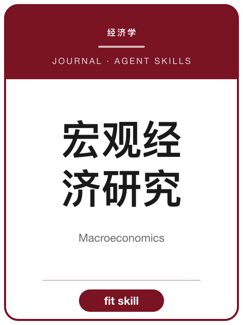

<!-- AJS-ROOT-JOURNAL-ENTRY -->
# 《宏观经济研究》

> 宏观经济政策与发展战略研究期刊。

| 期刊概览 | |
|---|---|
| **学科** | 宏观经济学 |
| **主办/出版** | 国家发展和改革委员会主管 · 中国宏观经济研究院主办 |
| **创刊** | 1979 |
| **ISSN** | 1008-2069 · CN 11-3952/F |
| **周期** | 月刊 |
| **收录/地位** | CSSCI · 北大中文核心 |
| **官方机构页** | [amr.org.cn](https://www.amr.org.cn/ghgk/yjg/znbm/201701/t20170109_1387070.html) |
| **核验日期** | 2026-06-17 |

**▶ 调用 skill —— [`macroeconomics`](../Chinese-SocialScience-Journal-Skills/skills/macroeconomics/)：** 选题契合度、框架、方法与证据门槛、写作体例与拒稿雷区。

属于 **[中文社会科学期刊 Skills](../Chinese-SocialScience-Journal-Skills/)** 合集。投稿前请以官网最新《投稿须知》为准。

---

<!-- 机器可读的规范指针——请勿删除或改动（由 tools/audit_repo.py 校验）。 -->

- Canonical skill: [Chinese-SocialScience-Journal-Skills/skills/macroeconomics/](../Chinese-SocialScience-Journal-Skills/skills/macroeconomics/)
- Skill name: `macroeconomics`
- Bundle: [Chinese-SocialScience-Journal-Skills/](../Chinese-SocialScience-Journal-Skills/)

此目录刻意不包含 `SKILL.md`；真正可安装的 skill 保留在 bundle 内，确保插件路径和 skill 计数保持稳定。
