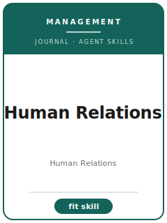

# Human Relations Skills

<p align="center"></p>

[English](README.md) | 简体中文

面向 **Human Relations（Human Relations）** 投稿的 12 个 agent skills。本包围绕 work, employment, organizations, social relations, power, identity, and critical management 设计，帮助稿件区别于 Organization Studies, Journal of Management Studies, Administrative Science Quarterly, and Work Employment and Society，并强调 socially grounded organization research that links theory, context, and lived work。

**官方依据核验日期：2026-06**（投稿前需复核易变细节）：见 [`resources/official-source-map.md`](resources/official-source-map.md)。

## 为什么需要单独的技能栈？

| Human Relations 约束 | 对稿件的要求 |
|-------------------|--------------|
| 范围 | 主张必须服务于 work, employment, organizations, social relations, power, identity, and critical management |
| 同门边界 | 说明为什么不是 Organization Studies, Journal of Management Studies, Administrative Science Quarterly, and Work Employment and Society |
| 证据标准 | 设计、模型、综述或质性证据必须匹配 socially grounded organization research that links theory, context, and lived work |
| 来源纪律 | 当前流程事实必须有来源，或明确标记 待核实 |

## 快速开始

```text
/plugin marketplace add ./Human-Relations-Skills
/plugin install human-relations-skills
```

手动使用：先打开 [`skills/humrel-workflow/SKILL.md`](skills/humrel-workflow/SKILL.md)。

## 默认工作流

```text
humrel-workflow → humrel-topic-selection → humrel-theory-development → humrel-literature-positioning → humrel-methods → humrel-data-analysis → humrel-contribution-framing → humrel-tables-figures → humrel-writing-style → humrel-submission → humrel-review-process → humrel-rebuttal
```

## 技能列表

| # | Skill | 作用 |
|---|-------|------|
| 1 | [`humrel-workflow`](skills/humrel-workflow/SKILL.md) | 面向 Human Relations 稿件的 Workflow Router |
| 2 | [`humrel-topic-selection`](skills/humrel-topic-selection/SKILL.md) | 面向 Human Relations 稿件的 Topic Selection |
| 3 | [`humrel-theory-development`](skills/humrel-theory-development/SKILL.md) | 面向 Human Relations 稿件的 Theory Development |
| 4 | [`humrel-literature-positioning`](skills/humrel-literature-positioning/SKILL.md) | 面向 Human Relations 稿件的 Literature Positioning |
| 5 | [`humrel-methods`](skills/humrel-methods/SKILL.md) | 面向 Human Relations 稿件的 Methods |
| 6 | [`humrel-data-analysis`](skills/humrel-data-analysis/SKILL.md) | 面向 Human Relations 稿件的 Data Analysis |
| 7 | [`humrel-contribution-framing`](skills/humrel-contribution-framing/SKILL.md) | 面向 Human Relations 稿件的 Contribution Framing |
| 8 | [`humrel-tables-figures`](skills/humrel-tables-figures/SKILL.md) | 面向 Human Relations 稿件的 Tables and Figures |
| 9 | [`humrel-writing-style`](skills/humrel-writing-style/SKILL.md) | 面向 Human Relations 稿件的 Writing Style |
| 10 | [`humrel-submission`](skills/humrel-submission/SKILL.md) | 面向 Human Relations 稿件的 Submission Preflight |
| 11 | [`humrel-review-process`](skills/humrel-review-process/SKILL.md) | 面向 Human Relations 稿件的 Review Process |
| 12 | [`humrel-rebuttal`](skills/humrel-rebuttal/SKILL.md) | 面向 Human Relations 稿件的 Rebuttal Strategy |

## 资源

- [`resources/README.md`](resources/README.md) — 资源索引
- [`resources/official-source-map.md`](resources/official-source-map.md) — 官方 URL 与易变信息
- [`resources/external_tools.md`](resources/external_tools.md) — 数据库、方法与软件工具
- [`resources/worked-examples/01-introduction.md`](resources/worked-examples/01-introduction.md) — 虚构引言改写示例
- [`resources/exemplars/library.md`](resources/exemplars/library.md) — 真实论文槽位与来源纪律
- [`resources/code/`](resources/code/) — 适用时使用的实证代码脚手架

## 许可

MIT (c) 2026 Bryce Wang。见 [LICENSE](LICENSE)。
